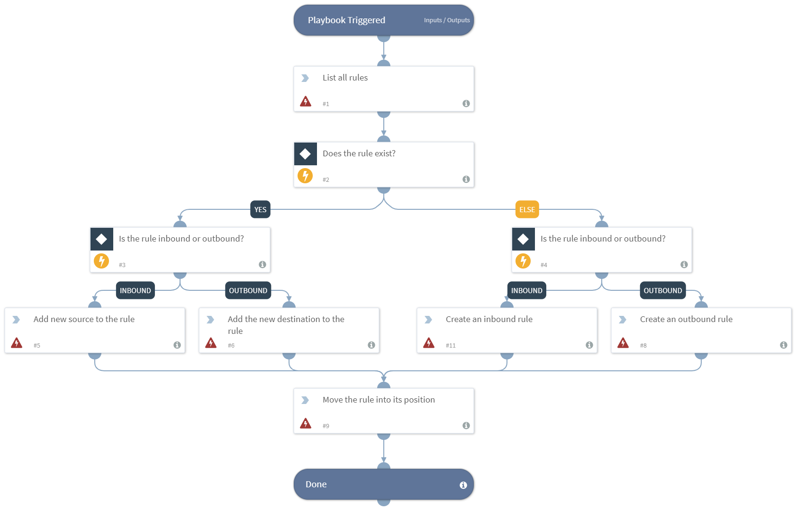

Creates or edits a Panorama rule and moves it into the desired position.

## Dependencies
This playbook uses the following sub-playbooks, integrations, and scripts.

### Sub-playbooks
This playbook does not use any sub-playbooks.

### Integrations
* Panorama

### Scripts
This playbook does not use any scripts.

### Commands
* pan-os-edit-rule
* pan-os-list-rules
* pan-os-move-rule
* pan-os-create-rule

## Playbook Inputs
---

| **Name** | **Description** | **Required** |
| --- | --- | --- | 
| device-group | The device group to work on. Exists only in panorama. |Optional |
| rule_name | The name of the rule to update, or the name of the rule that will be created. |  Required |
| log-forwarding-object-name | The server address to which to forward logs. | Optional |
| rule-position | The position of the rule in the ruleset. Can be, "Top", "Bottom", "Before", or "After". The default is "Bottom". | Optional |
| relative-rule-name | If the rule-position that is chosen is before or after, specify the rule name to which it is related. |Optional |
| inbound-or-outbound-rule | Determines if the rule is inbound or outbound. | Optional |
| element-to-add | The element to add to the rule. | Required |
| action-type | The action that will be defined in the rule. Can be, "allow", "deny", or "drop". | Required |
| pre-post-rulebase | Whether the rule is a pre-rulebase or post-rulebase rule, according to the rule structure. Exists only in panorama. | Optional |

## Playbook Outputs
---
There are no outputs for this playbook.

## Playbook Image
---

