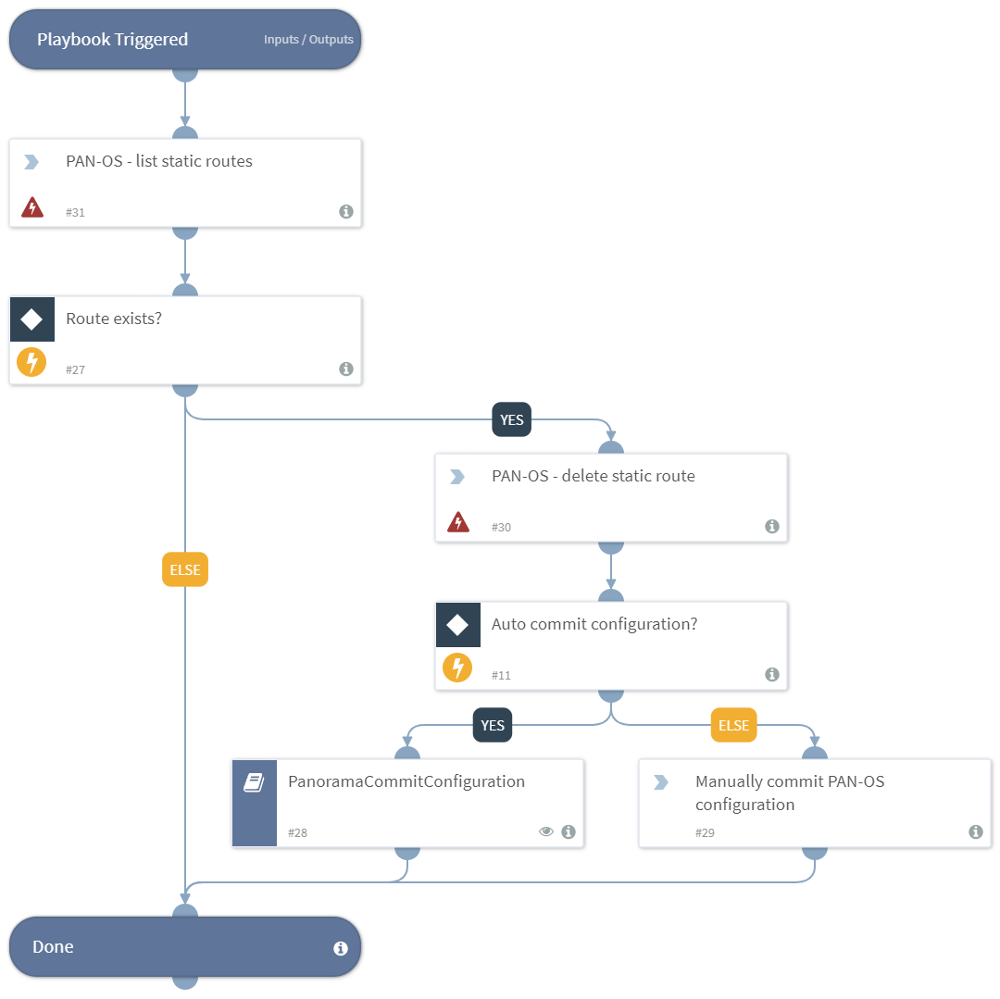

Deletes a PAN-OS static route from the PAN-OS instance.

## Dependencies
This playbook uses the following sub-playbooks, integrations, and scripts.

### Sub-playbooks
* PanoramaCommitConfiguration

### Integrations
This playbook does not use any integrations.

### Scripts
This playbook does not use any scripts.

### Commands
* pan-os-list-static-routes
* pan-os-delete-static-route

## Playbook Inputs
---

| **Name** | **Description** | **Default Value** | **Required** |
| --- | --- | --- | --- | 
| virtual_router_name | The name of the virtual router to configure the static routes for. | - | Required |
| route_name | The name to identify the static route (up to 31 characters). The name is case-sensitive and must be unique. Can include, letters, numbers, spaces, hyphens, and underscores. | - |Required |
| AutoCommit | Whether to auto-commit the configuration to PAN-OS. Can be, "Yes" or "No". | No |Optional |

## Playbook Outputs
---
There are no outputs for this playbook.

## Playbook Image
---

