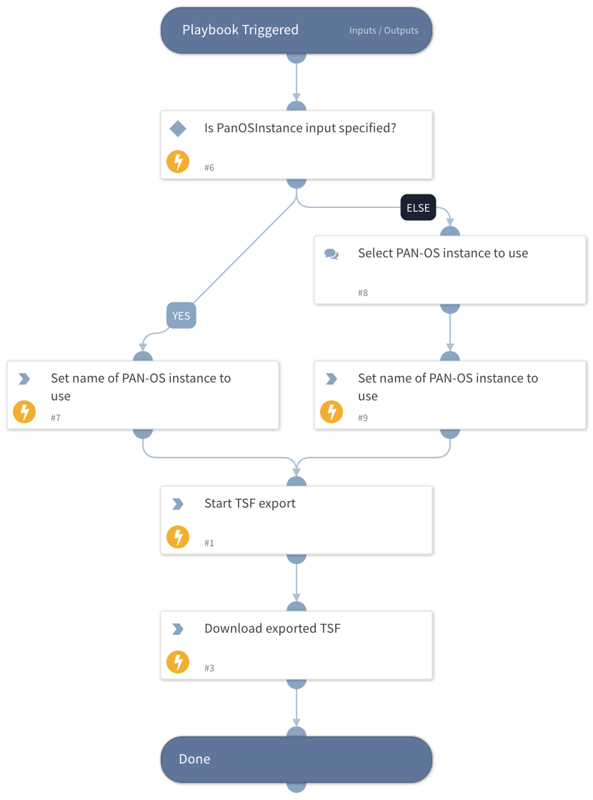

Export a tech support file (TSF) from PAN-OS.

## Dependencies

This playbook uses the following sub-playbooks, integrations, and scripts.

### Sub-playbooks

This playbook does not use any sub-playbooks.

### Integrations

This playbook does not use any integrations.

### Scripts

* Set
* SetAndHandleEmpty

### Commands

* pan-os-download-tech-support-file
* pan-os-export-tech-support-file

## Playbook Inputs

---

| **Name** | **Description** | **Default Value** | **Required** |
| --- | --- | --- | --- |
| PanOSInstance | Which instance of the PAN-OS integration to use |  | Optional |

## Playbook Outputs

---
There are no outputs for this playbook.

## Playbook Image

---

