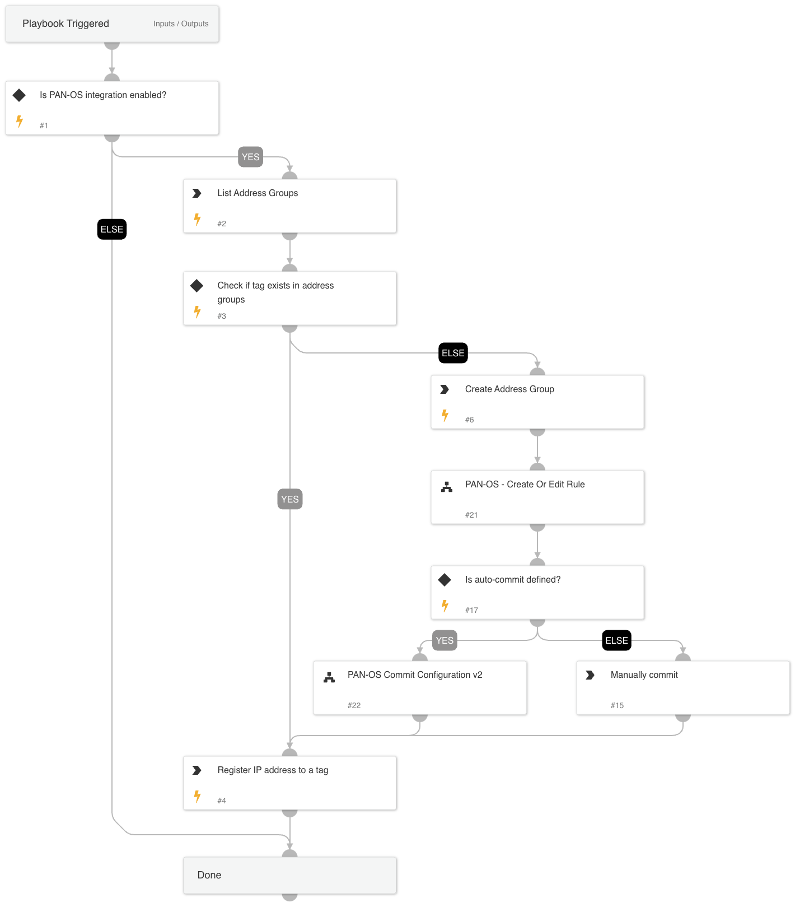

This playbook utilizes the Dynamic Address Group (DAG) capability of PAN-OS.
DAG enables analysts to create a rule one time, where the group is the source/destination, and adds IP addresses dynamically without the need to commit the configuration every time.

The playbook checks if the given tag already exists. If the tag exists, then the IP address is added to the tag.

If the tag does not exist, a new address group is created with the given tag and a matching rule, and the configuration is committed. 

## Dependencies

This playbook uses the following sub-playbooks, integrations, and scripts.

### Sub-playbooks

* PAN-OS - Create Or Edit Rule
* PAN-OS Commit Configuration

### Integrations

* Panorama

### Scripts

* AreValuesEqual

### Commands

* pan-os-list-address-groups
* pan-os-create-address-group
* pan-os-register-ip-tag

## Playbook Inputs

---

| **Name** | **Description** | **Default Value** | **Required** |
| --- | --- | --- | --- |
| tag_name | The name of the tag to add to PAN-OS. This can be a single tag. |  | Required |
| ip_list | The list of the IP addresses to block. |  | Required |
| address_group_name | The name of the group that will be created if the tag does not exist. |  | Required |
| rule_name | The name of the rule to update, or the name of the rule that will be created. |  | Optional |
| auto_commit | Whether the rule will be committed automatically. |  | Optional |
| log-forwarding-object-name | The server address to which to forward logs. |  | Optional |
| rule-position | The position of the rule in the ruleset. Valid values are:   \* Top   \* Bottom   \* Before   \* After  The default position is 'Top' |  | Optional |
| relative-rule-name | If the rule-position that is chosen is before or after, specify the rule name to which it is related. |  | Optional |
| inbound-or-outbound-rule | Determines if the rule is inbound or outbound. |  | Optional |
| action-type | The action that will be defined in the rule. Valid values are: \* allow \* deny \* drop |  | Optional |
| pre-post-rulebase | Determines whether the rule is a pre-rulebase or post-rulebase rule, according to the rule structure. Exists only in panorama\! |  | Required |
| device-group | the device group for which to return results. for panorama only\! |  | Optional |

## Playbook Outputs

---
There are no outputs for this playbook.

## Playbook Image

---

