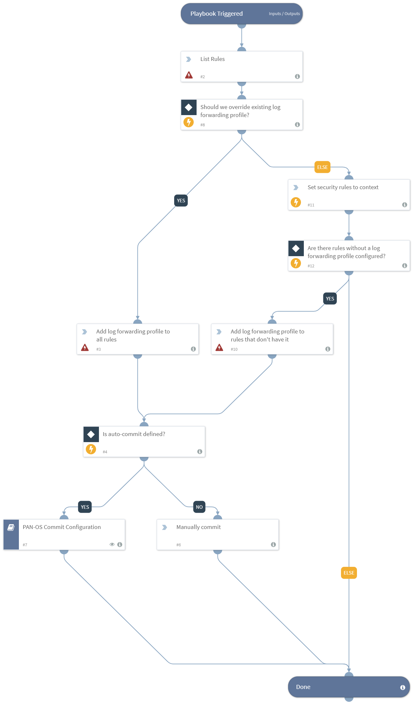

Sets up and maintains log forwarding for the Panorama rulebase.
It can be run when setting up a new instance, or as a periodic job to enforce log forwarding policy.
You can either update all rules and override previous profiles, or update only rules that do not have a log forwarding profile configured.
​
## Description & Playbook Flow
---
The playbook lists all of the rules (either pre-rulebase or post-rulebase). 
If the analyst wishes to override the log-forwarding profile for all rules, it updates all the rules with the given profile.
If the analyst wishes to update only rules with missing profiles, it will update only those rules.
In the end, the playbook will commit to PAN-OS (either auto-commit or manual commit by the analyst).

## Dependencies
This playbook uses the following sub-playbooks, integrations, and scripts.

### Sub-playbooks
* PAN-OS Commit Configuration

### Integrations
* Palo Alto Networks PAN-OS

### Scripts
* Set
* AreValuesEqual

### Commands
* pan-os-edit-rule
* pan-os-list-rules

## Playbook Inputs
---

| **Name** | **Description** | **Default Value** | **Required** |
| --- | --- | --- | --- | 
| log-forwarding-name | The name of the log-forwarding object that will be attached to all of the rules. | log_forwarding_101 | Required |
| auto_commit | Whether the rule should be committed automatically or manually. | yes | Optional |
| pre-post-rulebase | Either the pre-rulebase or post-rulebase, depending on the rule structure. | pre-rulebase | Required |
| device-group | The device group to work on. | - |Optional |
| override-existing-profiles | Whether the log-forwarding profiles that were already defined should be overrode. | False | Optional |

## Playbook Outputs
---
There are no outputs for this playbook.

## Known Limitations
---
The log forwarding profile needs to be configured manually and provided to this playbook as an input. [link](https://docs.paloaltonetworks.com/cortex/cortex-data-lake/cortex-data-lake-getting-started/get-started-with-cortex-data-lake)
In the future, we’ll support auto-creation of Cortex Data Lake log forwarding profiles.

## Playbook Image
---

