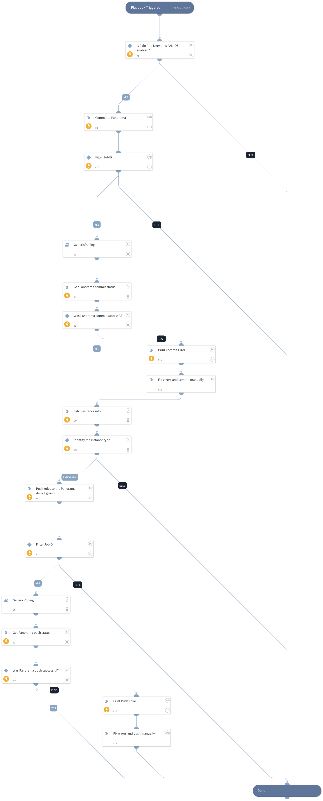

Deprecated. Use PAN-OS Commit Configuration v2 instead.

## Dependencies

This playbook uses the following sub-playbooks, integrations, and scripts.

### Sub-playbooks

* GenericPolling

### Integrations

* Panorama

### Scripts

* PrintErrorEntry

### Commands

* pan-os-commit
* pan-os-commit-status
* pan-os-push-to-device-group
* pan-os-push-status
* pan-os

## Playbook Inputs

---

| **Name** | **Description** | **Default Value** | **Required** |
| --- | --- | --- | --- |
| device-group |  The device group  | Optional |

## Playbook Outputs

---

| **Path** | **Description** | **Type** |
| --- | --- | --- |
| Panorama.Commit.Warnings | Job ID warnings. | string |
| Panorama.Push.Warnings | Job ID warnings. | unknown |

## Playbook Image

---

