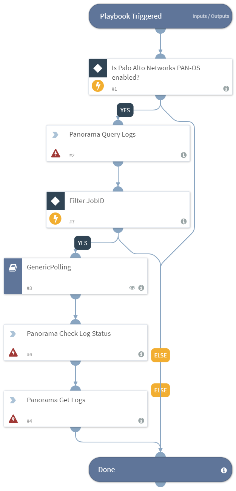

Queries Panorama Logs of types: traffic, threat, URL, data-filtering and WildFire.

## Dependencies
This playbook uses the following sub-playbooks, integrations, and scripts.

### Sub-playbooks
This playbook does not use any sub-playbooks.

### Integrations
This playbook does not use any integrations.

### Scripts
This playbook does not use any scripts.

### Commands
* pan-os-query-logs

## Playbook Inputs
---

| **Name** | **Description** | **Required** |
| --- | --- | --- | 
| log_type | The log type to query. Can be, "traffic", "threat", "wildfire", "url" or "data-filtering". | Required |
| query | The query string by which to match the criteria for the logs. This is similar to the query provided in the web interface under the **Monitor** tab when viewing the logs. | Optional |
| time-generated | The time the log was generated from the timestamp and prior to it. For example, "2019/08/11 01:10:44". | Optional |
| addr-src | The source address. | Optional |
| addr-dst | The destination address. | Optional |
| ip | The source or destination IP address. | Optional |
| zone-src | The source zone. | Optional |
| zone-dst | The destination zone. | Optional |
| action | The rule action. | Optional |
| port-dst | The destination port. | Optional |
| rule | The rule name. For example, "Allow all outbound". | Optional |
| url | The URL. For example, "safebrowsing.googleapis.com". | Optional |
| filedigest | The file hash (for WildFIre logs only). | Optional |

## Playbook Outputs
---

| **Path** | **Description** | **Type** |
| --- | --- | --- |
| Panorama.Monitor | The monitor logs object. | string |
| Panorama.Monitor.Logs.Action | The action taken for the session. Can be "alert", "allow", "deny", "drop", "drop-all-packets", "reset-client", "reset-server", "reset-both", or "block-url". | string |
| Panorama.Monitor.Logs.Application | The application associated with the session. | string |
| Panorama.Monitor.Logs.Category | For URL subtype, it is the URL category. For WildFire subtype, it is the verdict on the file and is either "malicious", "phishing", "grayware", or "benign". For other subtypes, the value is "any". | string |
| Panorama.Monitor.Logs.DeviceName | The hostname of the firewall on which the session was logged. | string |
| Panorama.Monitor.Logs.DestinationAddress | The original session destination IP address. | string |
| Panorama.Monitor.Logs.DestinationUser | The username of the user to which the session was sent. | string |
| Panorama.Monitor.Logs.DestinationCountry | The destination country or internal region for private addresses. The maximum length is 32 bytes. | string |
| Panorama.Monitor.Logs.DestinationPort | The destination port utilized by the session. | string |
| Panorama.Monitor.Logs.FileDigest | This is specific for the WildFire subtype, all other types do not use this field. The `filedigest` string shows the binary hash of the file sent to be analyzed by the WildFire service. | string |
| Panorama.Monitor.Logs.FileName | The file name or file type when the subtype is "file". The file name when the subtype is virus. The file name when the subtype is wildfire-virus. The file name when the subtype is wildfire. | string |
| Panorama.Monitor.Logs.FileType | The type of file that the firewall forwarded for WildFire analysis. This is relevant only for the WildFire subtype. All other types do not use this field. | string |
| Panorama.Monitor.Logs.FromZone | The zone from which the session originated. | string |
| Panorama.Monitor.Logs.URLOrFilename | The actual URI when the subtype is URL. Use file name or file type when the subtype is file. Use file name when the subtype is virus. Use file name when the subtype is wildfire-virus. Use file name when the subtype is wildfire. Use URL or file name when the subtype is vulnerability if applicable. | string |
| Panorama.Monitor.Logs.NATDestinationIP | Whether the destination NAT performed, the post-NAT destination IP address. | string |
| Panorama.Monitor.Logs.NATDestinationPort | The Post-NAT destination port. | string |
| Panorama.Monitor.Logs.NATSourceIP | The source NAT performed, the post-NAT source IP address. | string |
| Panorama.Monitor.Logs.NATSourcePort | The post-NAT source port. | string |
| Panorama.Monitor.Logs.PCAPid | The packet capture (pcap) ID is a 64 bit unsigned integral denoting an ID to correlate threat pcap files with extended pcaps taken as a part of that flow. All threat logs contain either a pcap_id of 0 (no associated pcap), or an ID referencing the extended pcap file. | string |
| Panorama.Monitor.Logs.IPProtocol | The IP address protocol associated with the session. | string |
| Panorama.Monitor.Logs.Recipient | The name of the receiver of an email that WildFire determined to be malicious when analyzing an email link forwarded by the firewall. Valid only for the WildFire subtype, all other types do not use this field. | string |
| Panorama.Monitor.Logs.Rule | The name of the rule that the session matched. | string |
| Panorama.Monitor.Logs.RuleID | The ID of the rule that the session matched. | string |
| Panorama.Monitor.Logs.ReceiveTime | The time the log was received at the management plane. | string |
| Panorama.Monitor.Logs.Sender | Specifies the name of the sender of an email that WildFire determined to be malicious when analyzing an email link forwarded by the firewall. This is valid only for the WildFire subtype, all other types do not use this field. | string |
| Panorama.Monitor.Logs.SessionID | The internal numerical identifier applied to each session. | string |
| Panorama.Monitor.Logs.DeviceSN | The serial number of the firewall on which the session was logged. | string |
| Panorama.Monitor.Logs.Severity | The severity associated with the threat. Can be, "informational", "low", "medium", "high", or "critical". | string |
| Panorama.Monitor.Logs.SourceAddress | The original session source IP address. | string |
| Panorama.Monitor.Logs.SourceCountry | The source country or internal region for private addresses. The maximum length is 32 bytes. | string |
| Panorama.Monitor.Logs.SourceUser | The username of the user who initiated the session. | string |
| Panorama.Monitor.Logs.SourcePort | The source port utilized by the session. | string |
| Panorama.Monitor.Logs.Name | The Palo Alto Networks identifier for the threat. It is a description string followed by a 64-bit numerical identifier. | string |
| Panorama.Monitor.Logs.ID | The Palo Alto Networks ID for the threat. | string |
| Panorama.Monitor.Logs.ToZone | The zone to which the session was sent. | string |
| Panorama.Monitor.Logs.TimeGenerated | The time that the log was generated on the dataplane. | string |
| Panorama.Monitor.Logs.URLCategoryList | The list of URL filtering categories that the firewall used to enforce policy. | string |
| Panorama.Monitor.Logs.Vsys | Vsys on the firewall that generated the log. | string |
| Panorama.Monitor.JobID | The job ID of the log query. | unknown |
| Panorama.Monitor.Status | The status of the log query. | string |
| Panorama.Monitor.Message | The message of the log query. | string |

## Playbook Image
---

