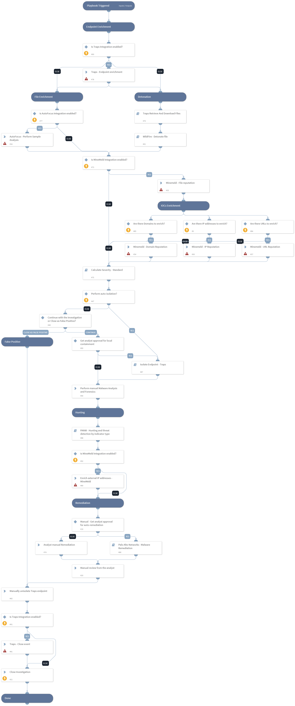

Deprecated. Use Malware Investigation and Response pack instead. For more information, refer to https://xsoar.pan.dev/docs/reference/packs/malware-investigation-and-response. This playbook is triggered by a Palo Alto Networks Cortex threat alert, generated by Traps.  The playbook performs host enrichment for the source host with Palo Alto Networks Traps, enriches information for the suspicious file with Palo Alto Networks Minemeld and AutoFocus, and automatically performs file detonation for the extracted file. It then performs IOC enrichment with Minemeld for all related IOCs, and calculates the incident severity based on all the findings. In addition we detonate the file for the full analysis report. 
The analyst can perform a manual memory dump for the suspected endpoint based on the incident’s severity, and choose to isolate the source endpoint with Traps.
Hunting tasks to find more endpoints that are infected is performed automatically based on a playbook input, and after all infected endpoints are found, remediation for all malicious IOCs is performed, including file quarantine, and IP and URLs blocking with Palo Alto Networks FireWall components such as Dynamic Address Groups and Custom URL Categories.
After the investigation review the incident is automatically closed.

## Dependencies

This playbook uses the following sub-playbooks, integrations, and scripts.

### Sub-playbooks

* PANW - Hunting and threat detection by indicator type
* Isolate Endpoint - Traps
* Traps Retrieve And Download Files
* Palo Alto Networks - Malware Remediation
* Calculate Severity - Standard
* WildFire - Detonate file

### Integrations

* Palo Alto Minemeld
* AutoFocus V2
* Traps

### Scripts

This playbook does not use any scripts.

### Commands

* file
* traps-get-endpoint-by-id
* domain
* url
* closeInvestigation
* ip
* traps-event-update
* autofocus-sample-analysis

## Playbook Inputs

---

| **Name** | **Description** | **Default Value** | **Required** |
| --- | --- | --- | --- |
| AutoIsolation | This input establishes the threshold severity from which to perform auto-isolation for the infected endpoint. Default is High. Specify the severity number: 0 - Unknown 0.5 - Informational 1 - Low 2 - Medium 3 - High 4 - Critical | 3 | Optional |
| traps_endpoint_id | Traps Endpoint ID. | incident.agentid | Optional |
| traps_file_name | Traps file name. | incident.filename | Optional |
| traps_event_id | Traps event ID. | incident.trapsid | Optional |
| SHA256 | File SHA256. | incident.sha256 | Optional |
| DAG | This input establishes whether Palo Alto Networks Panorama or Firewall Dynamic Address Groups are used. Specify Dynamic Address Group tag name for IP handling. |  | Optional |
| CustomURLCategory | This input establishes whether Palo Alto Networks Panorama or Firewall Custom URL Categories are used. Specify Category name for URL handling. |  | Optional |
| CustomBlockRule | This input establishes whether Palo Alto Networks Panorama or Firewall Custom block rules are used. Specify True to use Custom Block Rules. |  | Optional |
| IPListName | This input establishes whether Palo Alto Networks Panorama or Firewall External Dynamic Lists, are used for IP Blockage. Specify the EDL name for IP handling. |  | Optional |
| Miner | This input establishes whether Palo Alto Networks Minemeld is used. Specify Miner name to update with the malicious indicators. |  | Optional |
| StaticAddressGroup | This input establishes whether Palo Alto Networks Panorama or Firewall Static address groups are used. Specify Static address group name for IP handling. |  | Optional |
| AutoCommit | This input establishes whether to commit the configuration automatically. Yes - Commit automatically. No - Commit manually. | no | Optional |
| URLListName | This input establishes whether Palo Alto Networks Panorama or Firewall External Dynamic Lists are used for URL Blockage. Specify the EDL name for URL handling. |  | Optional |
| EDLServerIP | This input establishes whether Palo Alto Networks Panorama or Firewall External Dynamic Lists are used: \* The IP address of the web server on which the files are stored. \* The web server IP address is configured in the integration instance. |  | Optional |
| Traps | This input establishes whether Palo Alto Networks Traps remediation will take place. Specify Yes/No. | yes | Optional |

## Playbook Outputs

---
There are no outputs for this playbook.

## Playbook Image

---

