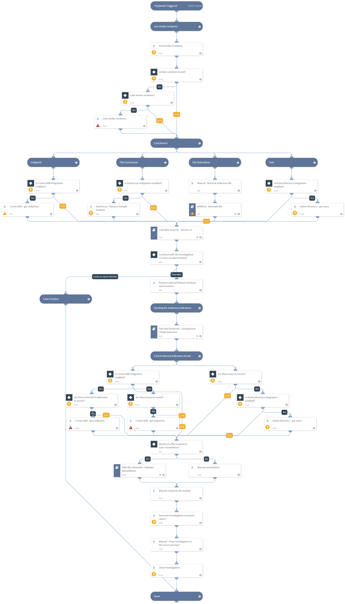

Deprecated. Use Malware Investigation and Response pack instead. For more information, refer to https://xsoar.pan.dev/docs/reference/packs/malware-investigation-and-response.This playbook is triggered by a Palo Alto Networks Cortex threat alert, generated by Traps.  The playbook performs host enrichment for the source host with Palo Alto Networks Traps, enriches information for the suspicious file with Palo Alto Networks Minemeld and AutoFocus, and automatically performs file detonation for the extracted file. It then performs IOC enrichment with Minemeld for all related IOCs, and calculates the incident severity based on all the findings. In addition we detonate the file for the full analysis report. 
The analyst can perform a manual memory dump for the suspected endpoint based on the incident’s severity, and choose to isolate the source endpoint with Traps.
Hunting tasks to find more endpoints that are infected is performed automatically based on a playbook input, and after all infected endpoints are found, remediation for all malicious IOCs is performed, including file quarantine, and IP and URLs blocking with Palo Alto Networks FireWall components such as Dynamic Address Groups and Custom URL Categories.
After the investigation review the incident is automatically closed.

## Dependencies

This playbook uses the following sub-playbooks, integrations, and scripts.

### Sub-playbooks

* WildFire - Detonate file
* Calculate Severity - Generic v2
* Palo Alto Networks - Malware Remediation
* Palo Alto Networks - Hunting And Threat Detection

### Integrations

* Cortex XDR - IR

### Scripts

* FindSimilarIncidents
* GenerateInvestigationSummaryReport

### Commands

* ad-get-user
* autofocus-sample-analysis
* xdr-get-endpoints
* closeInvestigation
* linkIncidents

## Playbook Inputs

---

| **Name** | **Description** | **Default Value** | **Required** |
| --- | --- | --- | --- |
| similarIncidentFields | This input accepts a comma-separated list of similar incident fields keys. |  | Optional |
| LinkSimilarIncidents | This input determines whether similar incidents that are found will be linked. Specify Yes/No. |  | Optional |
| SHA256 | File SHA256. | incident.sha256 | Optional |
| endpoint_id_list | A list of XDR endpoint IDs. |  | Optional |
| UseXDR | This input determines whether Palo Alto Networks Cortex XDR remediation will take place. Specify Yes/No | Yes | Optional |
| DAG | This input determines whether Palo Alto Networks Panorama or Firewall Dynamic Address Groups are used. Specify Dynamic Address Group tag name for IP handling. |  | Optional |
| CustomURLCategory | This input determines whether Palo Alto Networks Panorama or Firewall Custom URL Categories are used. Specify Category name for URL handling. |  | Optional |
| CustomBlockRule | This input determines whether Palo Alto Networks Panorama or Firewall Custom block rules are used. Specify True to use Custom Block Rules. |  | Optional |
| IPListName | This input determines whether Palo Alto Networks Panorama or Firewall External Dynamic Lists are used for IP Blockage. Specify the EDL name for IP handling. |  | Optional |
| Miner | This input determines whether Palo Alto Networks Minemeld is used. Specify Miner name to update with the malicious indicators. |  | Optional |
| StaticAddressGroup | This input determines whether Palo Alto Networks Panorama or Firewall Static address groups are used. Specify Static address group name for IP handling. |  | Optional |
| AutoCommit | This input determines whether to commit the configuration automatically. Yes - Commit automatically. No - Commit manually. | No | Optional |
| URLListName | This input determines whether Palo Alto Networks Panorama or Firewall External Dynamic Lists are used for URL Blockage. Specify the EDL name for URL handling. |  | Optional |
| EDLServerIP | This input determines whether Palo Alto Networks Panorama or Firewall External Dynamic Lists are used: \* The IP address of the web server on which the files are stored. \* The web server IP address is configured in the integration instance. |  | Optional |
| Traps | This input determines whether Palo Alto Networks Traps remediation will take place. Specify Yes/No. | No | Optional |
| internal_range | A list of internal IP ranges to check IP addresses against. The list should be provided in CIDR notation, separated by commas. An example of a list of ranges would be: "172.16.0.0/12,10.0.0.0/8,192.168.0.0/16" \(without quotes\). If a list is not provided, will use default list provided in the IsIPInRanges script \(the known IPv4 private address ranges\). |  | Optional |
| InternalDomainName | The organizations internal domain name. This is provided for the script IsInternalHostName that checks if the detected host names are internal or external if the hosts contain the internal domains suffix. For example demisto.com. If there is more than one domain, use the \| character to separate values such as \(demisto.com\|test.com\) |  | Optional |
| InternalHostRegex | This is provided for the script IsInternalHostName that checks if the detected host names are internal or external. If the hosts match the organization's naming convention. For example the host testpc1 will have the following regex \\w\{6\}\\d\{1\} |  | Optional |

## Playbook Outputs

---

| **Path** | **Description** | **Type** |
| --- | --- | --- |
| IP.Address | IP addresses. | unknown |
| URL.Malicious.Description | For malicious URLs, the reason that the vendor decided that the URL is malicious. | unknown |
| URL.Malicious | Malicious URLs. | unknown |
| File.Malicious.Description | For malicious files, the reason that the vendor decided that the file is malicious. | unknown |

## Playbook Image

---

