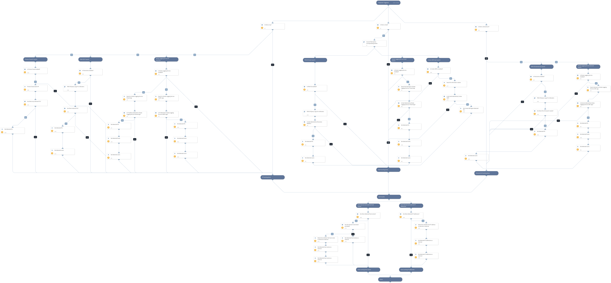

This is a multipurpose playbook used for hunting and threat detection. The playbook receives inputs based on hashes, IP addresses, or domain names provided manually or from outputs by other playbooks. 
The playbook leverages data received by PANW products including, Strata Logging Service, Autofocus and Pan-OS to search for IP addresses, host names and users related to the provided indicators.
The output provided by the playbook enables you to find possibly affected IP addresses, users, and endpoints.

## Dependencies

This playbook uses the following sub-playbooks, integrations, and scripts.

### Sub-playbooks

* Autofocus Query Samples, Sessions and Tags
* Convert file hash to corresponding hashes
* PAN-OS Query Logs For Indicators

### Integrations

This playbook does not use any integrations.

### Scripts

* IsIPInRanges
* IsIntegrationAvailable
* IsInternalHostName
* SetAndHandleEmpty

### Commands

* cdl-query-threat-logs
* cdl-query-traffic-logs
* cdl-query-url-logs
* prisma-cloud-network-search
* xdr-get-alerts

## Playbook Inputs

---

| **Name** | **Description** | **Default Value** | **Required** |
| --- | --- | --- | --- |
| SHA256 | SHA256 hash of the indicator to hunt. |  | Optional |
| MD5 | MD5 hash of the indicator to hunt. |  | Optional |
| SHA1 | SHA1 hash of the indicator to hunt. |  | Optional |
| IPAddresses | List of IP addresses. |  | Optional |
| URLDomain | List of domains or urls. |  | Optional |
| InternalRange | A list of internal IP ranges to check IP addresses against. The comma-separated list should be provided in CIDR notation. For example, a list of ranges would be: "172.16.0.0/12,10.0.0.0/8,192.168.0.0/16" \(without quotes\). | lists.PrivateIPs | Optional |
| InternalDomainName | The organizations internal domain name. This is provided for the script IsInternalHostName that checks if the detected host names are internal or external if the hosts contain the internal domains suffix. For example demisto.com. If there is more than one domain, use the \| character to separate values such as \(demisto.com\|test.com\) |  | Optional |
| InternalHostRegex | This is provided for the script IsInternalHostName that checks if the detected host names are internal or external. Checks if the hosts match the organization's naming convention. For example, the host testpc1 has the following regex \\w\{6\}\\d\{1\} |  | Optional |

## Playbook Outputs

---

| **Path** | **Description** | **Type** |
| --- | --- | --- |
| PANWHunting.DetectedUsers | User or array of users that were detected during hunting. | string |
| PANWHunting.DetectedInternalIPs | Internal IP addresses detected based on fields and inputs in your search. | string |
| PANWHunting.DetectedExternalIPs | External IP addresses detected based on fields and inputs in your search. | string |
| PANWHunting.DetectedInternalHosts | Internal host names detected based on fields and inputs in your search. | string |
| PANWHunting.DetectedExternalHosts | External host names detected based on fields and inputs in your search. | string |

## Playbook Image

---

