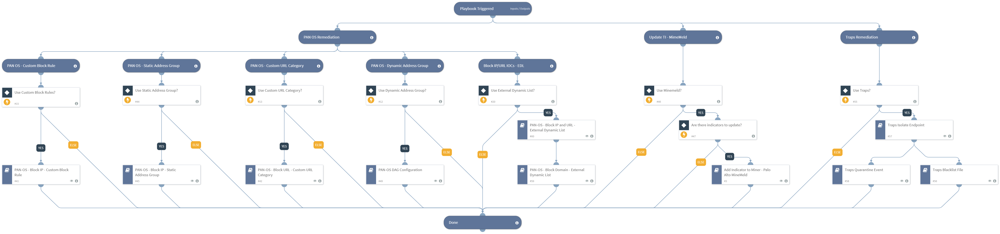

Deprecated. Use Malware Investigation and Response pack instead. For more information, refer to https://xsoar.pan.dev/docs/reference/packs/malware-investigation-and-response.This Playbook performs malicious IOC remediation using Palo Alto Networks integrations.

## Dependencies

This playbook uses the following sub-playbooks, integrations, and scripts.

### Sub-playbooks

* PAN-OS - Block URL - Custom URL Category
* Add Indicator to Miner - Palo Alto MineMeld
* PAN-OS - Block IP - Static Address Group
* PAN-OS - Block IP - Custom Block Rule
* Traps Quarantine Event
* Traps Blacklist File
* PAN-OS DAG Configuration
* PAN-OS - Block IP and URL - External Dynamic List
* Traps Isolate Endpoint
* Cortex XDR - Isolate Endpoint
* PAN-OS - Block Domain - External Dynamic List

### Integrations

This playbook does not use any integrations.

### Scripts

This playbook does not use any scripts.

### Commands

This playbook does not use any commands.

## Playbook Inputs

---

| **Name** | **Description** | **Default Value** | **Required** |
| --- | --- | --- | --- |
| DAG | This input establishes whether Palo Alto Networks Panorama or Firewall Dynamic Address Groups are used. Specify Dynamic Address Group tag name for IP handling. |  | Optional |
| CustomURLCategory | This input establishes whether Palo Alto Networks Panorama or Firewall Custom URL Categories are used. Specify Category name for URL handling. |  | Optional |
| CustomBlockRule | This input establishes whether Palo Alto Networks Panorama or Firewall Custom block rules are used. Specify True to use Custom Block Rules.  | False | Optional |
| IPListName | This input establishes whether Palo Alto Networks Panorama or Firewall External Dynamic Lists, are used for IP Blockage. Specify the EDL name for IP handling. |  | Optional |
| IP | Malicious IP Addresses to block. | IP.Address | Optional |
| URL | Malicious URLs to block. | URL.Data | Optional |
| LogForwarding | Panorama log forwarding object name. |  | Optional |
| StaticAddressGroup | This input establishes whether Palo Alto Networks Panorama or Firewall Static address groups are used. Specify Static address group name for IP handling. |  | Optional |
| Miner | This input establishes whether Palo Alto Networks Minemeld is used. Specify Miner name to update with the malicious indicators. |  | Optional |
| AutoCommit | This input establishes whether to commit the configuration automatically. Yes - Commit automatically. No - Commit manually. | No | Optional |
| URLListName | This input establishes whether Palo Alto Networks Panorama or Firewall External Dynamic Lists are used for URL Blockage. Specify the EDL name for URL handling. |  | Optional |
| EDLServerIP | This input establishes whether Palo Alto Networks Panorama or Firewall External Dynamic Lists are used: \* The IP address of the web server on which the files are stored. \* The web server IP address is configured in the integration instance. |  | Optional |
| Traps | This input establishes whether Palo Alto Networks Traps remediation will take place. Specify Yes/No |  | Optional |
| EndpointId | Traps Endpoint ID to isolate. |  | Optional |
| EventId | Traps event ID to perform file quarantine on. |  | Optional |
| SHA256 | SHA256 to blacklist using Traps. | File.SHA256 | Optional |
| DomainListName | This input establishes whether Palo Alto Networks Panorama or Firewall External Dynamic Lists, are used for domain blockage. Specify the EDL name for domain handling. |  | Optional |
| UseXDR | This input establishes whether Palo Alto Networks Cortex XDR remediation will take place. Specify Yes/No |  | Optional |
| xdr_endpoint_id | The endpoint ID \(string\) to isolate using Cortex XDR. You can retrieve the string from the xdr-get-endpoints command. | PaloAltoNetworksXDR.Endpoint.endpoint_id | Optional |

## Playbook Outputs

---
There are no outputs for this playbook.

## Playbook Image

---

