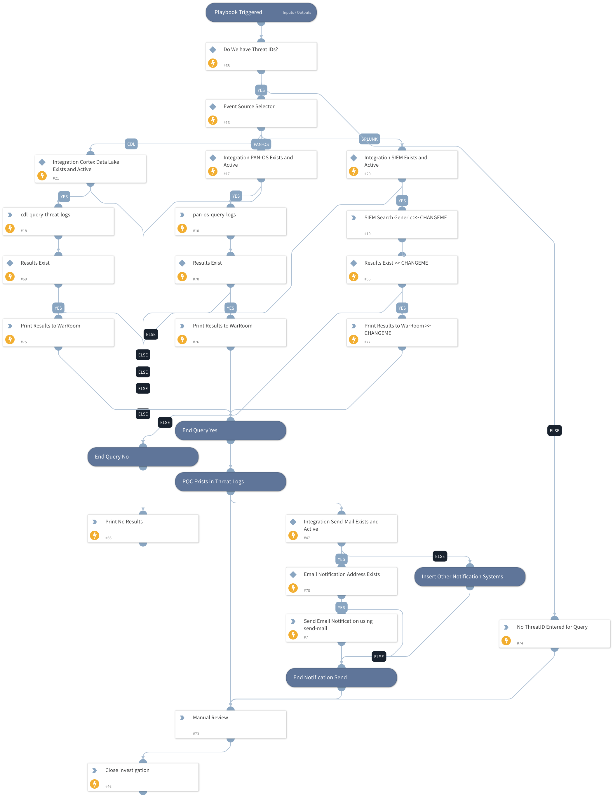

Search Vuln Sigs in Threat Logs for use of Post Quantum Crypto Signatures

## Dependencies

This playbook uses the following sub-playbooks, integrations, and scripts.

### Sub-playbooks

This playbook does not use any sub-playbooks.

### Integrations

* Mail Sender (New)
* Cortex Data Lake
* PAN-OS

### Scripts

* Print
* PrettyPrint

### Commands

* pan-os-query-logs
* cdl-query-threat-logs
* closeInvestigation
* send-mail

## Playbook Inputs

---

| **Name** | **Description** | **Default Value** | **Required** |
| --- | --- | --- | --- |
| notify_email | Send email notification for new malware | None | Optional |
| log_source | where should we poll for Log Events to investigate panos cdl siem | cdl | Optional |
| threat_ids | threat ID to search for as CSV list | 93486,93487,93488,93489,93490,93492,93494,93496,93497,93498,93499,93500,93501,93502,93503,93504,93505,93506,93507 | Optional |
| time_range_hours | how many hours back to query for events in hours | 24 | Optional |
| num_logs | how many logs to bring back | 100 | Optional |

## Playbook Outputs

---
There are no outputs for this playbook.

## Playbook Image

---

