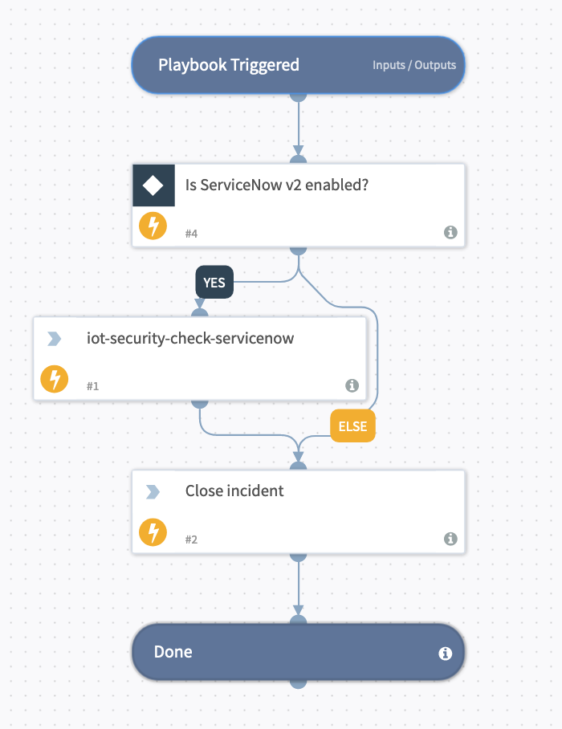

This playbook should be used in a recurring Job to check the ServiceNow ticket status for the Palo Alto Networks IoT (previously Zingbox) alerts or vulnerabilties.

## Dependencies
This playbook uses the following sub-playbooks, integrations, and scripts.

### Sub-playbooks
This playbook does not use any sub-playbooks.

### Integrations
* ServiceNow v2

### Scripts
* iot-security-check-servicenow

### Commands
* closeInvestigation

## Playbook Inputs
---
There are no inputs for this playbook.

## Playbook Outputs
---
There are no outputs for this playbook.

## Playbook Image
---

