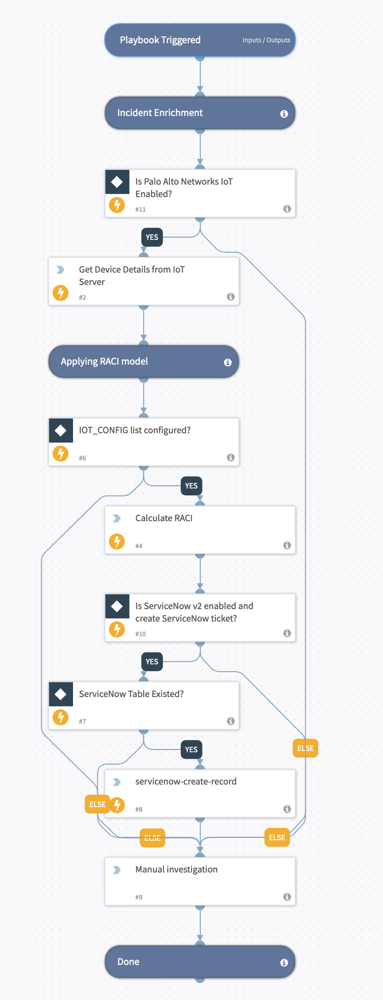

This playbook creates a ServiceNow ticket after the incident is enriched by Palo Alto Networks IoT security portal (previously Zingbox Cloud).

## Dependencies
This playbook uses the following sub-playbooks, integrations, and scripts.

### Sub-playbooks
This playbook does not use any sub-playbooks.

### Integrations
* Palo Alto Networks IoT
* ServiceNow v2

### Scripts
* iot-security-get-raci

### Commands
* iot-security-get-device
* servicenow-create-record

## Playbook Inputs
---

| **Name** | **Description** | **Default Value** | **Required** |
| --- | --- | --- | --- |
| IoTConfigListName | The list name defined in the XSOAR Lists for the RACI and ServiceNow calculation. | IOT_CONFIG | Optional |
| CreateServiceNowTicket | Determines if a ServiceNow ticket should be created based on the RACI calculation. Set to True to create an incident. | false | Optional |

## Playbook Outputs
---

| **Path** | **Description** | **Type** |
| --- | --- | --- |
| PaloAltoNetworksIoT | This path will have field "device" for the device details and "raci" if the command "iot\-security\-get\-raci" has output. | string |
| ServiceNow.Record | The ServiceNow record after creating the ServiceNow ticket. | string |

## Playbook Image
---

