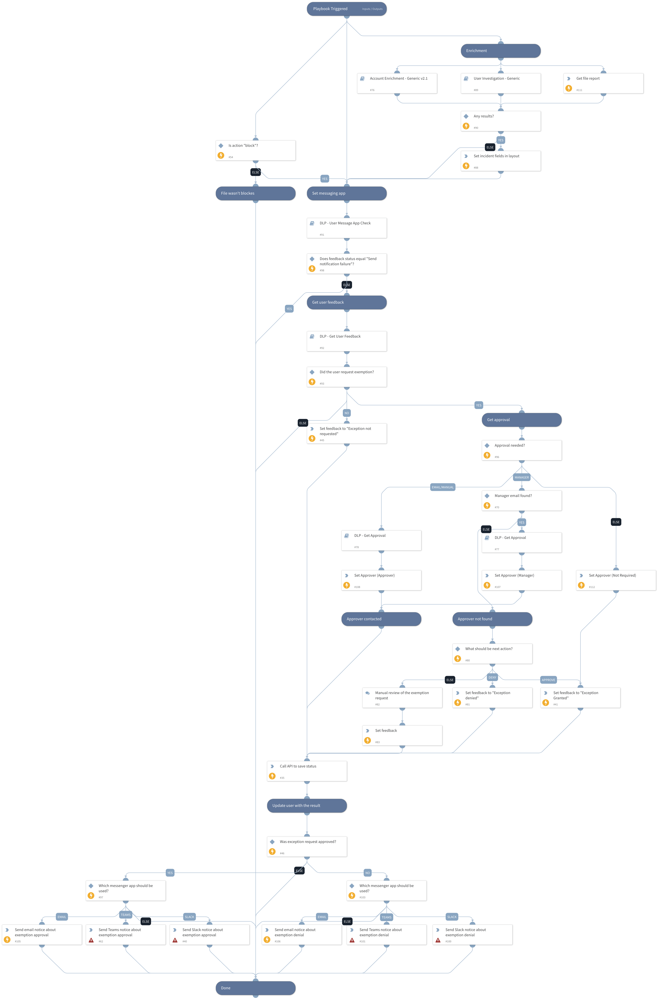

Collects feedback from user  about blocked files.

## Dependencies

This playbook handles Palo Alto Networks Enterprise DLP incidents. It Collects feedback from the user about blocked activities and automates the approval process, if required. Supported communication methods are Slack, Microsoft Teams and Email.

### Sub-playbooks

* DLP - Get User Feedback
* DLP - User Message App Check
* Account Enrichment - Generic v2.1
* DLP - Get Approval
* User Investigation - Generic

### Integrations

* SlackV3
* Microsoft Teams
* Palo_Alto_Networks_Enterprise_DLP

### Scripts

EmailAskUser

### Commands

* pan-dlp-get-report
* pan-dlp-update-incident
* send-notification
* setIncident

## Playbook Inputs

---

| **Name** | **Description** | **Default Value** | **Required** |
| --- | --- | --- | --- |
| ApprovalTarget | Can be either empty or one of the following: - Manager - &lt;email_address&gt; - Manual  "Manager" - the user's manager details will be retrieved using Active Directory enrichment and will be used for approving the exemption, if requested. &lt;email_address&gt; - the configured email address will be used for the approval process. "Manual" - Approval will be a manual task for a further review.  Leaving this input empty will skip the approval process. |  | Optional |
| ActionOnApproverNotFound | If the approver cannot be contacted via Slack or MS Teams, what should be the next action: - Deny - Approve - Manual | Manual | Optional |
| SendMailInstance | This input is only relevant when the "UserMessageApp" or "ApproverMessageApp" are set to "Email". The name of the instance to be used when executing the "send-mail" command in the playbook. In case it will be empty, all available instances will be used \(default\). |  | Optional |
| UserMessageApp | The communication method with the user. Can be one of the following:  - Slack - Microsoft Teams - Email  If you choose to set "Email", it's also possible to set the relevant email integration instance with the "SendEmailInstance" input. | Slack | Optional |
| ApproverMessageApp | The communication method with the approver. Can be one of the following:  - Slack - Microsoft Teams - Email - Manual  If you choose to set "Email", it's also possible to set the relevant email integration instance with the "SendEmailInstance" input. | Slack | Optional |
| DenyMessage | The message that users will receive when they are denied. | Thank you for the request. Your request was reviewed and denied. | Optional |

## Playbook Outputs

---
There are no outputs for this playbook.

## Playbook Image

---

