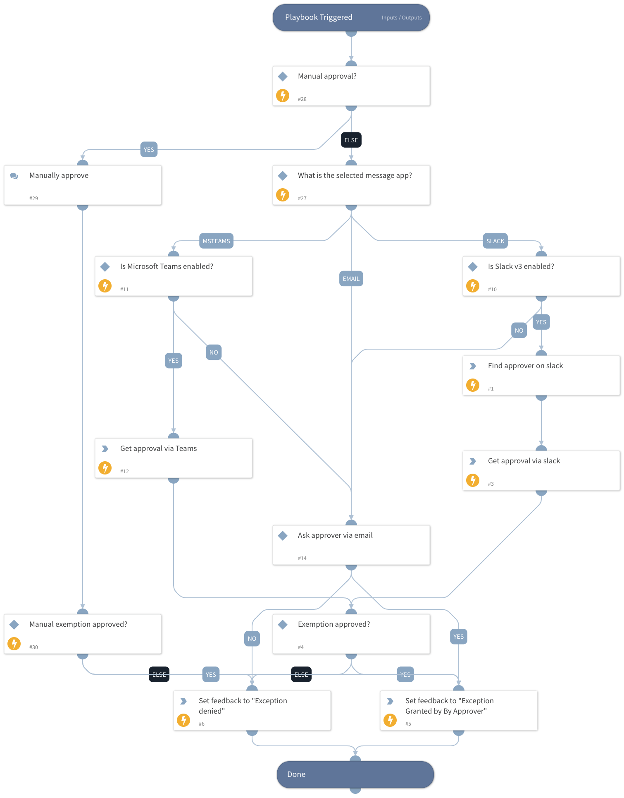

Get an approver response for an exemption request from a user.

## Dependencies

This playbook uses the following sub-playbooks, integrations, and scripts.

### Sub-playbooks

This playbook does not use any sub-playbooks.

### Integrations

* SlackV3

### Scripts

* MicrosoftTeamsAsk
* SlackAskV2
* IsIntegrationAvailable

### Commands

* slack-get-user-details
* setIncident

## Playbook Inputs

---

| **Name** | **Description** | **Default Value** | **Required** |
| --- | --- | --- | --- |
| Approver | The email address of the approver. |  | Optional |
| SendMailInstance | The name of the instance to be used when executing the "send-mail" command in the playbook. In case it will be empty, all available instances will be used \(default\). |  | Optional |
| ApproverMessageApp | The communication method with the approver. Can be one of the following:  - Slack - Microsoft Teams - Email  If you choose to set "Email", it's also possible to set the relevant email integration instance with the "SendEmailInstance" input. |  | Optional |
| Detections | Detected violation snippets. |  | Optional |

## Playbook Outputs

---

| **Path** | **Description** | **Type** |
| --- | --- | --- |
| ApproverExist | Whether the exemption approver was found via Slack. | string |

## Playbook Image

---

