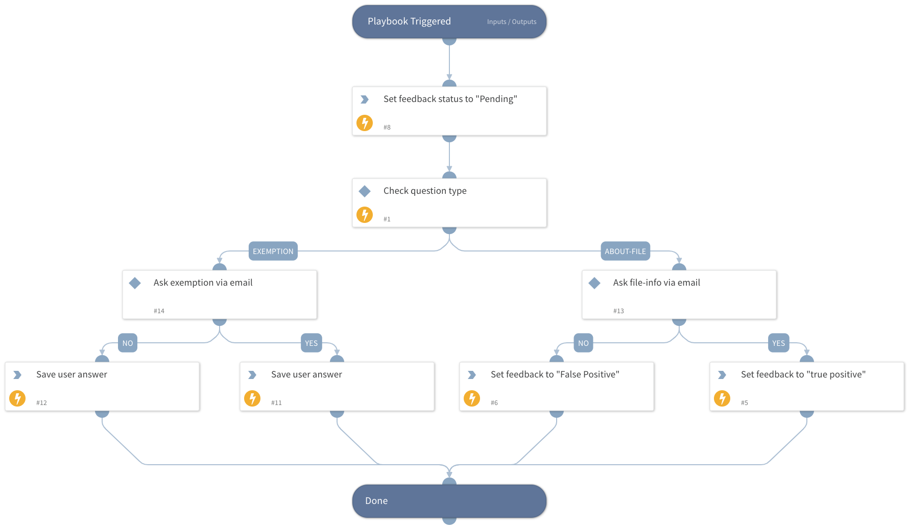

Get the user feedback via email on a blocked file, whether it is false or true positive and if an exemption is needed.

## Dependencies

This playbook uses the following sub-playbooks, integrations, and scripts.

### Sub-playbooks

This playbook does not use any sub-playbooks.

### Integrations

Palo_Alto_Networks_Enterprise_DLP

### Scripts

SetAndHandleEmpty

### Commands

* setIncident
* pan-dlp-update-incident

## Playbook Inputs

---

| **Name** | **Description** | **Default Value** | **Required** |
| --- | --- | --- | --- |
| UserDisplayName | The display name of the user. |  | Optional |
| data_profile_name | The name of the DLP data profile that detected the violation. |  | Optional |
| file_name | The name of the file that triggered the incident. |  | Optional |
| question_type | Whether to ask the user about the file content or about an exemption. |  | Optional |
| SendMailInstance | The name of the instance to be used when executing the "send-mail" command in the playbook. In case it will be empty, all available instances will be used \(default\). |  | Optional |
| UserEmail | The user email address. |  | Optional |
| Snippets | The snippets of the violation. |  | Optional |

## Playbook Outputs

---

| **Path** | **Description** | **Type** |
| --- | --- | --- |
| UserRequestedExemption | Whether the user requested exemption or not. | unknown |

## Playbook Image

---

