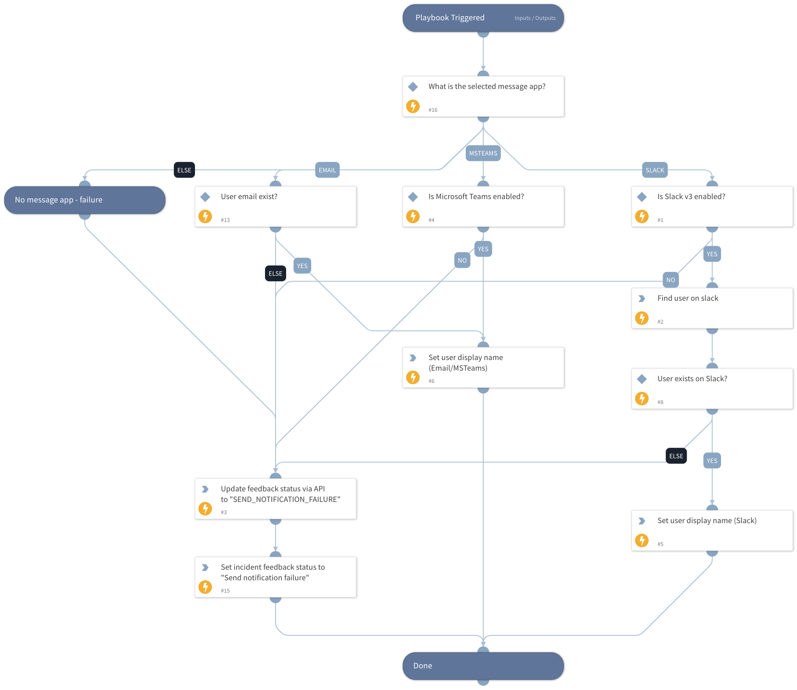

Check if the given message app exists and is configured and retrieve the user details from it.

## Dependencies

This playbook uses the following sub-playbooks, integrations, and scripts.

### Sub-playbooks

This playbook does not use any sub-playbooks.

### Integrations

* SlackV3
* Palo_Alto_Networks_Enterprise_DLP

### Scripts

* IsIntegrationAvailable
* Set

### Commands

* pan-dlp-update-incident
* setIncident
* slack-get-user-details

## Playbook Inputs

---

| **Name** | **Description** | **Default Value** | **Required** |
| --- | --- | --- | --- |
| UserEmail | The user email address that will be used through email communication in case both Slack and MS Teams are not enabled. |  | Optional |
| UserDisplayName | The display name of the user. Will be used in case MS Teams or Email are the message app. |  | Optional |
| UserMessageApp | The communication method with the user. Can be one of the following:  - Slack - Microsoft Teams - Email  If you choose to set "Email", it's also possible to set the relevant email integration instance with the "SendEmailInstance" input. |  | Optional |

## Playbook Outputs

---

| **Path** | **Description** | **Type** |
| --- | --- | --- |
| user_display_name | The user display name. | unknown |
| Slack.User | The user name returned from Slack. | unknown |

## Playbook Image

---

