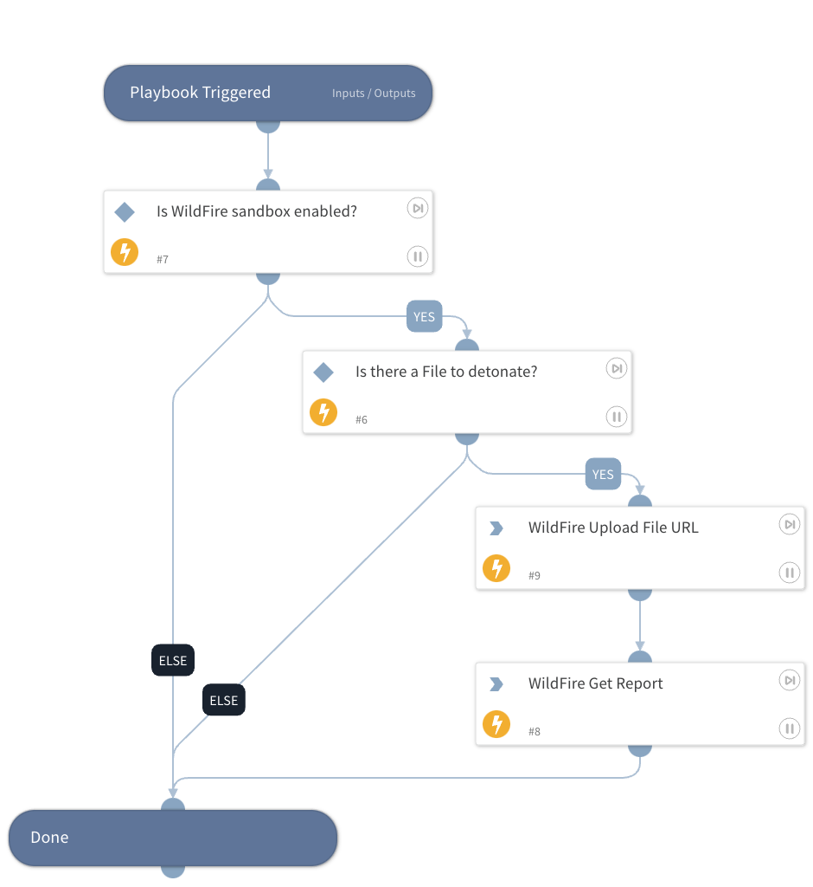

Detonate one or more files using the Wildfire v2 integration. This playbook returns relevant reports to the War Room and file reputations to the context data.
The detonation supports the following file types -
APK, JAR, DOC, DOCX, RTF, XLS, XLSX, PPT, PPTX, XML, PE32, PDF, DMG, PKG, RAR, 7Z.

## Dependencies

This playbook uses the following sub-playbooks, integrations, and scripts.

### Sub-playbooks

This playbook does not use any sub-playbooks.

### Integrations

* Palo_Alto_Networks_WildFire_v2

### Scripts

This playbook does not use any scripts.

### Commands

* wildfire-upload-file-url
* wildfire-report

## Playbook Inputs

---

| **Name** | **Description** | **Default Value** | **Required** |
| --- | --- | --- | --- |
| FileURL | URL of the web file to detonate. The FileUrl is taken from the context. | FileURL | Optional |
| Interval | Duration for executing the pooling \(in seconds\). | 1 | Optional |
| Timeout | The duration after which to stop pooling and to resume the playbook \(in seconds\). | 8 | Optional |
| ReportFileType | The resource type to download. Default is pdf. XML is also possible. |  | Optional |

## Playbook Outputs

---

| **Path** | **Description** | **Type** |
| --- | --- | --- |
| DBotScore | The DBotScore object. | unknown |
| DBotScore.Score | The actual score. | number |
| File.Size | File size. | number |
| File.MD5 | MD5 hash of the file. | string |
| File.SHA1 | SHA1 hash of the file. | string |
| File.Type | File type, e.g., "PE". | string |
| File.SHA256 | SHA256 hash of the file. | string |
| File.EntryID | The Entry ID of the sample. | string |
| File.Malicious.Vendor | For malicious files, the vendor that made the decision. | string |
| File.Name | Filename. | string |
| File.Malicious.Description | For malicious files, the reason the vendor made the decision. | string |
| DBotScore.Indicator | The indicator tested. | string |
| DBotScore.Type | The type of the indicator. | string |
| DBotScore.Vendor | Vendor used to calculate the score. | string |
| IP.Address | IPs relevant to the sample. | string |
| File | The file object. | unknown |
| InfoFile | The report file object. | unknown |
| InfoFile.EntryID | The EntryID of the report file. | string |
| InfoFile.Extension | The extension of the report file. | string |
| InfoFile.Name | The name of the report file. | string |
| InfoFile.Info | The info of the report file. | string |
| InfoFile.Size | The size of the report file. | number |
| InfoFile.Type | The type of the report file. | string |
| File.Malicious | The malicious object. | unknown |
| WildFire.Report | The submission object. | unknown |
| WildFire.Report.MD5 | MD5 of the submission. | string |
| WildFire.Report.SHA256 | SHA256 of the submission. | string |
| WildFire.Report.FileType | The type of the submission. | string |
| WildFire.Report.Status | The status of the submission. | string |
| WildFire.Report.Size | The size of the submission. | number |
| WildFire.Report.ExtractedURL.URL | The extracted URL. | string |
| WildFire.Report.ExtractedURL.Verdict | The extracted verdict. | number |

## Playbook Image

---

