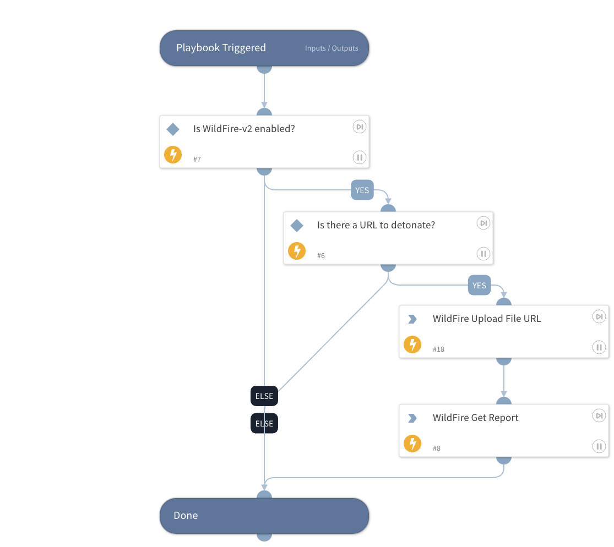

Detonate a webpage or remote file using the WildFire v2 integration. This playbook returns relevant reports to the War Room and file reputations to the context data.
The detonation supports the following file types:
APK, JAR, DOC, DOCX, RTF, OOXLS, XLSX, PPT, PPTX, XML, PE32, PDF, DMG, PKG, RAR, 7Z, JS.

## Dependencies

This playbook uses the following sub-playbooks, integrations, and scripts.

### Sub-playbooks

This playbook does not use any sub-playbooks.

### Integrations

* Palo_Alto_Networks_WildFire_v2
* WildFire-v2

### Scripts

This playbook does not use any scripts.

### Commands

* wildfire-report
* wildfire-upload-url

## Playbook Inputs

---

| **Name** | **Description** | **Default Value** | **Required** |
| --- | --- | --- | --- |
| URL | URL of the webpage or file url to detonate. The URL is taken from the context. | URL.Data | Optional |
| Interval | Duration for executing the polling \(in seconds\). | 60 | Optional |
| Timeout | The duration after which to stop polling and to resume the playbook \(in seconds\). | 600 | Optional |
| ReportFileType | The resource type to download. Values: PDF (default), XML. |  | Optional |

## Playbook Outputs

---

| **Path** | **Description** | **Type** |
| --- | --- | --- |
| DBotScore | The DBotScore object. | unknown |
| DBotScore.Score | The actual score. | number |
| File.Size | File size. | number |
| File.MD5 | MD5 hash. | string |
| File.SHA1 | SHA1 hash. | string |
| File.Type | File type e.g. "PE". | string |
| File.SHA256 | SHA256 hash. | string |
| File.EntryID | The Entry ID of the sample. | string |
| File.Malicious.Vendor | For malicious files, the vendor that determined that the file is malicious. | string |
| File.Name | Filename. | string |
| File.Malicious.Description | For malicious files, the reason the vendor determined that the file is malicious. | string |
| DBotScore.Indicator | The indicator we tested. | string |
| DBotScore.Type | The type of indicator. | string |
| DBotScore.Vendor | Vendor used to calculate the score. | string |
| IP.Address | IPs relevant to the sample. | string |
| File | The File object. | unknown |
| InfoFile | The report file object. | unknown |
| InfoFile.EntryID | The EntryID of the report file. | string |
| InfoFile.Extension | The extension of the report file. | string |
| InfoFile.Name | The name of the report file. | string |
| InfoFile.Info | The info of the report file. | string |
| InfoFile.Size | The size of the report file. | number |
| InfoFile.Type | The type of the report file. | string |
| File.Malicious | The malicious object. | unknown |
| WildFire.Report | The submission object. | unknown |
| WildFire.Report.MD5 | MD5 of the submission. | string |
| WildFire.Report.SHA256 | SHA256 of the submission. | string |
| WildFire.Report.FileType | The type of the submission. | string |
| WildFire.Report.Status | The status of the submission. | string |
| WildFire.Report.Size | The size of the submission. | number |
| WildFire.Report.URL | URL of the submission. | string |
| WildFire.Report.detection_reasons | The detection reasons object. | unknown |
| WildFire.Report.detection_reasons.description | Reason for the detection verdict. | string |
| WildFire.Report.detection_reasons.name | Name of the detection. | string |
| WildFire.Report.detection_reasons.type | Type of the detection. | string |
| WildFire.Report.detection_reasons.verdict | Verdict of the detection. | string |
| WildFire.Report.detection_reasons.artifacts | Artifacts for the detection reasons. | string |
| WildFire.Report.iocs | Associated IOCs. | string |
| WildFire.Report.ExtractedURL.URL | The extracted URL. | string |
| WildFire.Report.ExtractedURL.Verdict | The extracted verdict. | number |

## Playbook Image

---

