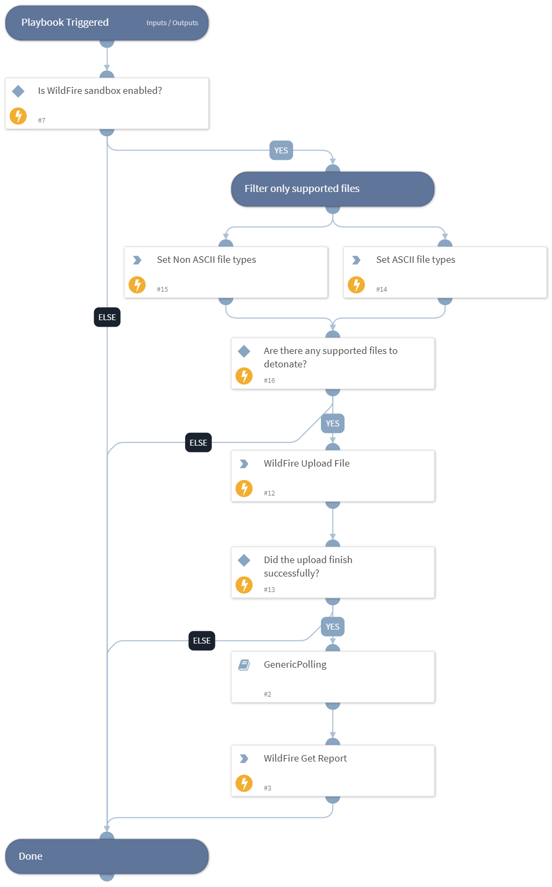

Detonate one or more files using the Wildfire integration. This playbook
returns relevant reports to the War Room and file reputations to the context data.
The detonation supports the following file types -
APK, JAR, DOC, DOCX, RTF, XLS, XLSX, PPT, PPTX, OOXML, PE32, PE, PDF, DMG, PKG, RAR, 7Z, JS, ELF, HTA, LNK, VBS, PS1, PERL, PYTHON, SHELL.

Note: Base64 encoded files are currently not supported

## Dependencies

This playbook uses the following sub-playbooks, integrations, and scripts.

### Sub-playbooks

* GenericPolling

### Integrations

* Palo_Alto_Networks_WildFire_v2

### Scripts

* SetAndHandleEmpty

### Commands

* wildfire-upload
* wildfire-report

## Playbook Inputs

---

| **Name** | **Description** | **Default Value** | **Required** |
| --- | --- | --- | --- |
| File | File object of the file to detonate. The file is taken from the context. | File | Optional |
| Interval | The duration for executing the polling \(in minutes\). | 1 | Optional |
| Timeout | The duration after which to stop polling and to resume the playbook. \(in minutes\) | 15 | Optional |
| ReportFileType | The resource type to download. |  | Optional |

## Playbook Outputs

---

| **Path** | **Description** | **Type** |
| --- | --- | --- |
| DBotScore.Score | The actual score. | string |
| DBotScore.Type | The type of the indicator. | string |
| File.Type | The file type, e.g. "PE". | string |
| File.Size | The file size | number |
| File.MD5 | The MD5 hash of the file. | string |
| File.Name | The filename. | string |
| File.SHA1 | The SHA1 hash of the file. | string |
| File | The file object. | unknown |
| File.SHA256 | TheSHA256 hash of the file. | string |
| File.Malicious | The malicious object. | unknown |
| File.Malicious.Vendor | The vendor that made the decision that the file is malicious. | string |
| DBotScore | The DBot object. | unknown |
| DBotScore.Indicator | The indicator that was tested. | string |
| DBotScore.Vendor | The vendor used to calculate the score. | string |
| WildFire.Report | The submission object. | unknown |
| WildFire.Report.Status | The status of the submission. | string |
| WildFire.Report.SHA256 | The SHA256 hash of the submission. | string |
| InfoFile | The report file object. | unknown |
| InfoFile.EntryID | The EntryID of the report file. | string |
| InfoFile.Extension | The extension of the report file. | string |
| InfoFile.Name | The name of the report file. | string |
| InfoFile.Info | The info of the report file. | string |
| InfoFile.Size | The size of the report file. | number |
| InfoFile.Type | The type of the report file. | string |
| WildFire.Report.MD5 | The MD5 hash of the submission. | string |
| WildFire.Report.FileType | The type of the submission. | string |
| WildFire.Report.Size | The size of the submission. | number |

## Playbook Image

---

