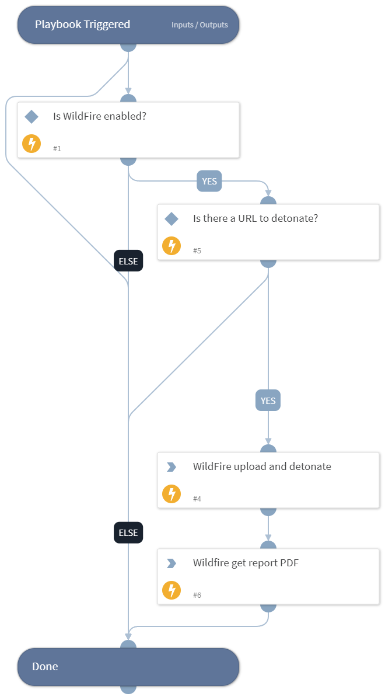

Detonate a URL using the WFire integration. This playbook returns relevant reports for a submitted URL and URL reputation to the context data.

## Dependencies

This playbook uses the following sub-playbooks, integrations, and scripts.

### Sub-playbooks

This playbook does not use any sub-playbooks.

### Integrations

* Palo_Alto_Networks_WildFire_v2

### Scripts

* IsIntegrationAvailable

### Commands

* wildfire-report
* wildfire-upload-url

## Playbook Inputs

---

| **Name** | **Description** | **Default Value** | **Required** |
| --- | --- | --- | --- |
| URL | The details of the URL to detonate. |  | Optional |

## Playbook Outputs

---
There are no outputs for this playbook.

## Playbook Image

---

