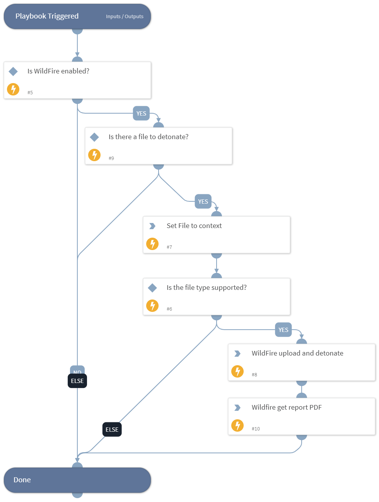

This playbook uploads, detonates, and analyzes files for the Wildfire sandbox.

## Dependencies
This playbook uses the following sub-playbooks, integrations, and scripts.

### Sub-playbooks
This playbook does not use any sub-playbooks.

### Integrations
Palo_Alto_Networks_WildFire_v2

### Scripts
* Set
* IsIntegrationAvailable

### Commands
* wildfire-upload
* wildfire-report

## Playbook Inputs
---

| **Name** | **Description** | **Default Value** | **Required** |
| --- | --- | --- | --- |
| File | The details of the file to detonate. |  | Optional |

## Playbook Outputs
---

| **Path** | **Description** | **Type** |
| --- | --- | --- |
| WildFire.Report | The Wildfire findings results. | string |

## Playbook Image
---

