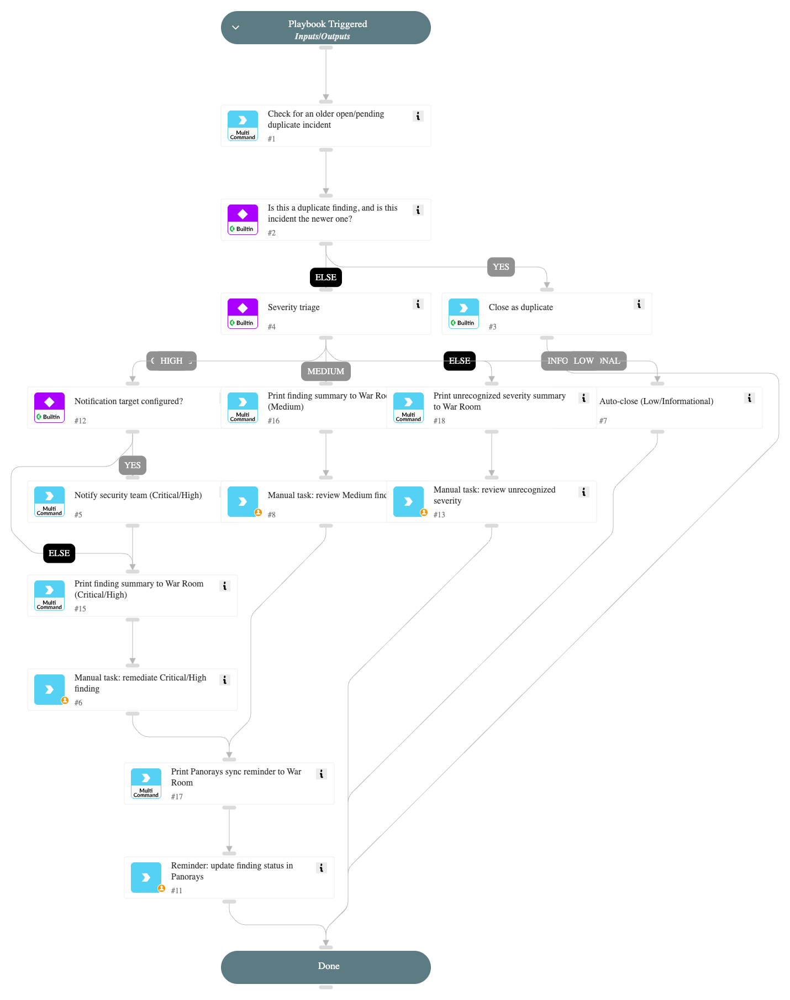

# Panorays

This pack provides an integration with the **Panorays** platform to monitor and manage internal security findings and posture.

## What does this pack do?

This pack enables you to integrate Panorays security posture data into Cortex XSOAR to automate the management of your organization's internal findings.

* **Automated incident ingestion:** Automatically fetch and create incidents in Cortex XSOAR based on internal security findings identified by Panorays for your organization.
* **Supply chain monitoring:** Automatically create incidents for critical findings detected across your supplier (third-party) portfolio, enriched with the supplier's name, domain, business impact, and risk scores.
* **Internal visibility:** Retrieve detailed lists of self-assessment findings, including severity, category, and affected assets, directly within the Cortex XSOAR War Room.
* **Posture management:** Accelerate your response to internal security gaps by centralizing Panorays findings alongside your other security tools.

## Monitoring your supply chain

A single instance fetches one scope, selected by the **Findings scope** parameter. To ingest both your own
findings and your suppliers' findings, configure two instances of the integration:

| Instance | Findings scope | Creates incidents of type |
| --- | --- | --- |
| Company posture | `Company Findings` | Panorays Finding |
| Supply chain | `Supplier Findings` | Panorays Supplier Finding |

For the supply chain instance, set **Incident type** to **Panorays Supplier Finding**. By default only
**CRITICAL** findings create incidents; widen this with the **Supplier finding severities** parameter.

Severity values are upper case (`CRITICAL`, `HIGH`, `MEDIUM`, `LOW`, `INFO`) and are matched exactly by the
Panorays API, so a value such as `Critical` returns no results.

Finding statuses are `OPEN`, `REOPENED`, and `DONE`. The **Supplier finding statuses** parameter defaults to
`OPEN,REOPENED`, which skips findings that have already been remediated while still raising an incident when a
previously closed finding is reopened. Note that a supplier can hold critical findings that are all `DONE`, in
which case no incidents are created; widen the status or severity filters when validating a new instance.

Each supplier finding incident is enriched with the supplier's name, ID, primary domain, business impact,
combined score, posture score, risk rating, and tags, so an analyst can judge how much the affected vendor
matters without leaving Cortex XSOAR.

### Rate limits and portfolio size

The Panorays API allows **150 requests per minute** and blocks the caller for a full hour when that ceiling is
exceeded. There is no portfolio-wide supplier findings endpoint, so the integration enumerates your suppliers
and then requests findings per supplier — roughly one request per supplier, per fetch.

The integration protects against the block in three ways:

* Requests are throttled to the **Maximum API requests per minute** setting (default 120).
* If the limit is reached anyway, the fetch stops immediately rather than polling the remaining
  suppliers while blocked, and resumes from the same supplier on a later run.

If an instance does get blocked, disable **Fetches incidents** until the hour has elapsed. Leaving it
enabled means every fetch fails against the block, and the instance may be re-blocked as soon as the
first one expires.
* The supplier list is cached and re-enumerated only once per **Supplier list cache TTL (hours)** (default 12).
* If a fetch reaches **Maximum number of incidents to fetch per run** part-way through the portfolio, it
  records its position and resumes there on the next run. When the limit falls in the middle of a single
  supplier's findings, the cursor stays on that supplier and the next run continues it, so the limit is
  honored and no finding is skipped. A ledger of already-ingested finding IDs prevents duplicates when a
  supplier is re-read this way.

Because the window start is frozen while a pass is in progress, a portfolio that takes several runs to
traverse still sees a single consistent time window. The window only advances once a full pass completes.

For large portfolios, keep the fetch interval at 15 minutes or higher, and consider narrowing the scope with
the **Supplier segment IDs** or **Supplier tags** parameters.

## Panorays Finding - Triage and Response playbook

This pack includes a playbook that triages "Panorays Finding" incidents end-to-end without depending on any
specific external ITSM tool:

* Detects and closes duplicate incidents already tracking the same Panorays Finding ID.
* Branches on finding severity: Critical/High findings trigger an optional notification (via any mail/chat
  integration implementing the generic `send-notification` command) and a native remediation task with an SLA;
  Medium findings go to an analyst review task; Low/Informational findings are auto-closed; any unrecognized or
  empty severity value is routed to a manual review task rather than being auto-closed.
* Reminds the analyst to sync the resolved status back to Panorays.

### Extending with your own ITSM

This pack intentionally does not ship a built-in hand-off to a specific ticketing product, since customers use
different tools (ServiceNow, Jira, and others). Remediation is tracked with native Cortex XSOAR tasks by default.
To route Critical/High findings to your own ITSM, duplicate the playbook (or add a task) after the "Manual task:
remediate Critical/High finding" step and call your own ticketing command or sub-playbook (e.g.
`servicenow-create-ticket`, `jira-create-issue`).

For more information, visit the [Panorays website](https://panorays.com).
