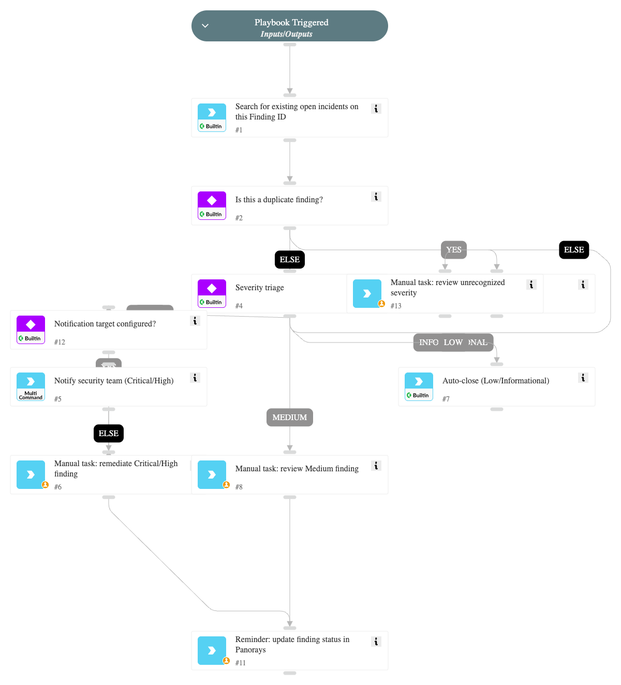

# Panorays

This pack provides an integration with the **Panorays** platform to monitor and manage internal security findings and posture.

## What does this pack do?

This pack enables you to integrate Panorays security posture data into Cortex XSOAR to automate the management of your organization's internal findings.

* **Automated incident ingestion:** Automatically fetch and create incidents in Cortex XSOAR based on internal security findings identified by Panorays for your organization.
* **Internal visibility:** Retrieve detailed lists of self-assessment findings, including severity, category, and affected assets, directly within the Cortex XSOAR War Room.
* **Posture management:** Accelerate your response to internal security gaps by centralizing Panorays findings alongside your other security tools.

## Panorays Finding - Triage and Response playbook

This pack includes a playbook that triages "Panorays Finding" incidents end-to-end without depending on any
specific external ITSM tool:

* Detects and closes duplicate incidents already tracking the same Panorays Finding ID.
* Branches on finding severity: Critical/High findings trigger an optional notification (via any mail/chat
  integration implementing the generic `send-notification` command) and a native remediation task with an SLA;
  Medium findings go to an analyst review task; Low/Informational findings are auto-closed; any unrecognized or
  empty severity value is routed to a manual review task rather than being auto-closed.
* Reminds the analyst to sync the resolved status back to Panorays.

### Extending with your own ITSM

This pack intentionally does not ship a built-in hand-off to a specific ticketing product, since customers use
different tools (ServiceNow, Jira, and others). Remediation is tracked with native Cortex XSOAR tasks by default.
To route Critical/High findings to your own ITSM, duplicate the playbook (or add a task) after the "Manual task:
remediate Critical/High finding" step and call your own ticketing command or sub-playbook (e.g.
`servicenow-create-ticket`, `jira-create-issue`).

For more information, visit the [Panorays website](https://panorays.com).
