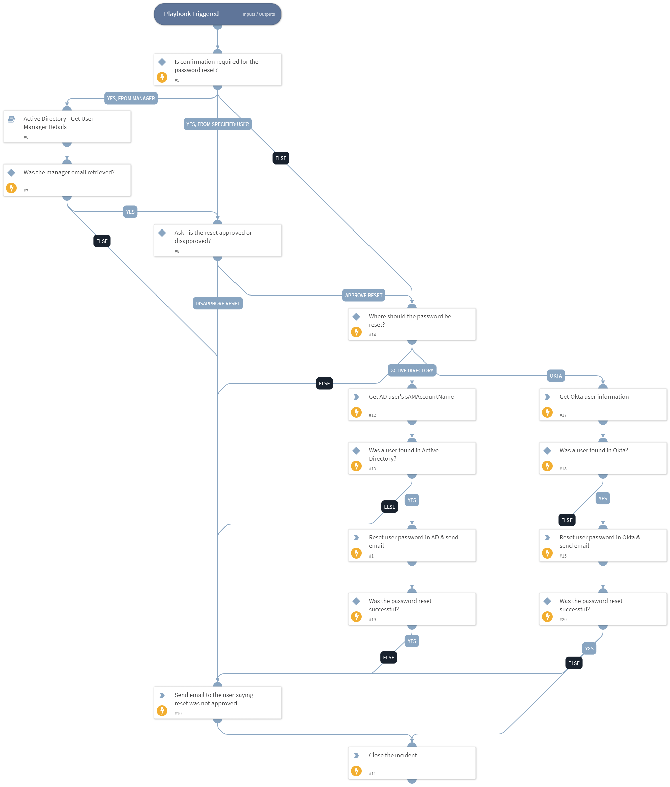

This playbook resets the password of an Active Directory or Okta user. The process is as follows:
1. A user requests a password reset using a chatbot in Slack or in Microsoft Teams.
2. The playbook optionally seeks approval to reset the user's password from the relevant stakeholder, or from the user's manager. The request will be available for approval/disapproval for 1 hour. If not processed within that time, it will be disapproved.
3. If the reset was approved, the playbook optionally verifies the user using 2-factor authentication, from the user's available 2FA methods on Okta.
4. If the reset is verified, a new password will be created while meeting the complexity requirements of the organization.
5. The user's password will be reset and set to the newly generated password. The user will be forced to change their password on next login.
6. The new user's password will be placed inside a password-protected ZIP (protected by a different password).
7. The encrypted ZIP file that contains the new password for the user will be sent to the user via email. 
8. The password for the ZIP file that contains the new user's password, will be sent to the requesting user through Slack or Teams.

This playbook is intended for use with Slack or Teams. In order to use it, please make sure that you have a classifier and mapper in place. The classifier should create a Password Reset via Chatbot incident, while the mapper should map the email of the user to the Reporter Email Address field.
This playbook assumes that the user requesting the password reset has the same email in Slack / Teams, and in Active Directory / Okta.

## Dependencies

This playbook uses the following sub-playbooks, integrations, and scripts.

### Sub-playbooks

* Active Directory - Get User Manager Details

### Integrations

This playbook does not use any integrations.

### Scripts

* IAMInitOktaUser
* GeneratePassword
* EmailAskUser
* IAMInitADUser

### Commands

* ad-get-user
* okta-get-user-factors
* okta-get-user
* closeInvestigation
* okta-verify-push-factor
* send-notification
* send-mail
* setIncident

## Playbook Inputs

---

| **Name** | **Description** | **Default Value** | **Required** |
| --- | --- | --- | --- |
| PasswordMaxDigits | The maximum number of digits in the generated password. If no value is specified, a value of 10 will be used. | 4 | Optional |
| PasswordMaxLowercase | Maximum number of lower case characters to include in the password. If no value is specified, a value of 10 will be used. | 4 | Optional |
| PasswordMaxSymbols | Maximum number of symbols to include in the password. If no value is specified, a value of 10 will be used. | 4 | Optional |
| PasswordMaxUppercase | Maximum number of upper case characters to include in the password. If no value is specified, a value of 10 will be used. | 4 | Optional |
| PasswordMinDigits | Minimum number of digits to include in the password. If no value is specified, a value of 0 will be used. | 2 | Optional |
| PasswordMinLowercase | Minimum number of lower case characters to include in the password. If no value is specified, a value of 0 will be used. | 2 | Optional |
| PasswordMinSymbols | Minimum number of symbols to include in the password. If no value is specified, a value of 0 will be used. | 2 | Optional |
| PasswordMinUppercase | Minimum number of upper case characters to include in the password. If no value is specified, a value of 0 will be used. | 2 | Optional |
| ApprovalTarget | Optional - determines who will approve or disapprove the password reset. Possible values are: no value specified, email address of the user who will receive the reset request, or "Manager".  If no value is specified - approval will not be required when resetting the password.  If the value of "Manager" is specified - the user's manager email will be retrieved from Active Directory, and an approval email will be sent to the manager to allow or decline the password reset.  If an email is specified  - an approval email will be sent to the email specified to allow or decline the password reset. | Manager | Optional |
| ApprovalEmailSubject | Optional - applicable only if the "ApprovalTarget" input is not blank. The subject of the email that will be sent to approve or disapprove the password reset. This email would be sent to the user's manager, IT staff or anyone else specified. | Action Required - User Password Reset | Optional |
| ApprovalEmailBody | Optional - applicable only if the "ApprovalTarget" input is not empty. The body of the email that will be sent to approve or disapprove the password reset. This email would be sent to the user's manager, IT staff or anyone else specified. | User [PLACEHOLDER] asked to reset their password. Please allow or decline the password reset. | Optional |
| TargetProduct | Determines where the user password will be reset. Some organizations provision the data from Okta to Active Directory, so they may choose to reset the password in Okta instead of Active Directory. Possible values are \(choose one\): - Active Directory - Okta | Okta | Optional |
| Require2FA | Whether to require that the user authenticates using an available authentication method. Currently, this only supports the Extra Verification methods available in Okta \(Okta Verify, SMS, Security Question or Google Authenticator\). | True | Optional |
| UserEmailSubject | The subject of the email with the password that will be sent to the user. | Password Reset | Optional |
| UserEmailBody | The body of the email with the password that will be sent to the user. Note: The password will not be included in the email body, but in a protected ZIP file instead. | Following your request to reset your password, we've changed your password to a new temporary password. After logging in, you will be required to change the password to a new one. You can find the password in the ZIP file attached to this email. The password to the ZIP file was sent to you in a direct message in Slack or in Teams. | Optional |
| ZipPasswordMessage | The message that will be sent to the user in Slack/Teams after their password was reset. The value of this input will be appended to the beginning of the the ZIP password that will be sent in the following manner: "The zip file password is: \[zip_password_will_be_here\]".  Note: There is no need to actually write the placeholder for the ZIP password. It will simply appear after your message.  | Following your request to reset your password, we've sent you an email with the new password. The password is protected inside an encrypted ZIP file. The password to the ZIP file is:  | Optional |
| ResetNotApprovedEmailSubject | The subject of the email that will be sent to the requesting user in case the reset was disapproved or could not be approved. | Password Reset Not Approved | Optional |
| ResetNotApprovedEmailBody | The body of the email that will be sent to the requesting user in case the reset was not approved or could not be approved. | Your request for a password reset could not be approved or was disapproved. Please contact the helpdesk for assistance with resetting your password.  If you did not ask to reset your password, please change your password immediately and report the incident. | Optional |
| RequireAccessForApprover | Optional - applicable only if the ApprovalTarget input is not empty. Determines whether the person approving the reset request must have access to the XSOAR server's network. Possible values are "True" or "False". If set to True - the person approving the request will receive and email with a link that takes them to a form hosted on this XSOAR server. This means that the approver must be able to access the network either through a VPN or directly. If set to False - the approver will get an email where they can simply reply with "yes" or "no", without having to click on a link that requires them to have access to the network of this server.  You may want to set this to False to make it easier for the stakeholder to approve the request even if they are on vacation or cannot access this network for any reason.  Note: Enabling this option requires you to have an email sender integration and an email listener integration enabled with the same email address configured on both. In addition, this option does not support disapproving the request automatically if a reply was not received within the 1 hour time window. | True | Optional |

## Playbook Outputs

---
There are no outputs for this playbook.

## Playbook Image

---

## Playbook Demo Video
<video controls>
    <source src="https://github.com/demisto/content-assets/raw/master/Assets/PasswordResetViaChatbot/Password%20Reset%20via%20Chatbot.mp4"
            type="video/mp4"/>
    Sorry, your browser doesn't support embedded videos. You can download the video at: https://github.com/demisto/content-assets/raw/master/Assets/PasswordResetViaChatbot/Password%20Reset%20via%20Chatbot.mp4
</video>