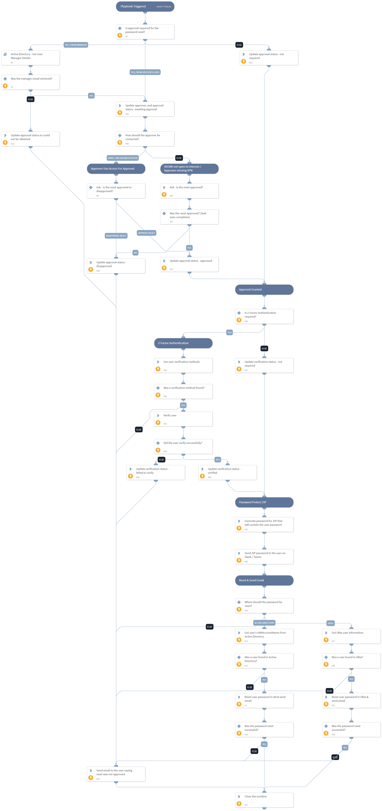

This playbooks should be triggered by a Slack or a Teams message from a user requesting to reset their forgotten password.
The playbook seeks approval before resetting the user's password. It then generates a new password for the user, meeting the complexity criteria defined in the playbook inputs, and sends an email to the user with the new password.
The only information required from the user requesting the password reset in this playbook is the "reporteremailaddress" field, which should hold the email address of the user asking for password reset.

## Dependencies

This playbook uses the following sub-playbooks, integrations, and scripts.

### Sub-playbooks

* Active Directory - Get User Manager Details

### Integrations

This playbook does not use any integrations.

### Scripts

* IAMInitOktaUser
* IAMInitADUser
* GeneratePassword

### Commands

* closeInvestigation
* okta-get-user
* okta-get-user-factors
* okta-verify-push-factor
* send-mail
* send-notification
* setIncident
* ad-get-user

## Playbook Inputs

---

| **Name** | **Description** | **Default Value** | **Required** |
| --- | --- | --- | --- |
| PasswordMaxDigits | The maximum number of digits in the generated password. If no value is specified, a value of 10 will be used. | 4 | Optional |
| PasswordMaxLowercase | Maximum number of lower case characters to include in password. If no value is specified, a value of 10 will be used. | 4 | Optional |
| PasswordMaxSymbols | Maximum number of symbols to include in password. If no value is specified, a value of 10 will be used. | 4 | Optional |
| PasswordMaxUppercase | Maximum number of upper case characters to include in password. If no value is specified, a value of 10 will be used. | 4 | Optional |
| PasswordMinDigits | Minimum number of digits to include in password. If no value is specified, a value of 0 will be used. | 2 | Optional |
| PasswordMinLowercase | Minimum number of lower case characters to include in password. If no value is specified, a value of 0 will be used. | 2 | Optional |
| PasswordMinSymbols | Minimum number of symbols to include in password. If no value is specified, a value of 0 will be used. | 2 | Optional |
| PasswordMinUppercase | Minimum number of upper case characters to include in password. If no value is specified, a value of 0 will be used. | 2 | Optional |
| ConfirmationTarget | Determines who will confirm the password reset. Possible values are: no value specified, email address of the user that will confirm the reset, or "Manager".  If no value is specified - confirmation will not be required when resetting the password.  If the value of "Manager" is specified - the user's manager email will be retrieved from Active Directory, and a confirmation email will be sent to the manager to allow or decline the password reset.  If an email is specified  - a confirmation email will be sent to the email specified to allow or decline the password reset. | Manager | Optional |
| ConfirmationEmailSubject | Optional - applicable only if the "ConfirmationTarget" input is not blank. The subject of the email that will be sent to approve or disapprove the password reset. This email would be sent to the user's manager, IT staff or anyone else specified. | Action Required - User Password Reset | Optional |
| ConfirmationEmailBody | Optional - applicable only if the "ConfirmationTarget" input is not blank. The body of the email that will be sent to approve or disapprove the password reset. This email would be sent to the user's manager, IT staff or anyone else specified. | User [PLACEHOLDER] asked to reset their password. Please allow or decline the password reset. | Optional |
| TargetProduct | Determines whether the user password will be reset. Some organizations provision the data from Okta to Active Directory, so they may choose to reset the password in Okta instead of Active Directory. Possible values are \(choose one\): - Active Directory - Okta | Okta | Optional |
| Require2FA | Whether to require that the user authenticates using an available authentication method. Currently, this only supports the Extra Verification methods available in Okta \(Okta Verify, SMS, Security Question or Google Authenticator\). | True | Optional |
| UserEmailSubject | The subject of the email with the password that will be sent to the user. | Password Reset | Optional |
| UserEmailBody | The body of the email with the password that will be sent to the user. Note: the password will not be included in the email body, but in a protected ZIP file instead. | Following your request to reset your password, we've changed your password to a new temporary password. After logging in, you will be required to change the password to a new one. You can find the password in the ZIP file attached to this email. The password to the ZIP file was sent to you in a direct message on Slack or on Teams. | Optional |
| ZipPasswordMessage | The message that will be sent to the user on Slack/Teams after their password was reset. The value of this input will be appended to the beginning of the the ZIP password that will be sent in the following manner: "The zip file password is: \[zip_password_will_be_here\]".  Note: there is no need to actually write the placeholder for the ZIP password. It will simply appear after your message.  | Following your request to reset your password, we've sent you an email with the new password. The password is protected inside an encrypted ZIP file. The password to the ZIP file is:  | Optional |
| ResetNotApprovedEmailSubject |  | Password Reset Not Approved | Optional |
| ResetNotApprovedEmailBody |  | Your request for a password reset could not be approved or was disapproved. Please contact helpdesk for assistance with resetting your password.  If you did not ask to reset your password, please change your password immediately and report the incident. | Optional |

## Playbook Outputs

---
There are no outputs for this playbook.

## Playbook Image

---

