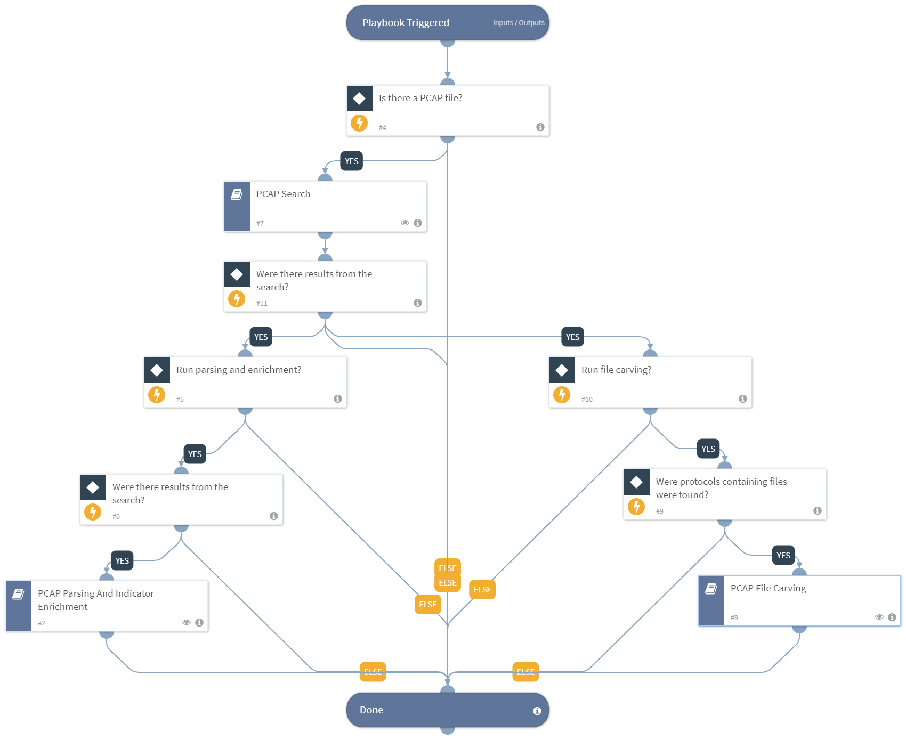

This playbook leverages all of the PCAP miner and PCAP file extractor sub playbook capabilities, including: 
* Search for specific values in a PCAP file 
* Parse and enrich detected indicators such as IP addresses, URLs, email addresses and domains found by the search . 
* Carve (extract) files found in the http, smb and other protocols and perform enrichment and detonation.

The playbooks is meant to be a demonstration of all the PCAP analysis capabilities however it is more likely to use each of the subplaybooks seperatly. In order to demonstrate the entire flow make sure that at least on of the following playbook inputs is configured in order for search results to exist.
* IPAddressToSearch
* TCPPortsToSearch
* UDPPortsToSearch
* ProtocolToSearch
* AdvancedSearchFilter

## Dependencies
This playbook uses the following sub-playbooks, integrations, and scripts.

### Sub-playbooks
* PCAP Parsing And Indicator Enrichment
* PCAP Search
* PCAP File Carving

### Integrations
This playbook does not use any integrations.

### Scripts
This playbook does not use any scripts.

### Commands
This playbook does not use any commands.

## Playbook Inputs
---

| **Name** | **Description** | **Default Value** | **Required** |
| --- | --- | --- | --- |
| PcapFileEntryID | This input specifies the file entry ID for the PCAP file if the user provided the file in the incident. One PCAP file can run per incident. | File.EntryID | Optional |
| RunParsingAndEnrichment | This input specifies whether to run the parsing and enrichment playbook. Values can be true or any other value for false. | true | Optional |
| RunFileCarving | This input specifies whether to run the file carving playbook. Values can be true or any other value for false. | true | Optional |
| RsaDecryptKeyEntryID | This input specifies the file entry ID for the RSA decrypt key if the user provided the key in the incident. | File.EntryID | Optional |
| WpaPassword | This input value is used to provide a WPA \(Wi-Fi Protected Access\) password to decrypt encrypted 802.11 Wi-FI traffic. |  | Optional |
| QueryOperator | In case the playbook has several search inputs provided such as IPAddressToSearch, TCPPortsToSearch ,UDPPortsToSearch, ProtocolToSearch and AdvancedSearchFilter. This input will specify if the inputs will be treated as an AND or an OR search for all the PCAP search filter. value can be "and" or "or". The default value is "and", If the IPAddressToSearch was defined as 192.168.1.1,192.168.1.2 The TCPPortsToSearch was defined as 445,443 And the QueryOperator was defined as "and" The resultant query will be \(ip.addr == 192.168.1.1 or ip.addr ==  192.168.1.2\) and \(tcp.port == 445 or tcp.port == 443\) If the QueryOperator was defined as "or" The resultant query will be \(ip.addr == 192.168.1.1 or ip.addr ==  192.168.1.2\) or \(tcp.port == 445 or tcp.port == 443\) | and | Optional |
| IPAddressToSearch | The value of an IP address to search. Can be a single IP or a comma delimited list of IP addresses. CIDR ranges are also acceptable. All IPs will be treated with the OR operator. |  | Optional |
| TCPPortsToSearch | The value of a TCP port number to search. Can be a single port or a comma delimited list of ports. All TCP ports will be treated with the OR operator. |  | Optional |
| UDPPortsToSearch | The value of a UDP port number to search. Can be a single port or a comma delimited list of ports. All UDP ports will be treated with the OR operator. |  | Optional |
| ProtocolToSearch | The protocols to search for within the PCAP file. Can be a single protocol or a comma delimited list of protocols. The protocol names should be the same as searching in Wireshark. For example smb2, dns etc.  All protocols will be treated with the OR operator. |  | Optional |
| AdvancedSearchFilter | Filter to apply on PCAP. Wireshark syntax as can be found here: https://www.wireshark.org/docs/man-pages/wireshark-filter.html This input is meant to handle more complex filters not covered by the other inputs. For example search by an attribute such as http.host, arp.dst.hw etc. |  | Optional |
| InternalIPRange | A list of internal IP ranges to check IP addresses against. The list should be provided in CIDR format, separated by commas. An example of a list of ranges could be: 172.16.0.0/12,10.0.0.0/8,192.168.0.0/16. If a list of IP ranges is not provided, the list provided in the IsIPInRanges script \(the known IPv4 private address ranges\) is used by default. |  | Optional |
| InternalUrlName | The organization's internal URL name. This is provided for the script IsInternalHostName that checks if the detected URLs are internal or external if the hosts contain the internal domains suffix. For example demisto.com. If there is more than one domain, use comma separation such as demisto.com,paloaltonetworks.com |  | Optional |
| WhichIndicatorTypeToEnrich | This input checks which indicator types that will be extracted from the PCAP will be enriched. Values can be ip email url To provide more than one indicator type use comma separation such as  ip,url,email | ip,url,email | Optional |
| InternalEmailDomainName | The organization's internal email domain name. This is provided for the script IsEmailAddressInternal that checks if the detected emails are internal or external. This  input can contain a List of internal domains to check, comma separated. |  | Optional |
| RegexToSearch | This input value is used to provide a python regular expression to search in the the packet body. An example can be \\w\{10\} for expressions that have 10 letter words. |  | Optional |
| ExtractedFilesLimit | This input limits the number of files to be extracted from the PCAP file. Default value is 5. | 5 | Optional |
| FileExtensionFilter | This input is used to select which file extensions to include or exclude from the PCAP file. Extensions must be comma separated, for example, png,gif,exe. This setting cannot be used with the FileTypeFilter. |  | Optional |
| FileTypeFilter | This input is used to select which file type \(MIME type\) to include or exclude from the PCAP file. Extensions must be comma separated, for example, image/jpeg,application/x-javascript This setting cannot be used with the FileExtensionFilter. |  | Optional |
| FilterType | This input is combined with the FileExtensionFilter input or the FileTypeFilter input. It specifies if the type/extensions list is inclusive or exclusive. Can be "inclusive" or "exclusive". Default is "inclusive". Default value is 'inclusive' | inclusive | Optional |
| AutoDetonateFiles | This input specifies whether to detonate files extracted from the PCAP. The default value is True, any other value will be considered as false. | True | Optional |

## Playbook Outputs
---

| **Path** | **Description** | **Type** |
| --- | --- | --- |
| InternalIPAddresses | The internal IP addresses that were found in the PCAP. | string |
| ExternalIPAddresses | The external IP addresses that were found in the PCAP. | string |
| DestinationTcpPorts | A list of destination TCP ports that were found in the PCAP. | string |
| DestinationUdpPorts | A list of destination UDP ports that were found in the PCAP. | string |
| DetectedProtocols | A list of protocols that were found in the PCAP. | string |
| ExternalEmailAddresses | The external email addresses that were found in the PCAP. | string |
| InternalEmailAddresses | The internal email addresses that were found in the PCAP. | string |
| ExternalUrls | The external URLs that were found in the PCAP. | string |
| InternalUrls | The internal URLs that were found in the PCAP. | string |
| PcapResults.Protocols | List of protocols found in the PCAP. | string |
| File.Malicious | The File malicious description | string |

## Playbook Image
---
