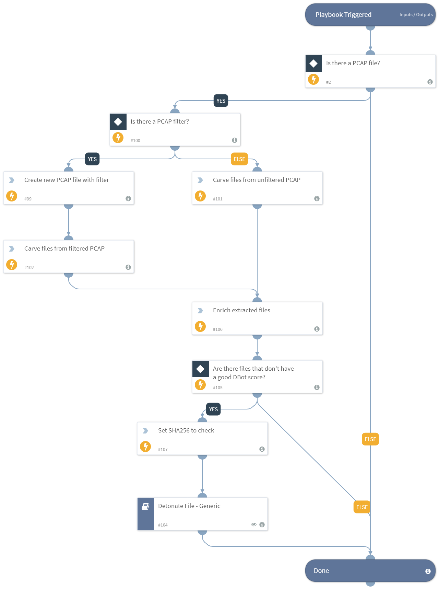

This playbook is used to carve (extract) files from within PCAP files and perform enrichment and detonation of the extracted files. Supported PCAP file types are pcap, cap, pcapng. The playbook can handle one PCAP file per incident. Additional inputs allow the user to provide the WPA password for decrypting 802.11 (wireless) traffic and adding an RSA certificate to decrypt SSL traffic. Additional options enable you to filter the files to extract according to the file extension or the actual file  type (MIME), and limit the amount of files to extract. Another feature enables you to specify a filter to create a new smaller PCAP file. To display the results within the relevant incident fields, the playbook needs to run in a PCAP Analysis incident type. For handling of PCAP files larger than 30 MB, refer to the PcapMinerV2 documentation.

## Dependencies
This playbook uses the following sub-playbooks, integrations, and scripts.

### Sub-playbooks
* Detonate File - Generic

### Integrations
This playbook does not use any integrations.

### Scripts
* PcapFileExtractor
* Set
* PcapMinerV2

### Commands
* file

## Playbook Inputs
---

| **Name** | **Description** | **Default Value** | **Required** |
| --- | --- | --- | --- |
| RsaDecryptKeyEntryID | This input specifies the file entry id for the RSA decrypt key if the user provided the key in the incident. | File.EntryID | Optional |
| PcapFileEntryID | This input specifies the file entry id for the PCAP file if the user provided the file in the incident. One PCAP file can run per incident. | File.EntryID | Optional |
| WpaPassword | This input value is used to provide a WPA \(Wi-Fi Protected Access\) password to decrypt encrypted 802.11 Wi-FI traffic. |  | Optional |
| PcapFilter | This input specifies a search filter to be used on the PCAP file. Filters can be used to search only for a specific IP, protocols, and other examples. The syntax is the same as in Wireshark which can be found here: https://www.wireshark.org/docs/man-pages/wireshark-filter.html For this playbook, using a PCAP filter will generate a new smaller PCAP file based on the provided filter thus reducing the extraction of non relevant files. |  | Optional |
| ExtractedFilesLimit | This input limits the number of files to be extracted from the PCAP file. Default value is 5. | 5 | Optional |
| FileExtensionFilter | This input is used to select which file extensions to include or exclude from the PCAP file. Extensions must be comma separated, for example, png,gif,exe. This setting cannot be used with the FileTypeFilter. |  | Optional |
| FileTypeFilter | This input is used to select which file type \(MIME type\) to include or exclude from the PCAP file. Extensions must be comma separated, for example, image/jpeg,application/x-javascript This setting cannot be used with the FileExtensionFilter. |  | Optional |
| FilterType | This input is combined with the FileExtensionFilter input or the FileTypeFilter input. It specifies if the type/extensions list is inclusive or exclusive. Can be "inclusive" or "exclusive". Default is "inclusive". Default value is 'inclusive' | inclusive | Optional |
| AutoDetonateFiles | This input specifies whether to detonate files extracted from the PCAP. The default value is True. Any other value will be considered as false. | True | Optional |
| AutoEnrichFiles | This input specifies whether to enrich files extracted from the PCAP. The default value is True. Any other value will be considered as false. | True | Optional |

## Playbook Outputs
---

| **Path** | **Description** | **Type** |
| --- | --- | --- |
| DBotScore | The DBotScore object. | string |
| File | The file object. | string |
| File.Malicious | The file malicious description. | string |
| File.Size | The file size. | string |
| File.MD5 | The file MD5 hash. | string |
| File.SHA1 | The file SHA1 hash. | string |
| File.SHA256 | The file SHA256 hash. | string |
| File.SHA512 | The file SHA512 hash. | string |
| File.Name | The file name. | string |
| File.SSDeep | The file SSDeep. | string |
| File.EntryID | The file entry ID. | string |
| File.Info | The file information. | string |
| File.Type | The file type. | string |
| File.Extension | The file extension. | string |

## Playbook Image
---

