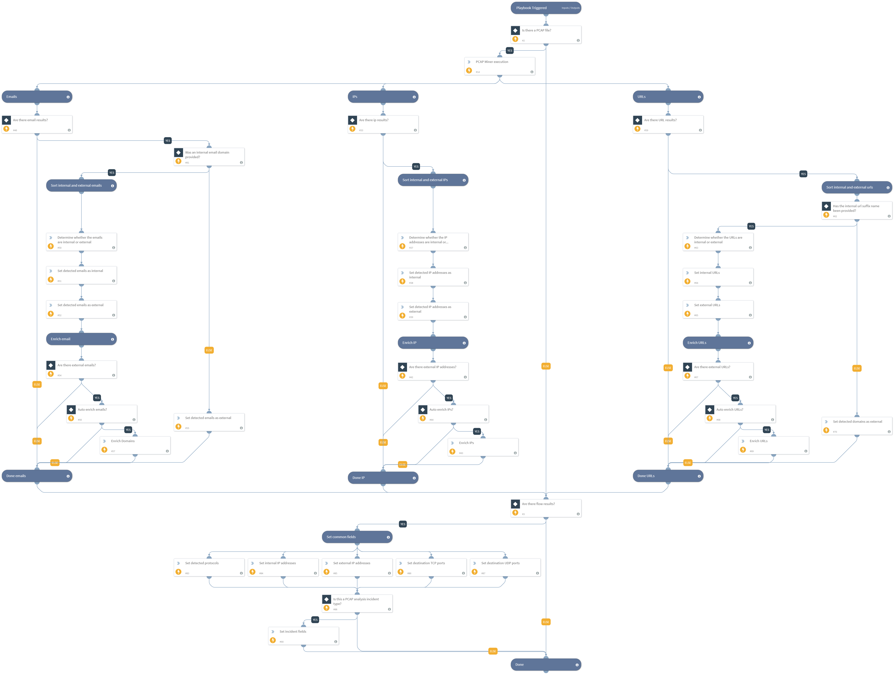

This playbook is used to parse and extract indicators within PCAP files and perform enrichment on the detected indicators. Supported file types are pcap, cap, pcapng. The playbook can handle one PCAP file per incident. The user inputs which indicator types are to be enriched including, email, URLs, IP addresses. The user can specify in the inputs which indicators are internal or that will be treated as internal (not enriched). The user can also specify a specific regex pattern to search for. Another option is to specify the protocol types to be printed to context for data extraction. Additional inputs allow the user to provide the WPA password for decrypting 802.11 (wireless) traffic and add an RSA certificate to decrypt SSL traffic. To display the results within the relevant incident fields, the playbook needs to run in a PCAP Analysis incident type. For handling of PCAP files larger than 30 MB, refer to the PcapMinerV2 documentation.

## Dependencies
This playbook uses the following sub-playbooks, integrations, and scripts.

### Sub-playbooks
This playbook does not use any sub-playbooks.

### Integrations
This playbook does not use any integrations.

### Scripts
* SetGridField
* IsUrlPartOfDomain
* PcapMinerV2
* SetAndHandleEmpty
* IsEmailAddressInternal
* IsIPInRanges

### Commands
* url
* ip
* email

## Playbook Inputs
---

| **Name** | **Description** | **Default Value** | **Required** |
| --- | --- | --- | --- |
| PcapFilter | This input specifies a search filter to be used on the pcap file. Filters can be used to search only for a specific IP, protocols, and other examples. The syntax is the same as in Wireshark which can be found here: https://www.wireshark.org/docs/man-pages/wireshark-filter.html

Using a filter can improve performance and decrease the output results.
 |  | Optional |
| ProtocolsToOutput | This input provides which protocols to output to context. This can be a single or several protocols from this list
 HTTP
 DNS
 LLMNR
 SYSLOG
 SMTP
 NETBIOS
 ICMP
 KERBEROS
 TELNET
 SSH
 IRC
 FTP
SMB2

To provide more than one protocol use comma separation such as 
DNS,FTP

Each selected protocol will have its own unique data displayed in context. Such as HTTP data, SMTP data etc. | DNS,SMB2,HTTP,LLMNR,SYSLOG,SMTP,NETBIOS,ICMP,KERBEROS,TELNET,SSH,IRC,FTP | Optional |
| RegexToSearch | This input value is used to provide a python regular expression to search in the the packet body. An example can be \\w\{10\} for expressions that have 10 letter words. |  | Optional |
| WpaPassword | This input value is used to provide a WPA \(Wi\-Fi Protected Access\) password to decrypt encrypted Wi\-FI traffic. |  | Optional |
| WhichIndicatorTypeToEnrich | This input checks which indicator types that will be extracted from the PCAP will be enriched. Values can be
ip
email
url
To provide more than one indicator type use comma separation such as 
ip,url,email

 |  | Optional |
| InternalUrlName | The organization's internal URL name. This is provided for the script IsInternalHostName that checks if the detected URLs are internal or external if the hosts contain the internal domains suffix. For example demisto.com. If there is more than one domain, use comma separation such as demisto.com,paloaltonetworks.com |  | Optional |
| InternalEmailDomainName | The organization's internal email domain name. This is provided for the script IsEmailAddressInternal that checks if the detected emails are internal or external. This  input can contain a List of internal domains to check, comma separated |  | Optional |
| InternalIPRange | A list of internal IP ranges to check IP addresses against. The list should be provided in CIDR format, separated by commas. An example of a list of ranges could be: 172.16.0.0/12,10.0.0.0/8,192.168.0.0/16. If a list of IP ranges is not provided, the list provided in the IsIPInRanges script \(the known IPv4 private address ranges\) is used by default. |  | Optional |
| PcapFileEntryID | This input specifics the file entry id for the PCAP file if the user provided the file in the incident. One PCAP file can run per incident. | File.EntryID | Optional |
| RsaDecryptKeyEntryID | This input specifics the file entry id for the RSA decrypt key if the user provided the key in the incident. | File.EntryID | Optional |

## Playbook Outputs
---

| **Path** | **Description** | **Type** |
| --- | --- | --- |
| InternalIPAddresses | The internal IP addresses that were found in the PCAP. | string |
| ExternalIPAddresses | The external IP addresses that were found in the PCAP. | string |
| ExternalEmailAddresses | The external email addresses that were found in the PCAP. | string |
| InternalEmailAddresses | The internal email addresses that were found in the PCAP. | string |
| ExternalUrls | The external URLs that were found in the PCAP. | String |
| InternalUrls | The internal URLs that were found in the PCAP. | string |
| PcapResults.Protocols | List of protocols found in the PCAP. | string |
| DestinationTcpPorts | A list of destination TCP ports that were found in the PCAP. | string |
| DestinationUdpPorts | A list of destination UDP ports that were found in the PCAP. | String |

## Playbook Image
---
