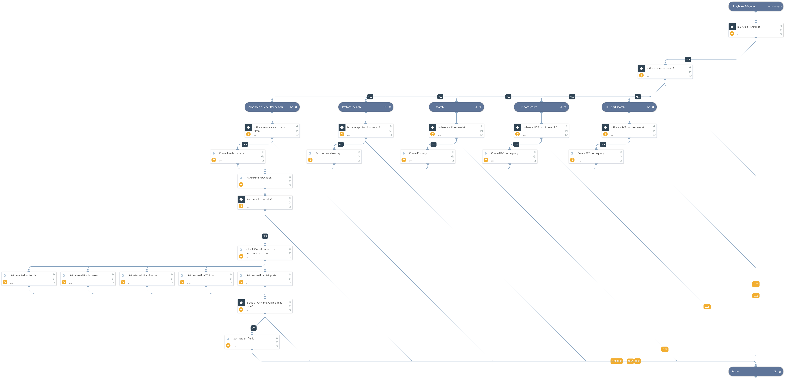

This playbook is used to parse and search within PCAP files. Supported file types are pcap, cap, pcapng. The playbook can handle one PCAP file per incident. The user inputs which objects the playbook should search for in the PCAP. The values to search are IP addresses, CIDR ranges, and TCP or UDP ports or protocols. In the event that more than one input type was specified, specify in the QueryOperator input (such as IP addresses and TCP ports) if the PCAP filter query will use an AND or an OR operator between the inputs.  Another option is to use advanced filters just like in Wireshark to use refined filters or for objects not specified in other inputs. Additional inputs allow the user to provide the WPA password for decrypting 802.11 (wireless) traffic and adding an RSA certificate to decrypt SSL traffic. To display the results within the relevant incident fields, the playbook needs to run in a PCAP Analysis incident type. For handling of PCAP files larger than 30 MB, refer to the PcapMinerV2 documentation.

## Dependencies
This playbook uses the following sub-playbooks, integrations, and scripts.

### Sub-playbooks
This playbook does not use any sub-playbooks.

### Integrations
This playbook does not use any integrations.

### Scripts
* SetAndHandleEmpty
* SetGridField
* PcapMinerV2
* IsIPInRanges

### Commands
This playbook does not use any commands.

## Playbook Inputs
---

| **Name** | **Description** | **Default Value** | **Required** |
| --- | --- | --- | --- |
| QueryOperator | In case the playbook has several search inputs provided such as IPAddressToSearch, TCPPortsToSearch ,UDPPortsToSearch, ProtocolToSearch and AdvancedSearchFilter. This input will specify if the inputs will be treated as an AND or an OR search for all the PCAP search filter. value can be "and" or "or". The default value is "and", If the IPAddressToSearch was defined as 192.168.1.1,192.168.1.2 The TCPPortsToSearch was defined as 445,443 And the QueryOperator was defined as "and" The resultant query will be \(ip.addr == 192.168.1.1 or ip.addr ==  192.168.1.2\) and \(tcp.port == 445 or tcp.port == 443\) If the QueryOperator was defined as "or" The resultant query will be \(ip.addr == 192.168.1.1 or ip.addr ==  192.168.1.2\) or \(tcp.port == 445 or tcp.port == 443\) | and | Required |
| IPAddressToSearch | The value of an IP address to search. Can be a single IP or a comma delimited list of IP addresses. CIDR ranges are also acceptable. All IPs will be treated with the OR operator. |  | Optional |
| TCPPortsToSearch | The value of a TCP port number to search. Can be a single port or a comma delimited list of ports. All TCP ports will be treated with the OR operator. |  | Optional |
| UDPPortsToSearch | The value of a UDP port number to search. Can be a single port or a comma delimited list of ports. All UDP ports will be treated with the OR operator. |  | Optional |
| ProtocolToSearch | The protocols to search for within the PCAP file. Can be a single protocol or a comma delimited list of protocols. The protocol names should be the same as searching in Wireshark. For example smb2, dns etc.  All protocols will be treated with the OR operator. |  | Optional |
| WpaPassword | This input value is used to provide a WPA \(Wi\-Fi Protected Access\) password to decrypt encrypted 802.11 Wi\-FI traffic. |  | Optional |
| AdvancedSearchFilter | Filter to apply on PCAP. Wireshark syntax as can be found here: https://www.wireshark.org/docs/man-pages/wireshark-filter.html
This input is meant to handle more complex filters not covered by the other inputs. For example search by an attribute such as http.host, arp.dst.hw etc. |  | Optional |
| RsaDecryptKeyEntryID | This input specifics the file entry id for the RSA decrypt key if the user provided the key in the incident. | File.EntryID | Optional |
| PcapFileEntryID | This input specifics the file entry id for the PCAP file if the user provided the file in the incident. One PCAP file can run per incident. | File.EntryID | Optional |
| InternalIPRange | A list of internal IP ranges to check IP addresses against. The list should be provided in CIDR format, separated by commas. An example of a list of ranges could be: 172.16.0.0/12,10.0.0.0/8,192.168.0.0/16. If a list of IP ranges is not provided, the list provided in the IsIPInRanges script \(the known IPv4 private address ranges\) is used by default. |  | Optional |

## Playbook Outputs
---

| **Path** | **Description** | **Type** |
| --- | --- | --- |
| InternalIPAddresses | The internal IP addresses that were found in the PCAP. | string |
| ExternalIPAddresses | The external IP addresses that were found in the PCAP. | string |
| DestinationTcpPorts | A list of destination TCP ports that were found in the PCAP | string |
| DestinationUdpPorts | A list of destination UDP ports that were found in the PCAP | String |
| DetectedProtocols | A list of protocols that were found in the PCAP | string |
| PcapQuery | The filter used for querying the PCAP file. | string |

## Playbook Image
---
