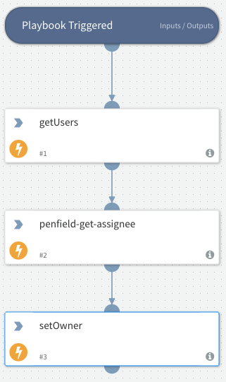

Invokes Penfield.AI backend to assign the incident to an online analyst.

## Dependencies
This playbook uses the following sub-playbooks, integrations, and scripts.

## Sub-playbooks
This playbook does not use any sub-playbooks.

## Integrations
* Penfield

## Scripts
This playbook does not use any scripts.

## Commands
* getUsers
* setOwner

## Playbook Inputs
---
There are no inputs for this playbook.

## Playbook Outputs
---
There are no outputs for this playbook.

## Playbook Image
---

