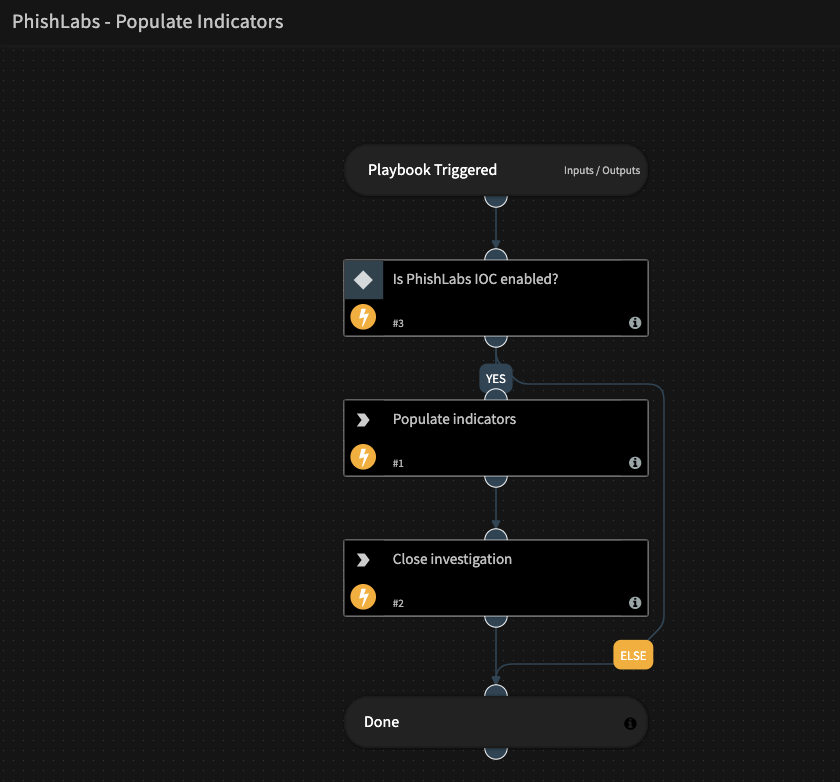

<!-- HTML_DOC -->

PhishLabs’ three 24/7 Security Operations Centers enables enterprise security teams to rapidly detect and respond to the email-based threats that reach the inboxes of end users.

In Cortex XSOAR, PhishLabs IOC can be used to retrieve indicators from the global feed or fetch email based incidents from the user feed.

<h2 id="phishlabs-ioc-playbooks">PhishLabs IOC Playbooks</h2>

  

<h2 id="use-cases">Use Cases</h2>

<ol>
<li>Retrieve and populate indicators from the PhishLabs IOC global feed</li>
<li>Fetch and retrieve indicators for email based incidents in the PhishLabs IOC user feed</li>
</ol>

<h2 id="configure-phishlabs-ioc-on-demisto">Configure PhishLabs IOC on Cortex XSOAR</h2>

<ol>
<li>Navigate to <strong>Settings</strong> &gt; <strong>Integrations</strong> &gt; <strong>Servers &amp; Services</strong>.</li>
<li>Search for PhishLabs IOC.</li>
<li>Click <strong>Add instance</strong> to create and configure a new integration instance.
<ul>
<li>
<strong>Name</strong>: a textual name for the integration instance.</li>
<li><strong>Server URL (e.g., https://ioc.phishlabs.com)</strong></li>
<li><strong>Credentials</strong></li>
<li><strong>Source Reliability.</strong> Reliability of the source providing the intelligence data. (The default value is: B - Usually reliable)</li>
<li><strong>Trust any certificate (not secure)</strong></li>
<li><strong>Use system proxy settings</strong></li>
<li><strong>Fetch incidents</strong></li>
<li><strong>Fetch for this time period, e.g., “1d”, “1h”, “10m”. The default is 1h.</strong></li>
<li><strong>Number of incidents to fetch each time</strong></li>
<li><strong>Incident type</strong></li>
</ul>
</li>
<li>Click <strong>Test</strong> to validate the URLs, token, and connection.</li>
</ol>

<h2 id="commands">Commands</h2>

You can execute these commands from the Cortex XSOAR CLI, as part of an automation, or in a playbook. After you successfully execute a command, a DBot message appears in the War Room with the command details.

<ol>
<li><a href="#get-the-global-ioc-feed" target="_self">Get the global IOC feed: phishlabs-global-feed</a></li>
<li><a href="#get-indicators-for-an-incident" target="_self">Get indicators for an incident: phishlabs-get-incident-indicators</a></li>
</ol>

<h3 id="get-the-global-ioc-feed">1. Get the global IOC feed</h3>

Retrieves the global IOC feed from PhishLabs.

<h5 id="base-command">Base Command</h5>

<code>phishlabs-global-feed</code>

<h5 id="input">Input</h5>

<table style="width: 749px;">
<thead>
<tr>
<th style="width: 154px;"><strong>Argument Name</strong></th>
<th style="width: 515px;"><strong>Description</strong></th>
<th style="width: 71px;"><strong>Required</strong></th>
</tr>
</thead>
<tbody>
<tr>
<td style="width: 154px;">since</td>
<td style="width: 515px;">Duration (from now) for which to pull updated data, for example, “1d”, “1h” or “10m”.</td>
<td style="width: 71px;">Optional</td>
</tr>
<tr>
<td style="width: 154px;">limit</td>
<td style="width: 515px;">Maximum number of results to return.</td>
<td style="width: 71px;">Optional</td>
</tr>
<tr>
<td style="width: 154px;">indicator_type</td>
<td style="width: 515px;">Filter the data by indicator type.</td>
<td style="width: 71px;">Optional</td>
</tr>
<tr>
<td style="width: 154px;">remove_protocol</td>
<td style="width: 515px;">Removes the protocol part from indicators, when the rule can be applied.</td>
<td style="width: 71px;">Optional</td>
</tr>
<tr>
<td style="width: 154px;">remove_query</td>
<td style="width: 515px;">Removes the query string part from indicators, when the rules can be applied.</td>
<td style="width: 71px;">Optional</td>
</tr>
<tr>
<td style="width: 154px;">false_positive</td>
<td style="width: 515px;">Whether the indicator is a false positive.</td>
<td style="width: 71px;">Optional</td>
</tr>
</tbody>
</table>

 

<h5 id="context-output">Context Output</h5>

<table style="width: 749px;">
<thead>
<tr>
<th style="width: 334px;"><strong>Path</strong></th>
<th style="width: 65px;"><strong>Type</strong></th>
<th style="width: 341px;"><strong>Description</strong></th>
</tr>
</thead>
<tbody>
<tr>
<td style="width: 334px;">URL.Data</td>
<td style="width: 65px;">String</td>
<td style="width: 341px;">URL address.</td>
</tr>
<tr>
<td style="width: 334px;">URL.Malicious.Vendor</td>
<td style="width: 65px;">String</td>
<td style="width: 341px;">Vendor reporting the malicious status.</td>
</tr>
<tr>
<td style="width: 334px;">URL.Malicious.Description</td>
<td style="width: 65px;">String</td>
<td style="width: 341px;">Description of the malicious URL.</td>
</tr>
<tr>
<td style="width: 334px;">PhishLabs.URL.Data</td>
<td style="width: 65px;">String</td>
<td style="width: 341px;">URL address.</td>
</tr>
<tr>
<td style="width: 334px;">PhishLabs.URL.ID</td>
<td style="width: 65px;">String</td>
<td style="width: 341px;">URL PhishLabs ID.</td>
</tr>
<tr>
<td style="width: 334px;">PhishLabs.URL.CreatedAt</td>
<td style="width: 65px;">Date</td>
<td style="width: 341px;">URL creation time, in PhishLabs.</td>
</tr>
<tr>
<td style="width: 334px;">PhishLabs.URL.UpdatedAt</td>
<td style="width: 65px;">Date</td>
<td style="width: 341px;">URL update time, in PhishLabs.</td>
</tr>
<tr>
<td style="width: 334px;">PhishLabs.URL.Attribute.Name</td>
<td style="width: 65px;">String</td>
<td style="width: 341px;">URL attribute name.</td>
</tr>
<tr>
<td style="width: 334px;">PhishLabs.URL.Attribute.Value</td>
<td style="width: 65px;">String</td>
<td style="width: 341px;">URL attribute value.</td>
</tr>
<tr>
<td style="width: 334px;">PhishLabs.URL.Attribute.CreatedAt</td>
<td style="width: 65px;">Date</td>
<td style="width: 341px;">URL attribute creation time.</td>
</tr>
<tr>
<td style="width: 334px;">PhishLabs.URL.FalsePositive</td>
<td style="width: 65px;">Boolean</td>
<td style="width: 341px;">Whether this URL is a false positive.</td>
</tr>
<tr>
<td style="width: 334px;">Domain.Name</td>
<td style="width: 65px;">String</td>
<td style="width: 341px;">Domain name.</td>
</tr>
<tr>
<td style="width: 334px;">Domain.Malicious.Vendor</td>
<td style="width: 65px;">String</td>
<td style="width: 341px;">Vendor reporting the malicious status.</td>
</tr>
<tr>
<td style="width: 334px;">Domain.Malicious.Description</td>
<td style="width: 65px;">String</td>
<td style="width: 341px;">Description of the malicious domain.</td>
</tr>
<tr>
<td style="width: 334px;">PhishLabs.Domain.Name</td>
<td style="width: 65px;">String</td>
<td style="width: 341px;">Domain name.</td>
</tr>
<tr>
<td style="width: 334px;">PhishLabs.Domain.ID</td>
<td style="width: 65px;">String</td>
<td style="width: 341px;">Domain PhishLabs ID.</td>
</tr>
<tr>
<td style="width: 334px;">PhishLabs.Domain.CreatedAt</td>
<td style="width: 65px;">Date</td>
<td style="width: 341px;">Domain creation time, in PhishLabs.</td>
</tr>
<tr>
<td style="width: 334px;">PhishLabs.Domain.UpdatedAt</td>
<td style="width: 65px;">Date</td>
<td style="width: 341px;">Domain update time, in PhishLabs.</td>
</tr>
<tr>
<td style="width: 334px;">PhishLabs.Domain.Attribute.Name</td>
<td style="width: 65px;">String</td>
<td style="width: 341px;">Domain attribute name.</td>
</tr>
<tr>
<td style="width: 334px;">PhishLabs.Domain.Attribute.Value</td>
<td style="width: 65px;">String</td>
<td style="width: 341px;">Domain attribute value.</td>
</tr>
<tr>
<td style="width: 334px;">PhishLabs.Domain.Attribute.CreatedAt</td>
<td style="width: 65px;">Date</td>
<td style="width: 341px;">Domain attribute creation time.</td>
</tr>
<tr>
<td style="width: 334px;">PhishLabs.Domain.FalsePositive</td>
<td style="width: 65px;">Boolean</td>
<td style="width: 341px;">Whether this domain is a false positive.</td>
</tr>
<tr>
<td style="width: 334px;">File.Name</td>
<td style="width: 65px;">String</td>
<td style="width: 341px;">Full filename.</td>
</tr>
<tr>
<td style="width: 334px;">File.MD5</td>
<td style="width: 65px;">String</td>
<td style="width: 341px;">MD5 hash of the file.</td>
</tr>
<tr>
<td style="width: 334px;">File.Type</td>
<td style="width: 65px;">String</td>
<td style="width: 341px;">File type.</td>
</tr>
<tr>
<td style="width: 334px;">PhishLabs.File.ID</td>
<td style="width: 65px;">String</td>
<td style="width: 341px;">File PhishLabs ID.</td>
</tr>
<tr>
<td style="width: 334px;">PhishLabs.File.Name</td>
<td style="width: 65px;">String</td>
<td style="width: 341px;">Full filename.</td>
</tr>
<tr>
<td style="width: 334px;">PhishLabs.File.MD5</td>
<td style="width: 65px;">String</td>
<td style="width: 341px;">MD5 hash of the file.</td>
</tr>
<tr>
<td style="width: 334px;">PhishLabs.File.Type</td>
<td style="width: 65px;">String</td>
<td style="width: 341px;">File type.</td>
</tr>
<tr>
<td style="width: 334px;">PhishLabs.File.CreatedAt</td>
<td style="width: 65px;">Date</td>
<td style="width: 341px;">File creation time, in PhishLabs.</td>
</tr>
<tr>
<td style="width: 334px;">PhishLabs.File.UpdatedAt</td>
<td style="width: 65px;">Date</td>
<td style="width: 341px;">File update time, in PhishLabs.</td>
</tr>
<tr>
<td style="width: 334px;">PhishLabs.File.Attribute.Name</td>
<td style="width: 65px;">String</td>
<td style="width: 341px;">File attribute name.</td>
</tr>
<tr>
<td style="width: 334px;">PhishLabs.File.Attribute.Value</td>
<td style="width: 65px;">String</td>
<td style="width: 341px;">File attribute value.</td>
</tr>
<tr>
<td style="width: 334px;">PhishLabs.File.Attribute.CreatedAt</td>
<td style="width: 65px;">Date</td>
<td style="width: 341px;">File attribute creation time.</td>
</tr>
<tr>
<td style="width: 334px;">PhishLabs.File.FalsePositive</td>
<td style="width: 65px;">Boolean</td>
<td style="width: 341px;">Whether this file is a false positive.</td>
</tr>
<tr>
<td style="width: 334px;">DBotScore.Indicator</td>
<td style="width: 65px;">string</td>
<td style="width: 341px;">The indicator that was tested.</td>
</tr>
<tr>
<td style="width: 334px;">DBotScore.Type</td>
<td style="width: 65px;">string</td>
<td style="width: 341px;">Indicator type.</td>
</tr>
<tr>
<td style="width: 334px;">DBotScore.Vendor</td>
<td style="width: 65px;">string</td>
<td style="width: 341px;">Vendor used to calculate the score.</td>
</tr>
<tr>
<td style="width: 334px;">DBotScore.Score</td>
<td style="width: 65px;">number</td>
<td style="width: 341px;">The actual score.</td>
</tr>
</tbody>
</table>

 

<h5 id="command-example">Command Example</h5>

<pre>phishlabs-global-feed since=30d indicator_type=Domain remove_protocol=true limit=10
</pre>

<h5 id="context-example">Context Example</h5>

<pre>{
    "Domain": [
        {
            "Malicious": {
                "Vendor": "PhishLabs", 
                "Description": "Domain in PhishLabs feed"
            }, 
            "Name": "malicious1.tk/"
        }, 
        {
            "Malicious": {
                "Vendor": "PhishLabs", 
                "Description": "Domain in PhishLabs feed"
            }, 
            "Name": "malicious2.tk/"
        }, 
        {
            "Malicious": {
                "Vendor": "PhishLabs", 
                "Description": "Domain in PhishLabs feed"
            }, 
            "Name": "malicious3.tk/"
        }, 
        {
            "Malicious": {
                "Vendor": "PhishLabs", 
                "Description": "Domain in PhishLabs feed"
            }, 
            "Name": "malicious4.com/"
        }
    ], 
    "DBotScore": [
        {
            "type": "domain", 
            "Indicator": "malicious1.tk/", 
            "Score": 3, 
            "Vendor": "PhishLabs"
        }, 
        {
            "type": "domain", 
            "Indicator": "malicious2.tk/", 
            "Score": 3, 
            "Vendor": "PhishLabs"
        }, 
        {
            "type": "domain", 
            "Indicator": "malicious3.tk/", 
            "Score": 3, 
            "Vendor": "PhishLabs"
        }, 
        {
            "type": "domain", 
            "Indicator": "malicious4.com/", 
            "Score": 3, 
            "Vendor": "PhishLabs"
        }
    ], 
    "PhishLabs.Domain": [
        {
            "ID": "009d2062-bc79-4836-a649-80286612199e", 
            "CreatedAt": "2019-05-17T03:29:54Z", 
            "Name": "malicious1.tk/"
        }, 
        {
            "ID": "80c16ebb-afe1-4898-91a6-c4b39d50a14f", 
            "CreatedAt": "2019-05-17T03:29:54Z", 
            "Name": "malicious2.tk/"
        }, 
        {
            "ID": "a435f1e4-1e92-4921-8a5f-12bc1a7a67ce", 
            "CreatedAt": "2019-05-17T03:29:54Z", 
            "Name": "malicious3.tk/"
        }, 
        {
            "ID": "f3923b6c-0445-40ef-998c-8cf57adb391d", 
            "CreatedAt": "2019-05-15T19:57:43Z", 
            "Name": "malicious4.com/"
        }
    ]
}
</pre>

<h5 id="human-readable-output">Human Readable Output</h5>

<h3 id="phishlabs-global-feed">PhishLabs Global Feed</h3>

<table border="2">
<thead>
<tr>
<th>Indicator</th>
<th>Type</th>
<th>Created At</th>
<th>False Positive</th>
</tr>
</thead>
<tbody>
<tr>
<td>malicious1.tk/</td>
<td>Domain</td>
<td>2019-05-17T03:29:54Z</td>
<td>false</td>
</tr>
<tr>
<td>malicious2.tk/</td>
<td>Domain</td>
<td>2019-05-17T03:29:54Z</td>
<td>false</td>
</tr>
<tr>
<td>malicious3.tk/</td>
<td>Domain</td>
<td>2019-05-17T03:29:54Z</td>
<td>false</td>
</tr>
<tr>
<td>malicious4.com/</td>
<td>Domain</td>
<td>2019-05-15T19:57:43Z</td>
<td>false</td>
</tr>
</tbody>
</table>

 

<h3 id="get-indicators-for-an-incident">2. Get indicators for an incident</h3>

Retrieves indicators from a specified PhishLabs incident. To fetch incidents to Cortex XSOAR, enable fetching incidents.

<h5 id="base-command-1">Base Command</h5>

<code>phishlabs-get-incident-indicators</code>

<h5 id="input-1">Input</h5>

<table style="width: 749px;">
<thead>
<tr>
<th style="width: 169px;"><strong>Argument Name</strong></th>
<th style="width: 500px;"><strong>Description</strong></th>
<th style="width: 71px;"><strong>Required</strong></th>
</tr>
</thead>
<tbody>
<tr>
<td style="width: 169px;">incident_id</td>
<td style="width: 500px;">PhishLabs incident reference ID, for example, “INC123456”.</td>
<td style="width: 71px;">Required</td>
</tr>
<tr>
<td style="width: 169px;">since</td>
<td style="width: 500px;">Duration (from now) for which to pull updated data, for example, “1d”, “1h” or “10m”.</td>
<td style="width: 71px;">Optional</td>
</tr>
<tr>
<td style="width: 169px;">limit</td>
<td style="width: 500px;">Maximum number of results to return.</td>
<td style="width: 71px;">Optional</td>
</tr>
<tr>
<td style="width: 169px;">indicator_type</td>
<td style="width: 500px;">Filter the data by indicator type.</td>
<td style="width: 71px;">Optional</td>
</tr>
<tr>
<td style="width: 169px;">indicators_classification</td>
<td style="width: 500px;">How to classify indicators from the feed.</td>
<td style="width: 71px;">Optional</td>
</tr>
<tr>
<td style="width: 169px;">remove_protocol</td>
<td style="width: 500px;">Removes the protocol part from indicators, when the rule can be applied.</td>
<td style="width: 71px;">Optional</td>
</tr>
<tr>
<td style="width: 169px;">remove_query</td>
<td style="width: 500px;">Removes the query string part from indicators, when the rules can be applied.</td>
<td style="width: 71px;">Optional</td>
</tr>
</tbody>
</table>

 

<h5 id="context-output-1">Context Output</h5>

<table style="width: 749px;">
<thead>
<tr>
<th style="width: 332px;"><strong>Path</strong></th>
<th style="width: 67px;"><strong>Type</strong></th>
<th style="width: 341px;"><strong>Description</strong></th>
</tr>
</thead>
<tbody>
<tr>
<td style="width: 332px;">URL.Data</td>
<td style="width: 67px;">String</td>
<td style="width: 341px;">URL address.</td>
</tr>
<tr>
<td style="width: 332px;">URL.Malicious.Vendor</td>
<td style="width: 67px;">String</td>
<td style="width: 341px;">Vendor reporting the malicious status.</td>
</tr>
<tr>
<td style="width: 332px;">URL.Malicious.Description</td>
<td style="width: 67px;">String</td>
<td style="width: 341px;">Description of the malicious URL.</td>
</tr>
<tr>
<td style="width: 332px;">PhishLabs.URL.Data</td>
<td style="width: 67px;">String</td>
<td style="width: 341px;">URL address.</td>
</tr>
<tr>
<td style="width: 332px;">PhishLabs.URL.CreatedAt</td>
<td style="width: 67px;">Date</td>
<td style="width: 341px;">URL creation time, in PhishLabs</td>
</tr>
<tr>
<td style="width: 332px;">PhishLabs.URL.UpdatedAt</td>
<td style="width: 67px;">Date</td>
<td style="width: 341px;">URL update time, in PhishLabs.</td>
</tr>
<tr>
<td style="width: 332px;">PhishLabs.URL.Attribute.Name</td>
<td style="width: 67px;">String</td>
<td style="width: 341px;">URL attribute name.</td>
</tr>
<tr>
<td style="width: 332px;">PhishLabs.URL.Attribute.Value</td>
<td style="width: 67px;">String</td>
<td style="width: 341px;">URL attribute value.</td>
</tr>
<tr>
<td style="width: 332px;">PhishLabs.URL.Attribute.CreatedAt</td>
<td style="width: 67px;">Date</td>
<td style="width: 341px;">URL attribute creation time.</td>
</tr>
<tr>
<td style="width: 332px;">PhishLabs.URL.FalsePositive</td>
<td style="width: 67px;">Boolean</td>
<td style="width: 341px;">Whether this URL is a false positive.</td>
</tr>
<tr>
<td style="width: 332px;">Domain.Name</td>
<td style="width: 67px;">String</td>
<td style="width: 341px;">Domain name.</td>
</tr>
<tr>
<td style="width: 332px;">Domain.Malicious.Vendor</td>
<td style="width: 67px;">String</td>
<td style="width: 341px;">Vendor reporting the malicious status.</td>
</tr>
<tr>
<td style="width: 332px;">Domain.Malicious.Description</td>
<td style="width: 67px;">String</td>
<td style="width: 341px;">Description of the malicious domain.</td>
</tr>
<tr>
<td style="width: 332px;">PhishLabs.Domain.Name</td>
<td style="width: 67px;">String</td>
<td style="width: 341px;">Domain name</td>
</tr>
<tr>
<td style="width: 332px;">PhishLabs.Domain.CreatedAt</td>
<td style="width: 67px;">Date</td>
<td style="width: 341px;">Domain creation time, in PhishLabs.</td>
</tr>
<tr>
<td style="width: 332px;">PhishLabs.Domain.UpdatedAt</td>
<td style="width: 67px;">Date</td>
<td style="width: 341px;">Domain update time, in PhishLabs.</td>
</tr>
<tr>
<td style="width: 332px;">PhishLabs.Domain.Attribute.Name</td>
<td style="width: 67px;">String</td>
<td style="width: 341px;">Domain attribute name.</td>
</tr>
<tr>
<td style="width: 332px;">PhishLabs.Domain.Attribute.Value</td>
<td style="width: 67px;">String</td>
<td style="width: 341px;">Domain attribute value.</td>
</tr>
<tr>
<td style="width: 332px;">PhishLabs.Domain.Attribute.CreatedAt</td>
<td style="width: 67px;">Date</td>
<td style="width: 341px;">Domain attribute creation time.</td>
</tr>
<tr>
<td style="width: 332px;">PhishLabs.Domain.FalsePositive</td>
<td style="width: 67px;">Boolean</td>
<td style="width: 341px;">Whether this domain is a false positive.</td>
</tr>
<tr>
<td style="width: 332px;">Email.To</td>
<td style="width: 67px;">String</td>
<td style="width: 341px;">Recipient of the email.</td>
</tr>
<tr>
<td style="width: 332px;">Email.From</td>
<td style="width: 67px;">String</td>
<td style="width: 341px;">Sender of the email.</td>
</tr>
<tr>
<td style="width: 332px;">Email.Body</td>
<td style="width: 67px;">String</td>
<td style="width: 341px;">Body of the email.</td>
</tr>
<tr>
<td style="width: 332px;">Email.Subject</td>
<td style="width: 67px;">String</td>
<td style="width: 341px;">Subject of the email.</td>
</tr>
<tr>
<td style="width: 332px;">PhishLabs.Email.ID</td>
<td style="width: 67px;">String</td>
<td style="width: 341px;">Email PhishLabs ID.</td>
</tr>
<tr>
<td style="width: 332px;">PhishLabs.Email.To</td>
<td style="width: 67px;">String</td>
<td style="width: 341px;">Recipient of the email.</td>
</tr>
<tr>
<td style="width: 332px;">PhishLabs.Email.From</td>
<td style="width: 67px;">String</td>
<td style="width: 341px;">Sender of the email.</td>
</tr>
<tr>
<td style="width: 332px;">PhishLabs.Email.Body</td>
<td style="width: 67px;">String</td>
<td style="width: 341px;">Body of the email.</td>
</tr>
<tr>
<td style="width: 332px;">PhishLabs.Email.Subject</td>
<td style="width: 67px;">String</td>
<td style="width: 341px;">Subject of the email.</td>
</tr>
<tr>
<td style="width: 332px;">PhishLabs.Email.CreatedAt</td>
<td style="width: 67px;">Date</td>
<td style="width: 341px;">Email creation time, in PhishLabs.</td>
</tr>
<tr>
<td style="width: 332px;">PhishLabs.Email.UpdatedAt</td>
<td style="width: 67px;">Date</td>
<td style="width: 341px;">Email update time, in PhishLabs.</td>
</tr>
<tr>
<td style="width: 332px;">PhishLabs.Email.Attribute.Name</td>
<td style="width: 67px;">String</td>
<td style="width: 341px;">Email attribute name.</td>
</tr>
<tr>
<td style="width: 332px;">PhishLabs.Email.Attribute.Value</td>
<td style="width: 67px;">String</td>
<td style="width: 341px;">Email attribute value.</td>
</tr>
<tr>
<td style="width: 332px;">PhishLabs.Email.Attribute.CreatedAt</td>
<td style="width: 67px;">Date</td>
<td style="width: 341px;">Email attribute creation time.</td>
</tr>
<tr>
<td style="width: 332px;">File.Name</td>
<td style="width: 67px;">String</td>
<td style="width: 341px;">Full filename.</td>
</tr>
<tr>
<td style="width: 332px;">File.MD5</td>
<td style="width: 67px;">String</td>
<td style="width: 341px;">MD5 hash of the file.</td>
</tr>
<tr>
<td style="width: 332px;">File.Type</td>
<td style="width: 67px;">String</td>
<td style="width: 341px;">File type.</td>
</tr>
<tr>
<td style="width: 332px;">PhishLabs.File.ID</td>
<td style="width: 67px;">String</td>
<td style="width: 341px;">File PhishLabs ID.</td>
</tr>
<tr>
<td style="width: 332px;">PhishLabs.File.Name</td>
<td style="width: 67px;">String</td>
<td style="width: 341px;">Full filename.</td>
</tr>
<tr>
<td style="width: 332px;">PhishLabs.File.MD5</td>
<td style="width: 67px;">String</td>
<td style="width: 341px;">MD5 hash of the file.</td>
</tr>
<tr>
<td style="width: 332px;">PhishLabs.File.Type</td>
<td style="width: 67px;">String</td>
<td style="width: 341px;">File type.</td>
</tr>
<tr>
<td style="width: 332px;">PhishLabs.File.CreatedAt</td>
<td style="width: 67px;">Date</td>
<td style="width: 341px;">File creation time, in PhishLabs.</td>
</tr>
<tr>
<td style="width: 332px;">PhishLabs.File.UpdatedAt</td>
<td style="width: 67px;">Date</td>
<td style="width: 341px;">File update time, in PhishLabs.</td>
</tr>
<tr>
<td style="width: 332px;">PhishLabs.File.Attribute.Name</td>
<td style="width: 67px;">String</td>
<td style="width: 341px;">File attribute name.</td>
</tr>
<tr>
<td style="width: 332px;">PhishLabs.File.Attribute.Value</td>
<td style="width: 67px;">String</td>
<td style="width: 341px;">File attribute value.</td>
</tr>
<tr>
<td style="width: 332px;">PhishLabs.File.Attribute.CreatedAt</td>
<td style="width: 67px;">Date</td>
<td style="width: 341px;">File attribute creation time.</td>
</tr>
<tr>
<td style="width: 332px;">PhishLabs.File.FalsePositive</td>
<td style="width: 67px;">Boolean</td>
<td style="width: 341px;">Whether this file is a false positive.</td>
</tr>
<tr>
<td style="width: 332px;">DBotScore.Indicator</td>
<td style="width: 67px;">string</td>
<td style="width: 341px;">The indicator that was tested.</td>
</tr>
<tr>
<td style="width: 332px;">DBotScore.Type</td>
<td style="width: 67px;">string</td>
<td style="width: 341px;">Indicator type.</td>
</tr>
<tr>
<td style="width: 332px;">DBotScore.Vendor</td>
<td style="width: 67px;">string</td>
<td style="width: 341px;">Vendor used to calculate the score.</td>
</tr>
<tr>
<td style="width: 332px;">DBotScore.Score</td>
<td style="width: 67px;">number</td>
<td style="width: 341px;">The actual score.</td>
</tr>
</tbody>
</table>

 

<h5 id="command-example-1">Command Example</h5>

<pre>phishlabs-get-incident-indicators incident_id=INC0037375 indicators_classification=Suspicious since=7d
</pre>

<h5 id="context-example-1">Context Example</h5>

<pre>{
    "URL": [
        {
            "Data": "https://malicious1?email=dbot@demisto.com"
        }, 
        {
            "Data": "http://malicious2/index.html?l=_JeHFUq_VJOXK0QWHtoGYDw1774256418&amp;fid.13InboxLight.aspxn.1774256418&amp;fid.125289964252813InboxLight99642_Product-user&amp;user=#dbot@demisto.com"
        }
    ], 
    "PhishLabs.Email": [
        {
            "Body": "&lt;meta http-equiv=\"Content-Type\" content=\"text/html; charset=utf-8\"&gt;&lt;table border=\"0\" style=\"font-family: calibri; font-size: 16px; background-color: rgb(255, 255, 255);\" width=\"100%\"&gt;\n\t      &lt;tbody&gt;&lt;tr&gt;&lt;td align=\"center\"&gt;\n\t      &lt;table border=\"0\" cellpadding=\"0\" cellspacing=\"0\" height=\"100%\" style=\"min-width: 600px;\" width=\"100%\"&gt;\n\t      &lt;tbody&gt;&lt;tr align=\"center\"&gt;&lt;td&gt;\n\t      &lt;table border=\"0\" cellpadding=\"0\" cellspacing=\"0\" style=\"max-width: 600px;\"&gt;\n\t      &lt;tbody&gt;&lt;tr&gt;&lt;td&gt;\n              &lt;tbody&gt;&lt;/tbody&gt;&lt;/table&gt;&lt;/td&gt;&lt;/tr&gt;&lt;tr height=\"16\"&gt;&lt;/tr&gt;&lt;tr&gt;&lt;td&gt;\n              &lt;tbody&gt;&lt;tr&gt;&lt;td colspan=\"3\" height=\"69px\"&gt;&amp;nbsp;&lt;/td&gt;&lt;/tr&gt;&lt;tr&gt;&lt;td width=\"28px\"&gt;&amp;nbsp;&lt;/td&gt;\n\t      &lt;td style=\"font-family: Roboto-Regular, Helvetica, Arial, sans-serif; font-size: 57px; color: rgb(255, 255, 255); line-height: 0.25;\"&gt;\n              &lt;span style=\"color:#f95316;\"&gt;Office-365 Password&lt;/span&gt;&lt;/a&gt;&lt;/td&gt;&lt;td width=\"32px\"&gt;&amp;nbsp;&lt;/td&gt;&lt;/tr&gt;\n              &lt;tr&gt;&lt;td colspan=\"3\" height=\"18px\"&gt;&amp;nbsp;&lt;/td&gt;&lt;/tr&gt;&lt;/tbody&gt;&lt;/table&gt;&lt;/td&gt;&lt;/tr&gt;\n              &lt;table bgcolor=\"#fff\" border=\"0\" cellpadding=\"0\" cellspacing=\"0\" style=\"min-width: 600px; max-width: 900px; border-width: 0px 1px 1px; border-right-style: solid; border-left-style: solid; border-right-color: rgb(240, 240, 240); border-left-color: rgb(240, 240, 240); border-bottom-style: solid; border-bottom-color: rgb(192, 192, 192); border-bottom-left-radius: 3px; border-bottom-right-radius: 3px;\" width=\"100%\"&gt;\n\t      \n\n\t      &lt;tbody&gt;&lt;tr height=\"16px\"&gt;&lt;td rowspan=\"3\" width=\"32px\"&gt;&amp;nbsp;&lt;/td&gt;&lt;td&gt;&amp;nbsp;&lt;/td&gt;\n\t      &lt;td rowspan=\"3\" width=\"32px\"&gt;&amp;nbsp;&lt;/td&gt;&lt;/tr&gt;&lt;tr&gt;&lt;td&gt;&lt;table border=\"0\" cellpadding=\"0\" cellspacing=\"0\" style=\"min-width: 300px;\"&gt;\n\t      &lt;tbody&gt;&lt;tr&gt;&lt;td style=\"font-family: Roboto-Regular, Helvetica, Arial, sans-serif; font-size: 13px; color: rgb(32, 32, 32); line-height: 1.5;\"&gt;\n              &lt;a href=\"https://bestiankelly.com/kp/index.php?email=dbot@demisto.com\" style=\"text-decoration: none;\"&gt;\n                 &lt;span style=\"color:#f95316;\"&gt;  &lt;/span&gt; .\n&lt;br&gt; &lt;br&gt;\n\n &lt;a href=\"https://bestiankelly.com/kp/index.php?email=dbot@demisto.com\" style=\"text-decoration: none;\"&gt;\n              &lt;span style=\"color:#000000;\"&gt;\n              Dear &lt;b&gt;dbot&lt;/b&gt;&lt;div&gt;&amp;nbsp;&lt;/div&gt;\n\n\n\t      Your account password is due for expiration today\n&lt;br&gt;&lt;br&gt;\t\n&lt;body&gt; Please kindly use the below to continue with same password.\n\n&lt;body&gt; \n&lt;br&gt;\n&lt;/head&gt;\n&lt;body style=\"margin: 0.4em;\"&gt;\n&lt;p&gt;&lt;font color=\"#ffffff\" size=\"4\" style=\"background-color: rgb(38, 136, 217);\"&gt;&lt;u&gt;&lt;strong&gt;Keep &amp;nbsp; Same password &lt;/strong&gt;&lt;/u&gt;&lt;/font&gt;&lt;/p&gt;\n\n\n\n&lt;br&gt;\n \n&lt;br&gt;\n\t      &lt;p&gt;Security Team &lt;br&gt;&lt;/span&gt;&lt;/a&gt;&lt;br&gt;&amp;nbsp;&lt;/p&gt;&lt;/td&gt;\n\n              &lt;/tr&gt;&lt;/tbody&gt;&lt;/table&gt;&lt;/td&gt;&lt;/tr&gt;&lt;/tbody&gt;&lt;/table&gt;&lt;/td&gt;&lt;/tr&gt;\n\t      &lt;tr height=\"16\"&gt;&lt;/tr&gt;&lt;tr&gt;&lt;td style=\"max-width: 900px; font-family: Roboto-Regular, Helvetica, Arial, sans-serif; font-size: 10px; color: rgb(188, 188, 188); line-height: 1.5;\"&gt;&amp;nbsp;&lt;/td&gt;&lt;/tr&gt;&lt;tr&gt;&lt;td&gt;\n              &lt;table style=\"font-family: Roboto-Regular, Helvetica, Arial, sans-serif; font-size: 10px; color: rgb(102, 102, 102); line-height: 18px; padding-bottom: 10px;\"&gt;\n\t      &lt;tbody&gt;&lt;tr&gt;&lt;td&gt;&lt;span style=\"color:#424242;\"&gt;This notification was sent to &lt;b&gt;dbot@demisto.com&lt;/b&gt; of Microsoft.com.&lt;/span&gt;&lt;/a&gt;&lt;/td&gt;&lt;/tr&gt;&lt;/tbody&gt;&lt;/table&gt;&lt;/td&gt;&lt;/tr&gt;&lt;/tbody&gt;&lt;/table&gt;&lt;/td&gt;\n\t      &lt;td width=\"32px\"&gt;&amp;nbsp;&lt;/td&gt;&lt;/tr&gt;&lt;/tbody&gt;&lt;/table&gt;&lt;/td&gt;&lt;/tr&gt;&lt;/tbody&gt;\n&lt;/table&gt;", 
            "From": [
                "Microsoft update &lt;onme@www1079.sakura.ne.jp&gt;"
            ], 
            "Attribute": [
                {
                    "Value": "Microsoft update &lt;onme@www1079.sakura.ne.jp&gt;", 
                    "Type": null, 
                    "Name": "from", 
                    "CreatedAt": "2019-05-23T16:56:59Z"
                }, 
                {
                    "Value": "&lt;dbot@demisto.com&gt;", 
                    "Type": null, 
                    "Name": "to", 
                    "CreatedAt": "2019-05-23T16:56:59Z"
                }, 
                {
                    "Value": "&lt;tbody&gt;&lt;tr&gt;&lt;td&gt;&lt;span style=\"color:#424242;\"&gt;This notification was sent to &lt;b&gt;dbot@demisto.com&lt;/b&gt; of Microsoft.com.&lt;/span&gt;&lt;/a&gt;&lt;/td&gt;&lt;/tr&gt;&lt;/tbody&gt;&lt;/table&gt;&lt;/td&gt;&lt;/tr&gt;&lt;/tbody&gt;&lt;/table&gt;&lt;/td&gt;\n\t      &lt;td width=\"32px\"&gt;&amp;nbsp;&lt;/td&gt;&lt;/tr&gt;&lt;/tbody&gt;&lt;/table&gt;&lt;/td&gt;&lt;/tr&gt;&lt;/tbody&gt;\n&lt;/table&gt;", 
                    "Type": null, 
                    "Name": "email-body", 
                    "CreatedAt": "2019-05-23T16:56:59Z"
                }
            ], 
            "To": [
                "&lt;dbot@demisto.com&gt;"
            ], 
            "ID": "cdb80cf5-d012-4b8d-86a7-7956ed026835", 
            "CreatedAt": "2019-05-23T16:56:59Z", 
            "Subject": "[[ Account Password Reset]]"
        }
    ], 
    "DBotScore": [
        {
            "type": "url", 
            "Indicator": "malicious1?email=dbot@demisto.com", 
            "Score": 2, 
            "Vendor": "PhishLabs"
        }, 
        {
            "type": "url", 
            "Indicator": "http://malicious2/index.html?l=_JeHFUq_VJOXK0QWHtoGYDw1774256418&amp;fid.13InboxLight.aspxn.1774256418&amp;fid.125289964252813InboxLight99642_Product-user&amp;user=#dbot@demisto.com", 
            "Score": 2, 
            "Vendor": "PhishLabs"
        }
    ], 
    "Email": [
        {
            "Body": "     &lt;tbody&gt;&lt;tr&gt;&lt;td&gt;&lt;span style=\"color:#424242;\"&gt;This notification was sent to &lt;b&gt;dbot@demisto.com&lt;/b&gt; of Microsoft.com.&lt;/span&gt;&lt;/a&gt;&lt;/td&gt;&lt;/tr&gt;&lt;/tbody&gt;&lt;/table&gt;&lt;/td&gt;&lt;/tr&gt;&lt;/tbody&gt;&lt;/table&gt;&lt;/td&gt;\n\t      &lt;td width=\"32px\"&gt;&amp;nbsp;&lt;/td&gt;&lt;/tr&gt;&lt;/tbody&gt;&lt;/table&gt;&lt;/td&gt;&lt;/tr&gt;&lt;/tbody&gt;\n&lt;/table&gt;", 
            "To": "&lt;dbot@demisto.com&gt;", 
            "From": "Microsoft update &lt;onme@www1079.sakura.ne.jp&gt;", 
            "Subject": "[[ Account Password Reset]]"
        }
    ], 
    "PhishLabs.URL": [
        {
            "Data": "https://malicious1/index.php?email=dbot@demisto.com", 
            "ID": "04e38909-53d8-4e4a-8593-8d1fd5a10261", 
            "CreatedAt": "2019-05-23T16:56:59Z"
        }, 
        {
            "Data": "http://malicious2/index.html?l=_JeHFUq_VJOXK0QWHtoGYDw1774256418&amp;fid.13InboxLight.aspxn.1774256418&amp;fid.125289964252813InboxLight99642_Product-user&amp;user=#dbot@demisto.com", 
            "ID": "354bbeb8-9fea-4ccd-85bb-ce68cd364113", 
            "CreatedAt": "2019-05-23T16:56:59Z"
        }
    ]
}
</pre>

<h5 id="human-readable-output-1">Human Readable Output</h5>

<h2 id="indicators-for-incident-inc0037375">Indicators for incident INC0037375</h2>

<h3 id="indicator">Indicator</h3>

<table border="2">
<thead>
<tr>
<th>Indicator</th>
<th>Type</th>
<th>Created At</th>
<th>False Positive</th>
</tr>
</thead>
<tbody>
<tr>
<td>malicious1/index.php?email=dbot@demisto.com</td>
<td>URL</td>
<td>2019-05-23T16:56:59Z</td>
<td>false</td>
</tr>
</tbody>
</table>

No attributes for this indicator

<h3 id="indicator-1">Indicator</h3>

<table border="2">
<thead>
<tr>
<th>Indicator</th>
<th>Type</th>
<th>Created At</th>
<th>False Positive</th>
</tr>
</thead>
<tbody>
<tr>
<td>malicious2/index.html?l=_JeHFUq_VJOXK0QWHtoGYDw1774256418&amp;fid.13InboxLight.aspxn.1774256418&amp;fid.125289964252813InboxLight99642_Product-user&amp;user=#dbot@demisto.com</td>
<td>URL</td>
<td>2019-05-23T16:56:59Z</td>
<td>false</td>
</tr>
</tbody>
</table>

No attributes for this indicator

<h3 id="indicator-2">Indicator</h3>

<table border="2">
<thead>
<tr>
<th>Indicator</th>
<th>Type</th>
<th>Created At</th>
<th>False Positive</th>
</tr>
</thead>
<tbody>
<tr>
<td>[[ Account Password Reset]]</td>
<td>E-mail</td>
<td>2019-05-23T16:56:59Z</td>
<td>false</td>
</tr>
</tbody>
</table>

<h3 id="attributes">Attributes</h3>

<table border="2">
<thead>
<tr>
<th>Name</th>
<th>Value</th>
<th>Created At</th>
</tr>
</thead>
<tbody>
<tr>
<td>from</td>
<td>Microsoft update <a href="mailto:onme@www1079.sakura.ne.jp">onme@www1079.sakura.ne.jp</a>
</td>
<td>2019-05-23T16:56:59Z</td>
</tr>
<tr>
<td>to</td>
<td><a href="mailto:dbot@demisto.com">dbot@demisto.com</a></td>
<td>2019-05-23T16:56:59Z</td>
</tr>
<tr>
<td>email-body</td>
<td> </td>
</tr>
</tbody>
<tbody>
<tr>
<td>This notification was sent to <strong>dbot@demisto.com</strong>of Microsoft.com.</td>
</tr>
</tbody>
</table>
    2019-05-23T16:56:59Z

 

<h2 id="additional-information">Additional Information</h2>

The IOC feed in PhishLabs is divided into two endpoints:

<h3 id="global-feed">Global Feed</h3>

This is the PhishLabs global database for malicious indicators.  This feed consists of indicators that are classified as malicious by PhishLabs -  URLs, domains, and attachments (MD5 hashes). All the indicators from this feed are classified as malicious in Cortex XSOAR.  To populate indicators from PhishLabs in Cortex XSOAR, use the <code>PhishLabsPopulateIndicators</code> script/playbooks.

<h3 id="user-feed">User Feed</h3>

This feed is exclusive for the user and consists of emails that were sent to PhishLabs and were classified as malicious emails. For each malicious email, an incident is created that contains the email details and the extracted indicators. These indicators are not necessarily malicious though. In Cortex XSOAR,  the user can choose whether to classify those indicators as malicious or suspicious. Incidents can be fetched by enabling fetch incidents in the integration configuration.

<h2 id="known-limitations">Known Limitations</h2>

The PhishLabs IOC API is on version 0.1.0, it may be subject to change.

<h2 id="troubleshooting">Troubleshooting</h2>

Retrieving indicators for an incident - if the incident was fetched to Cortex XSOAR but wasn’t found by the command, try running it with a longer duration, for example, <code>since=30d</code>.  Possible error codes from the API:  <code>400 Bad Request</code> - Unsupported request format  <code>401 Unauthorized</code> - Incorrect credentials provided  <code>403 Forbidden</code> - Insufficient permissions  <code>404 Not Found</code> - Requested resource was not found .

