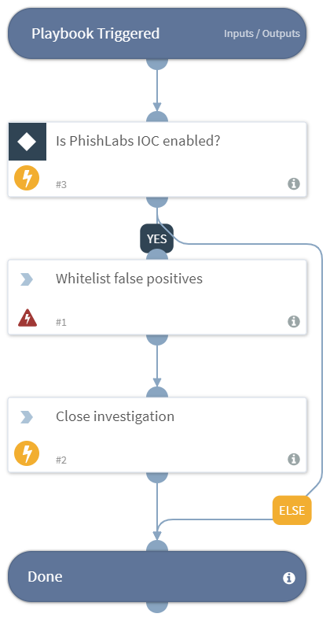

Adds indicators from PhishLabs that were classified as false positives to allow list, according to a defined period of time.

## Dependencies
This playbook uses the following sub-playbooks, integrations, and scripts.

### Sub-playbooks
This playbook does not use any sub-playbooks.

### Integrations
* Builtin

### Scripts
* PhishLabsPopulateIndicators

### Commands
* closeInvestigation

## Playbook Inputs
---

| **Name** | **Description** | **Default Value** | **Required** |
| --- | --- | --- | --- |
| Since | The allow list indicators within this duration (from now). | 1h | Optional |

## Playbook Outputs
---
There are no outputs for this playbook.

## Playbook Image
---

