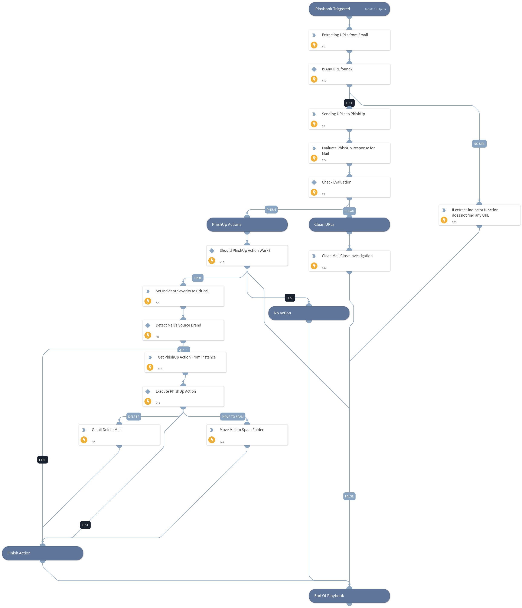

Extracts URLs from mail body and checks URLs with PhishUp. Takes action based on PhishUp results.

## Dependencies
This playbook uses the following sub-playbooks, integrations, and scripts.

### Sub-playbooks
This playbook does not use any sub-playbooks.

### Integrations
* PhishUp
* Gmail

### Scripts
* IncreaseIncidentSeverity

### Commands
* closeInvestigation
* phishup-get-chosen-action
* url
* extractIndicators
* phishup-evaluate-response
* gmail-delete-mail
* gmail-move-mail

## Playbook Inputs
---

| **Name** | **Description** | **Default Value** | **Required** |
| --- | --- | --- | --- |
| EmailBodyHtml | Email Mail Body for extracting URLs. Default Value is "$\{incident.emailbodyhtml\}" | ${incident.emailbodyhtml} | Required |
| ShouldPhishUpActionWork | If you do not want actions such as deleting mail and moving to spam in PhishUp playbook, you should set the value False. Default value is True | True | Required |
| GmailMessageID | Identify mail for deleting and moving funcitons. Defaultly it comes from incident which is setted from PhishUp Gmail Mapper | ${incident.emailmessageid} | Required |
| GmailUserID | Identify user for deleting and moving funcitons. Defaultly it comes from incident which is setted from PhishUp Gmail Mapper | ${incident.emailto} | Required |

## Playbook Outputs
---

| **Path** | **Description** | **Type** |
| --- | --- | --- |
| PhishUp.Evaluation | Phishing Result for URLs inside the HTML \(Clean, Phish\) | string |

## Playbook Image
---
