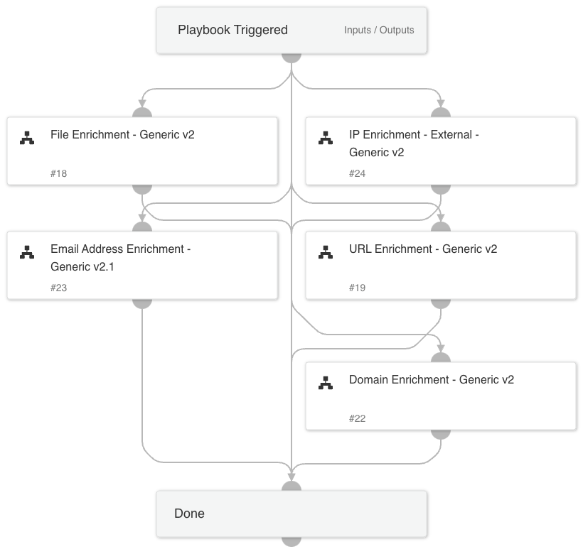

Enrich entities using one or more integrations

## Dependencies

This playbook uses the following sub-playbooks, integrations, and scripts.

### Sub-playbooks

* Domain Enrichment - Generic v2
* File Enrichment - Generic v2
* IP Enrichment - External - Generic v2
* URL Enrichment - Generic v2
* Email Address Enrichment - Generic v2.1

### Integrations

This playbook does not use any integrations.

### Scripts

This playbook does not use any scripts.

### Commands

This playbook does not use any commands.

## Playbook Inputs

---

| **Name** | **Description** | **Default Value** | **Required** |
| --- | --- | --- | --- |
| IP | The IP addresses to enrich | IP.Address | Optional |
| InternalRange | A list of internal IP ranges to check IP addresses against. The comma-separated list should be provided in CIDR notation. For example, a list of ranges would be: "172.16.0.0/12,10.0.0.0/8,192.168.0.0/16" \(without quotes\). | lists.PrivateIPs | Optional |
| MD5 | File MD5 to enrich | File.MD5 | Optional |
| SHA256 | File SHA256 to enrich | File.SHA256 | Optional |
| SHA1 | File SHA1 to enrich | File.SHA1 | Optional |
| URL | URL to enrich | URL.Data | Optional |
| Email | The email addresses to enrich | Account.Email.Address | Optional |
| Hostname | The hostname to enrich | Endpoint.Hostname | Optional |
| Username | The Username to enrich | Account.Username | Optional |
| Domain | The domain name to enrich | Domain.Name | Optional |
| ResolveIP | Determines whether the IP Enrichment - Generic playbook should convert IP addresses to hostnames using a DNS query. You can set this to either True or False. | False | Optional |
| InternalDomains | A CSV list of internal domains. The list will be used to determine whether an email address is internal or external. |  | Optional |

## Playbook Outputs

---

| **Path** | **Description** | **Type** |
| --- | --- | --- |
| IP | The IP object. | unknown |
| Endpoint | The endpoint object. | unknown |
| Endpoint.Hostname | The hostname that was enriched. | string |
| Endpoint.OS | The endpoint's operating system. | string |
| Endpoint.IP | A list of endpoint IP addresses. | unknown |
| Endpoint.MAC | A list of endpoint MAC addresses. | unknown |
| Endpoint.Domain | The endpoint domain name. | string |
| DBotScore | The DBotScore object. | unknown |
| DBotScore.Indicator | The indicator that was tested. | string |
| DBotScore.Type | The indicator type. | string |
| DBotScore.Vendor | Vendor used to calculate the score. | string |
| DBotScore.Score | The actual score. | number |
| File | The file object. | unknown |
| File.SHA1 | SHA1 hash of the file. | string |
| File.SHA256 | SHA256 hash of the file. | string |
| File.MD5 | MD5 hash of the file. | string |
| File.Malicious | Whether the file is malicious. | unknown |
| File.Malicious.Vendor | For malicious files, the vendor that made the decision. | string |
| URL | The URL object. | uknown |
| URL.Data | The enriched URL. | string |
| URL.Malicious | Whether the detected URL was malicious. | unknown |
| URL.Vendor | Vendor that labeled the URL as malicious. | string |
| URL.Description | Additional information for the URL. | string |
| Domain | The domain object. | unknown |
| Account | The account object. | unknown |
| Account.Email | The email of the account. | unknown |
| Account.Email.NetworkType | The email account NetworkType \(Internal/External\). | string |
| Account.Email.Distance | The object that contains the distance between the email domain and the compared domain.  | unknown |
| Account.Email.Distance.Domain | The compared domain. | string |
| Account.Email.Distance.Value | The distance between the email domain and the compared domain.  | number |
| ActiveDirectory.Users | An object containing information about the user from Active Directory. | unknown |
| ActiveDirectory.Users.sAMAccountName | The user's samAccountName. | unknown |
| ActiveDirectory.Users.userAccountControl | The user's account control flag. | unknown |
| ActiveDirectory.Users.mail | The user's email address. | unknown |
| ActiveDirectory.Users.memberOf | Groups the user is a member of. | unknown |
| CylanceProtectDevice | The device information about the hostname that was enriched using Cylance Protect v2. | unknown |

## Playbook Image

---

