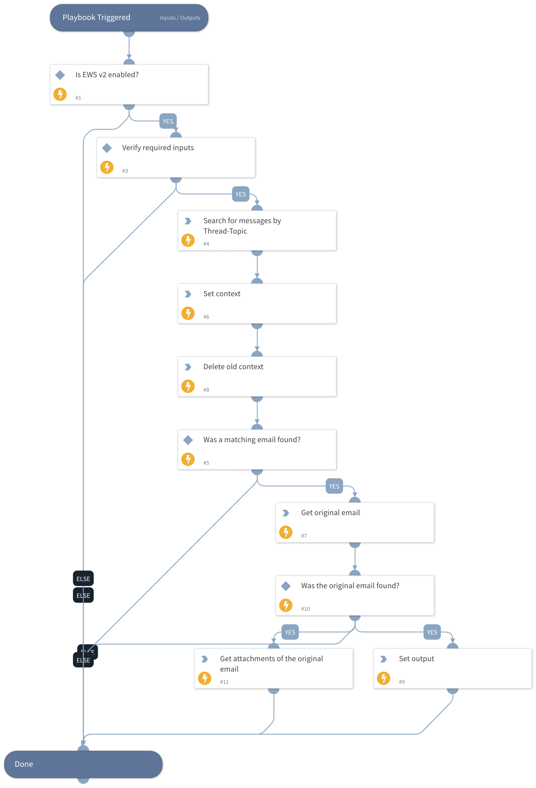

This playbook retrieves the original email in a thread, including headers and attachments, when the reporting user forwarded the original email not as an attachment.
Note: You must have the necessary eDiscovery permissions in the EWS integration to execute a global search.

## Dependencies
This playbook uses the following sub-playbooks, integrations, and scripts.

### Sub-playbooks
This playbook does not use any sub-playbooks.

### Integrations
* EWS v2

### Scripts
* DeleteContext
* Set

### Commands
* ews-search-mailbox
* ews-get-items
* ews-get-attachment

## Playbook Inputs
---

| **Name** | **Description** | **Default Value** | **Required** |
| --- | --- | --- | --- |
| Mailbox | Email address of the reporting user. | incident.labels.Email/from | Optional |
| InReplyTo | The InReplyTo header in the forwarded email. | incident.labels.Email/Header/In-Reply-To | Optional |
| ThreadTopic | The ThreadTopic header in the forwarded email. | incident.labels.Email/Header/Thread-Topic | Optional |

## Playbook Outputs
---

| **Path** | **Description** | **Type** |
| --- | --- | --- |
| Email | The email object | unknown |
| Email.To | The email recipient. | string |
| Email.From | The email sender. | string |
| Email.HTML | The email HTML. | string |
| Email.Body | The email text body. | string |
| Email.Headers | The email headers. | unknown |
| Email.Subject | The email subject. | string |
| File | The original attachments. | unknown |
| Email.HeadersMap | The email headers map. | unknown |

## Playbook Image
---
