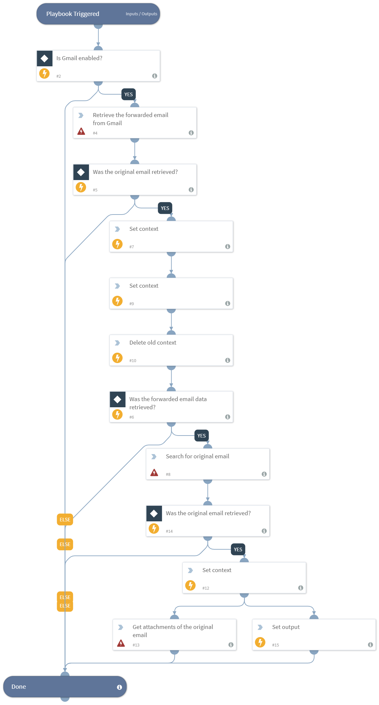

Retrieves the original email in a thread, including headers and attahcments, when the reporting user forwarded the original email not as an attachment.

You must have the necessary permissions in your Gmail service to execute global search: Google Apps Domain-Wide Delegation of Authority.

## Dependencies
This playbook uses the following sub-playbooks, integrations, and scripts.

### Sub-playbooks
This playbook does not use any sub-playbooks.

### Integrations
* Gmail

### Scripts
* DeleteContext
* Set

### Commands
* gmail-get-attachments
* gmail-get-mail
* gmail-search

## Playbook Inputs
---

| **Name** | **Description** | **Default Value** | **Source** | **Required** |
| --- | --- | --- | --- | --- |
| EmailID | The email ID of the forwarded message. | emailmessageid | incident | Optional |
| User | The email address of the reporting user. | emailto | incident | Optional |
| From | The email address of the thread originator. | emailfrom | incident | Optional |

## Playbook Outputs
---

| **Path** | **Description** | **Type** |
| --- | --- | --- |
| Email | The email object. | unknown |
| Email.To | The recipient of the email. | string |
| Email.From | The sender of the email. | string |
| Email.CC | The CC address of the email. | string |
| Email.BCC | The BCC address of the email. | string |
| Email.HTML | The email HTML. | string |
| Email.Body | The email text body. | string |
| Email.Headers | The email headers. | string |
| Email.Subject | The email subject. | string |
| File | Original attachments. | unknown |

## Playbook Image
---

