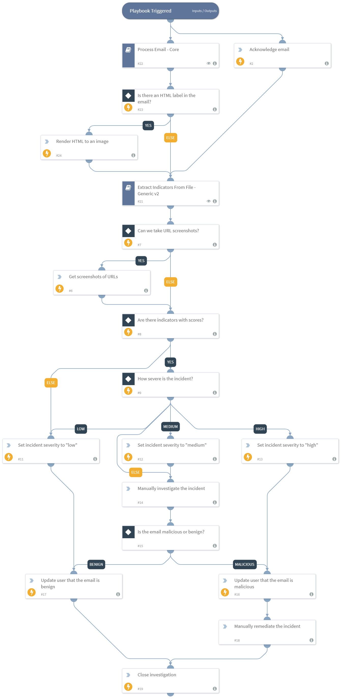

Provides a basic response to phishing incidents. 

Playbook features:
- Calculates reputation for all indicators.
- Extracts indicators from email attachments.
- Calculates severity for the incident based on indicator reputation.
- Updates reporting user about investigation status.
- Allows manual remediation of the incident.

## Dependencies
This playbook uses the following sub-playbooks, integrations, and scripts.

### Sub-playbooks
* Process Email - Core
* Extract Indicators From File - Generic v2

### Integrations
* Builtin

### Scripts
This playbook does not use any scripts.

### Commands
* rasterize
* send-mail
* setIncident
* rasterize-email
* closeInvestigation

## Playbook Inputs
---

| **Name** | **Description** | **Default Value** | **Required** |
| --- | --- | --- | --- | 
| GetURLScreenshots | Whether the user wants the Rasterize integration to produce images of URLs that are involved in the incident. If "True", screenshots will be taken. | True | Optional |

## Playbook Outputs
---
There are no outputs for this playbook.

## Playbook Image
---

