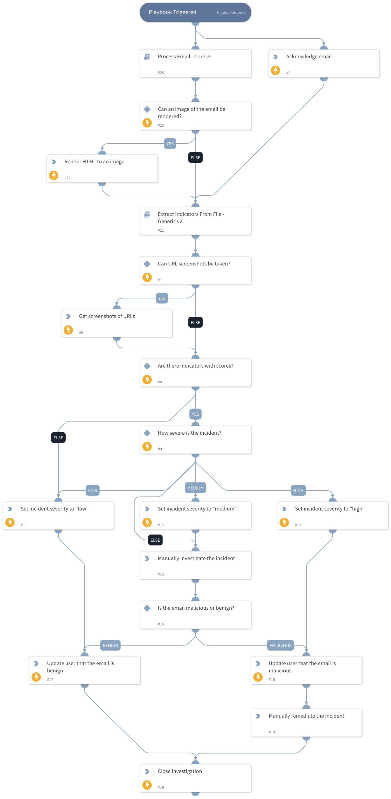

This playbook provides a basic response to phishing incidents, including:
- Calculating reputation for all indicators
- Extracting indicators from email attachments
- Calculating severity for the incident based on indicator reputation
- Updating the reporting user about investigation status
- Enabling manual incident remediation 

This updated playbook uses:
  1) Incident fields instead of labels
  2) The "Process Email - Core v2" playbook

## Dependencies
This playbook uses the following sub-playbooks, integrations, and scripts.

### Sub-playbooks
* Extract Indicators From File - Generic v2
* Process Email - Core v2

### Integrations
This playbook does not use any integrations.

### Scripts
This playbook does not use any scripts.

### Commands
* rasterize
* rasterize-email
* closeInvestigation
* setIncident
* send-mail

## Playbook Inputs
---

| **Name** | **Description** | **Default Value** | **Required** |
| --- | --- | --- | --- |
| GetURLScreenshots | Whether the user wants the Rasterize integration to produce images of URLs involved in the incident. If "True", screenshots are taken. | True | Optional |

## Playbook Outputs
---
There are no outputs for this playbook.

## Playbook Image
---
