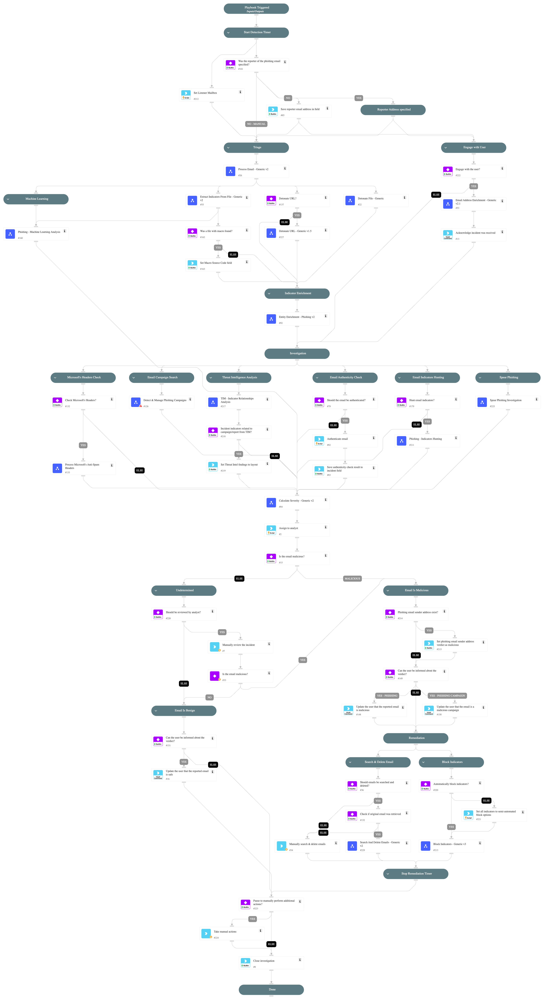

This playbook investigates and remediates a potential phishing incident. It engages with the user who triggered the incident while investigating the incident itself.

Note:
- Final remediation tasks are manual by default. can be managed by "SearchAndDelete" and "BlockIndicators" inputs. 
- Do not rerun this playbook inside a phishing incident since it can produce an unexpected result. Create a new incident instead if needed.

## Dependencies

This playbook uses the following sub-playbooks, integrations, and scripts.

### Sub-playbooks

* Block Indicators - Generic v3
* Calculate Severity - Generic v2
* Detect & Manage Phishing Campaigns
* Detonate File - Generic
* Detonate URL - Generic v1.5
* Email Address Enrichment - Generic v2.1
* Entity Enrichment - Phishing v2
* Extract Indicators From File - Generic v2
* Phishing - Indicators Hunting
* Phishing - Machine Learning Analysis
* Process Email - Generic v2
* Process Microsoft's Anti-Spam Headers
* Search And Delete Emails - Generic v2
* Spear Phishing Investigation
* TIM - Indicator Relationships Analysis

### Integrations

This playbook does not use any integrations.

### Scripts

* AssignAnalystToIncident
* CheckEmailAuthenticity
* Set
* SetAndHandleEmpty

### Commands

* closeInvestigation
* send-mail
* setIncident
* setIndicator

## Playbook Inputs

---

| **Name** | **Description** | **Default Value** | **Required** |
| --- | --- | --- | --- |
| Role | The default role to assign the incident to. |  | Required |
| OnCall | Set to True to assign only the user that is currently on shift. | False | Optional |
| EmailHuntingCreateNewIncidents | When "True", the "Phishing - Handle Microsoft 365 Defender Results" sub-playbook will open new phishing incidents for each email that contains one of the malicious indicators. Default is "False". | False | Optional |
| ListenerMailbox | The mailbox which is being used to fetch phishing incidents. This mailbox would be excluded in the "Phishing - Indicators Hunting" playbook. In case the value of this input is empty, the value of the "Email To" incident field will be automatically used as the listener mailbox. |  | Optional |
| SendMailInstance | The name of the instance to be used when executing the "send-mail" command in the playbook. In case it will be empty, all available instances will be used \(default\). |  | Optional |
| UserEngagement | Specify whether to engage with the user via email for investigation updates. Set the value to 'True' to allow user engagement, or 'False' to avoid user engagement. | True | Optional |
| TakeManualActions | Specify whether to stop the playbook to take additional action before closing the incident. Set the value to 'True' to stop the playbook before closing the incidents, or "False" to close the incident once the playbook flow is done. | False | Optional |
| NonMaliciousEmailReview | In case of an incident with a non-malicious email, it is possible either to close the incident or to review and approve it by an analyst. Set the value "True" for a review of the incident by an analyst. Set the value "False" to close the incident. | True | Optional |
| DetonateURL | Determines whether to use the "URL Detonation" playbook. Detonating a URL may take a few minutes. | False | Optional |
| InternalRange | This input is used in the "Entity Enrichment - Phishing v2" playbook. A list of internal IP ranges to check IP addresses against. The comma-separated list should be provided in CIDR notation. For example, a list of ranges is: "172.16.0.0/12,10.0.0.0/8,192.168.0.0/16" \(without quotes\). | lists.PrivateIPs | Optional |
| InternalDomains | A CSV list of internal domains. The list is used to determine whether an email address is internal or external. |  | Optional |
| AuthenticateEmail | Determines whether the authenticity of the email should be verified using SPF, DKIM, and DMARC. | True | Optional |
| CheckMicrosoftHeaders | Whether to check Microsoft headers for BCL/PCL/SCL scores and set the "Severity" and "Email Classification" accordingly. | True | Optional |
| GetOriginalEmail | For forwarded emails. When "True", retrieves the original email in the thread.  You must have the necessary permissions in your email service to execute global search.  - For EWS: eDiscovery - For Gmail: Google Apps Domain-Wide Delegation of Authority - For MSGraph: As described in these links https://docs.microsoft.com/en-us/graph/api/message-get https://docs.microsoft.com/en-us/graph/api/user-list-messages | False | Optional |
| OriginalAuthenticationHeader | This input will be used as the "original_authentication_header" argument in the "CheckEmailAuthenticity" script under the "Authenticate email" task. The header that holds the original Authentication-Results header value. This can be used when an intermediate server changes the original email and holds the original header value in a different header. Note - Use this only if you trust the server creating this header. |  | Optional |
| PhishingModelName | Optional - the name of a pre-trained phishing model to predict phishing type using machine learning. |  | Optional |
| DBotPredictURLPhishingURLsNumber | The number of URLs to extract from the email HTML and analyze in the "DBotPredictURLPhishing" automation. This automation runs several checks to determine the score of the URLs found in the email, sets a verdict for URLs found as "Suspicious" or "Malicious", and adds these URLs as indicators. Based on the verdict, the incident severity is set \(Medium for "Suspicious" and High for "Malicious"\). Note: - You need to install the "Phishing URL" pack to use this automation. - False/True positives are possible. - This automation may take a few minutes to run. - To increase result accuracy, it is recommended to install and enable the "Whois" pack \(optional\). | 3 | Optional |
| EmailFileToExtract | Reported emails and emails retrieved during playbook execution can contain multiple nested email files. For example, an EML nested inside another EML file. If multiple level files are detected, this field determines which file represents the phishing email.  For example: User1 receives an email from Attacker. User1 attaches the email as an EML file and sends the email to User2. User2 also attaches that email as a file, and reports it as phishing. In this case, the phishing email would be the "inner file" \(as opposed to "outer file"\).  Possible values are: Inner file, Outer file, All files. Inner file: The file at the deepest level is parsed. If there is only one file, that file is parsed. Outer file: The file at the first level is parsed. All files: All files are parsed. Do not use this option in the phishing playbook, as there should only be one phishing email per playbook run. | Inner file | Optional |
| HuntEmailIndicators | Whether to enter the "Email Indicators Hunting" branch in the playbook. Under this branch, sub-playbooks would be triggered in order to hunt malicious indicators found in other emails and optionally, automatically create new incidents for each found email \(configurable through next playbook inputs\). Default is "True". | True | Optional |
| KeyWordsToSearch | A comma-separated list of keywords to search in the email body. For example: name of the organization finance app that the attacker might impersonate. This input is used in the "Spear Phishing Investigation" sub-playbook. |  | Optional |
| BlockIndicators | This input manages the automated block indicators capability. Set to "True" for automatically block all malicious indicators. Set to "False" to manually choose which indicators to block, if any. | False | Optional |
| SearchAndDelete | Enables the Search and Delete capability. For a malicious email, the "Search and Delete" sub-playbook looks for other instances of the email and deletes them pending analyst approval. | False | Optional |
| SearchAndDeleteIntegration | Determines which product and playbook is used to search and delete the phishing email from user inboxes.   - Set this to "MS Graph" to use the "Search And Delete Emails - Generic v2" playbook with Microsoft Purview eDiscovery via Microsoft Graph Security.   - Set this to "EWS" to use the "Search And Delete Emails - EWS" playbook.   - Set this to "Gmail" to use the "Search And Delete - Gmail" playbook. | EWS | Optional |
| MsgCase | The name of the Microsoft Purview eDiscovery case to use for searching and deleting emails. Required when SearchAndDeleteIntegration is set to "MS Graph". | XSOAR Auto Phishing | Optional |
| MsgMailboxScope | Determines the scope of mailboxes to search when using the Microsoft Graph Security path. Use "recipientsOnly" to search only in the email recipient mailboxes identified in the incident. Use "allTenantMailboxes" to search across all mailboxes in the tenant. Note - searching all mailboxes may take significant time. Applicable only when SearchAndDeleteIntegration is set to "MS Graph". | recipientsOnly | Optional |
| MsgDeleteType | Sets the deletion method when using the Microsoft Graph Security path. "Soft" moves emails to the recoverable items folder \(can be restored\). "Hard" permanently purges emails \(unrecoverable\). Leave empty to decide manually for each incident. Applicable only when SearchAndDeleteIntegration is set to "MS Graph". | Soft | Optional |
| MsgMailboxExclusion | A comma-separated list of mailbox email addresses to exclude from the search when MsgMailboxScope is set to "allTenantMailboxes". Note: this performs message-level filtering — if an email thread involves an excluded address, the message may still appear in other mailboxes. Applicable only when SearchAndDeleteIntegration is set to "MS Graph". |  | Optional |

## Playbook Outputs

---
There are no outputs for this playbook.

## Playbook Image

---

