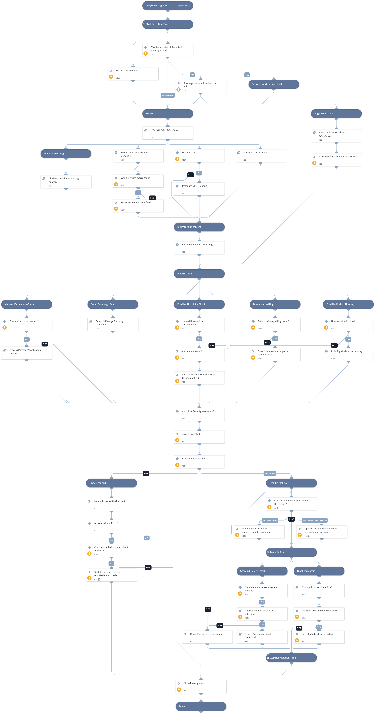

This playbook investigates and remediates a potential phishing incident. It engages with the user that triggered the incident while investigating the incident itself. 
For the **Phishing Alerts** use case, see the [Phishing Alerts Investigation playbook](https://xsoar.pan.dev/docs/reference/playbooks/phishing-alerts-investigation).

Note: 
Final remediation tasks are always decided by a human analyst.

v3 includes:
- Changing all labels to incident fields.
- **Process Email - Generic v2** playbook (replaces the older version), which includes:
    - Changing all labels to incident fields.
    - Better handling for forwarded emails.
    - Support for the new "Phishing Alerts" pack.
- New **Detonate URL - Generic** playbook.
- New playbook inputs (see their descriptions in the table at the bottom of this page): 
    - InternalDomains
    - DetonateURL
    - InternalRange
    - PhishingModelName
- Inline field extraction, which requires the **On field change** configuration to be set to "inline" in the **Phishing** incident type. This enables extracting indicators whenever an incident field is changed (available for Cortex XSOAR from version 6.1).

##### Triggers
The investigation is triggered by an email sent or forwarded to a designated phishing inbox. One of the following mail listener integrations creates a phishing incident in Cortex XSOAR from every received email.
- EWS v2
- Gmail
- Microsoft Mail Graph
- Mail Listener (does not support retrieving original emails when the suspected emails are not attached)

##### Configuration
- Create an email inbox for phishing reports. Make sure the user in control of that inbox has the permissions required by your integration (EWS v2, Gmail, or MSGraph).
- Configure the main **Phishing - Generic v3** playbook inputs.
- Optional: Configure the Active Directory critical asset names inputs in the **Calculate Severity - Generic v2** playbook or leave them empty.
- Optional: Configure the *InternalRange* and *ResolveIP* inputs in the **IP Enrichment - External - Generic v2** playbook.
- Optional: Configure the *Rasterize* and *VerifyURL* inputs in the **URL Enrichment - Generic v2** playbook.
- Optional: Personalize the user engagement messages sent throughout the investigation in the **Phishing - Generic v3** playbook under the following tasks: 
    - **Acknowledge incident was received** (task #13)
    - **Update the user that the reported email is safe** (task #16)
    - **Update the user that the reported email is malicious** (task #17)
    - **Update the user that the email is a malicious campaign** (task #130)
- Optional: Configure the *ExchangeLocation* input in the **Search And Delete Emails - Generic v2** playbook.
- Optional: Configure the *SearchAndDeleteIntegration* input in the **Search And Delete Emails - Generic v2** playbook.
- Optional: Personalize the inputs in the **Detect & Manage Phishing Campaigns** playbook.
- Optional: Configure the minimum severity for PCL, SCL, and BCL score in the **Process Microsoft's Anti-Spam Headers** playbook.
- Optional: Configure the *EmailBrand* input in the **Process Email - Generic v2** playbook.

##### Best Practices & Suggestions
- The email received in the designated phishing inbox should contain the potential phishing email as a file attachment so the headers of the original suspected email are retained. If the email is not attached, the original email with its headers is retrieved only if the required permissions are configured and the *GetOriginalEmail* input is set to True in the **Process Email - Generic v2** playbook.
- Gmail or EWS v2 works best with the use case.
- Configuring the optional configurations can significantly optimize the investigation. 

## Dependencies
This playbook uses the following sub-playbooks, integrations, and scripts.

### Sub-playbooks
* Process Microsoft's Anti-Spam Headers
* Block Indicators - Generic v2
* Detonate URL - Generic
* Extract Indicators From File - Generic v2
* Entity Enrichment - Phishing v2
* Email Address Enrichment - Generic v2.1
* Search And Delete Emails - Generic v2
* Calculate Severity - Generic v2
* Process Email - Generic v2
* Detect & Manage Phishing Campaigns
* Detonate File - Generic

### Integrations
This playbook does not use any integrations.

### Scripts
* DBotPredictPhishingWords
* AssignAnalystToIncident
* CheckEmailAuthenticity
* DBotPredictURLPhishing
* Set

### Commands
* extractIndicators
* setIncident
* send-mail
* closeInvestigation

## Playbook Inputs
---

| **Name** | **Description** | **Default Value** | **Required** |
| --- | --- | --- | --- |
| Role | The default role to assign the incident to. | Administrator | Required |
| SearchAndDelete | Enables the Search and Delete capability. For a malicious email, the "Search and Delete" sub-playbook looks for other instances of the email and deletes them pending analyst approval. | False | Optional |
| BlockIndicators | Enables the Block Indicators capability. For a malicious email, the "Block Indicators" sub-playbook blocks all malicious indicators in the relevant integrations. | False | Optional |
| AuthenticateEmail | Determines whether the authenticity of the email should be verified using SPF, DKIM, and DMARC. | True | Optional |
| OnCall | Set to True to assign only the user that is currently on shift. | False | Optional |
| SearchAndDeleteIntegration | Determines which product and playbook is used to search and delete the phishing email from the users' inboxes.   - Set this to "O365" to use the "O365 - Security And Compliance - Search And Delete" playbook.   - Set this to "EWS" to use the "Search And Delete Emails - EWS" playbook.   - Set this to "Gmail" to use the "Search And Delete - Gmail" playbook. | EWS | Optional |
| O365DeleteType | Sets the method to delete emails in the "O365 - Security And Compliance - Search And Delete" playbook. Can be "Soft" \(recoverable\), or "Hard" \(unrecoverable\). Leave empty to decide manually for each email incident. This is only applicable if the SearchAndDeleteIntegration input is set to O365. | Soft | Optional |
| O365ExchangeLocation | The exchange location. Determines from where to search and delete emails using O365 playbooks. Use the value "All" to search all mailboxes, or use $\{incident.emailto\} to search and delete the email only from the recipient's inbox. Note:  - Searching all mailboxes may take a significant amount of time.  - This input is used only when searching and deleting emails in O365 and only applies if the SearchAndDeleteIntegration input is set to O365. | incident.emailto | Optional |
| O365AllowNotFoundSearchLocations | Used only when searching and deleting emails in O365. Determines whether to include mailboxes other than regular user mailboxes in the compliance search. | False | Optional |
| O365ExchangeLocationExclusion | Used only when searching and deleting emails in O365. A comma-separated list of mailboxes/distribution groups to exclude when you use the value "All" for the O365ExchangeLocation input. |  | Optional |
| CheckMicrosoftHeaders | Whether to check Microsoft's headers for BCL/PCL/SCL scores and set the "Severity" and "Email Classification" accordingly. | True | Optional |
| InternalDomains | A CSV list of internal domains. The list is used to determine whether an email address is internal or external. |  | Optional |
| DetonateURL | Determines whether to use the "URL Detonation" playbook. Detonating a URL may take a few minutes. | False | Optional |
| InternalRange | This input is used in the task "Entity Enrichment - Phishing v2" playbook. A list of internal IP ranges to check IP addresses against. The list should be provided in CIDR notation, separated by commas. An example of a list of ranges is: "172.16.0.0/12,10.0.0.0/8,192.168.0.0/16" \(without quotes\). If a list is not provided, uses the default list provided in the IsIPInRanges script \(the known IPv4 private address ranges\). |  | Optional |
| PhishingModelName | Optional - the name of a pre-trained phishing model to predict phishing type using machine learning. | phishing_model | Optional |
| GetOriginalEmail | For forwarded emails. When "True", retrieves the original email in the thread. You must have the necessary permissions in your email service to execute global search. - For EWS: eDiscovery - For Gmail: Google Apps Domain-Wide Delegation of Authority - For MSGraph: As described in these links https://docs.microsoft.com/en-us/graph/api/message-get   https://docs.microsoft.com/en-us/graph/api/user-list-messages |  | Optional |
| DBotPredictURLPhishingURLsNumber | The number of URLs to extract from the email HTML and analyze in the "DBotPredictURLPhishing" automation. This automation runs several checks to determine the score of the URLs found in the email, sets a verdict for URLs found as "Suspicious" or "Malicious", and adds these URLs as indicators. Based on the verdict, the incident severity is set \(Medium for "Suspicious" and High for "Malicious"\). Note: - False/True positives are possible. - This automation may take a few minutes to run. - To increase result accuracy, it is recommended to install and enable the [Whois pack](https://xsoar.pan.dev/marketplace/details/Whois) \(optional\). | 3 | Optional |

## Playbook Outputs
---
There are no outputs for this playbook.

## Playbook Image
---
