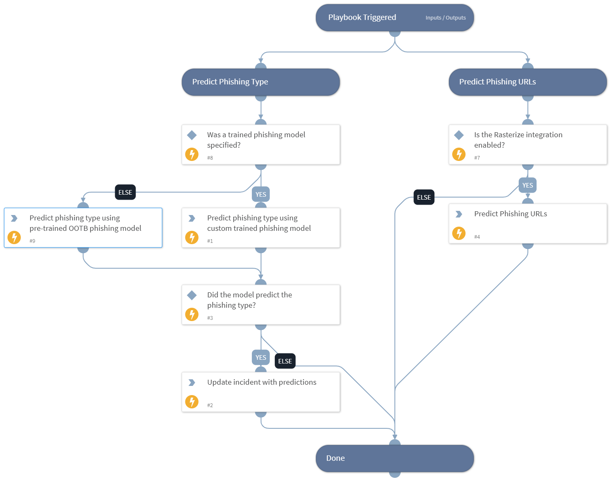

Runs various machine-learning based checks on phishing emails and URLs, in an attempt to predict whether they are phishing or benign.

## Dependencies
This playbook uses the following sub-playbooks, integrations, and scripts.

### Sub-playbooks
This playbook does not use any sub-playbooks.

### Integrations
This playbook does not use any integrations.

### Scripts
* DBotPredictURLPhishing
* DBotPredictPhishingWords
* DBotPredictOutOfTheBoxV2
* IsIntegrationAvailable

### Commands
* setIncident

## Playbook Inputs
---

| **Name** | **Description** | **Default Value** | **Required** |
| --- | --- | --- | --- |
| ExtractedURLsFromFiles | The list of URLs that were extracted from the file. This output is a duplicate of the URL.Data output and it enables parent playbooks to identify the URLs generated by this playbook. |  | Optional |
| PhishingModelName | Optional - the name of a pre-trained phishing model to predict phishing type using machine learning. |  | Optional |
| DBotPredictURLPhishingURLsNumber | The number of URLs to extract from the email HTML and analyze in the "DBotPredictURLPhishing" automation. This automation runs several checks to determine the score of the URLs found in the email, sets a verdict for URLs found as "Suspicious" or "Malicious", and adds these URLs as indicators. Based on the verdict, the incident severity is set \(Medium for "Suspicious" and High for "Malicious"\). Note: - You need to install the "Phishing URL" pack to use this automation. - False/True positives are possible. - This automation may take a few minutes to run. - To increase result accuracy, it is recommended to install and enable the "Whois" pack \(optional\). |  | Optional |
| EmailText | The email text of the phishing email if it exists. |  | Optional |
| EmailHTML | The email HTML body of the phishing email if it exists. |  | Optional |
| EmailSubject | The subject of the phishing email if it exists. |  | Optional |

## Playbook Outputs
---
There are no outputs for this playbook.

## Playbook Image
---
