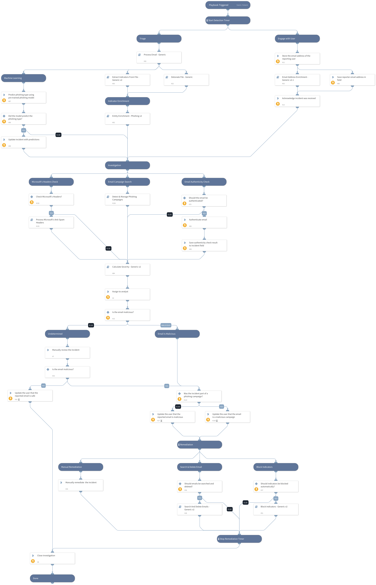

## Usage

Use this playbook to investigate and remediate a potential phishing incident and detect phishing campaigns. The playbook simultaneously engages with the user that triggered the incident, while investigating the incident itself.

The final remediation tasks are always decided by a human analyst.

To see how to set up a phishing incident generally in Cortex XSOAR, go to the [Phishing Use Case Tutorial](https://docs.paloaltonetworks.com/cortex/cortex-xsoar/6-2/cortex-xsoar-tutorials/tutorials/phishing-use-case.html).

##### Triggers
The investigation is triggered by an email sent or forwarded to a designated "phishing inbox". A mail listener integration that listens to that mailbox, will use every received email to create a phishing incident in Cortex XSOAR.
A mail listener can be one of the following integrations:
- EWS v2
- Gmail
- Mail Listener (does not support retrieval of original emails when the suspected emails are not attached)

##### Configuration
- Create an email inbox that should be used for phishing reports. Make sure the user in control of that inbox has the permissions required by your integration (EWS v2 or Gmail).
- Configure the `Phishing` incident type to run the `Phishing Investigation - Generic v2` playbook.
- Configure the inputs of the main `Phishing Investigation - Generic v2` playbook.
- Optional - configure the Active Directory critical asset names under the inputs of the `Calculate Severity - Generic v2` inputs or leave them empty.
- Optional - Should you want to perform domain-squatting checks - configure the `InternalDomains` input of the `Email Address Enrichment - Generic v2.1` playbook. We recommend to configure this so we can provide better insight into phishing emails.
- Optional - Configure the `InternalRange` and `ResolveIP` inputs of the `IP Enrichment - External - Generic v2` playbook.
- Optional - Configure the `Rasterize` and `VerifyURL` inputs of the `URL Enrichment - Generic v2` playbook.
- Optional - Personalize the user engagement messages sent throughout the investigation in the `Phishing Investigation - Generic v2` playbook. 
These task have the following names:
  - Acknowledge incident was received (task #13)
  - Update the user that the reported email is safe (task #16)
  - Update the user that the reported email is malicious (task #17)
  - Update the user that the reported email is malicious (task #17
- Optional - Configure the `ExchangeLocation` input of the `Search And Delete Emails - Generic v2` playbook.
- Optional - Personalize the inputs of the `Detect & Manage Phishing Campaigns` playbook.

##### Best Practices & Suggestions
- The email received in the designated phishing inbox should be an email **containing** the potential phishing email as a file attachment, so that the headers of the original suspected email are retained.
- Using Gmail or EWS v2 work best with the use case.
- If phishing emails are forwarded instead of attached as files, Auto extract should not be turned off so that all indicators are properly extracted and analyzed.
- Configuring the optional configurations can greatly enhance the investigation.

## Dependencies
* Builtin

### Sub-playbooks
* Calculate Severity - Generic v2
* Email Address Enrichment - Generic v2.1
* Process Email - Generic
* Extract Indicators From File - Generic v2
* Detonate File - Generic
* Entity Enrichment - Phishing v2
* Search And Delete Emails - Generic v2
* Block Indicators - Generic v2
* Detect & Manage Phishing Campaigns
* Process Microsoft's Anti-Spam Headers

### Integrations
This playbook does not use any integrations.

### Scripts
* DBotPredictPhishingWords
* CheckEmailAuthenticity
* FindEmailCampaign
* Set
* AssignAnalystToIncident

### Commands
* setIncident
* closeInvestigation
* send-mail
* extractIndicators

## Playbook Inputs
---

| **Name** | **Description** | **Default Value** | **Required** |
| --- | --- | --- | --- |
| Role | The default role to assign the incident to. | Administrator | Required |
| SearchAndDelete | Enable the "Search and Delete" capability \(can be either "True" or "False"\). In case of a malicious email, the "Search and Delete" sub-playbook will look for other instances of the email and delete them pending analyst approval. | False | Optional |
| BlockIndicators | Enable the "Block Indicators" capability \(can be either "True" or "False"\). In case of a malicious email, the "Block Indicators" sub-playbook will block all malicious indicators in the relevant integrations. | False | Optional |
| AuthenticateEmail | Whether the authenticity of the email should be verified, using SPF, DKIM and DMARC. | False | Optional |
| OnCall | Set to true to assign only user that is currently on shift. Requires Cortex XSOAR v5.5 or later. | False | Optional |
| SearchAndDeleteIntegration | Determines which product and playbook will be used to search and delete the phishing email from users' inboxes. Set this to "O365" to use the O365 - Security And Compliance - Search And Delete playbook. Set this to "EWS" to use the Search And Delete Emails - EWS playbook. | EWS | Optional |
| O365DeleteType | The method by which to delete emails using the O365 - Security And Compliance - Search And Delete playbook. Could be "Soft" \(recoverable\), or "Hard" \(unrecoverable\). Leave empty to decide manually for each email incident. This is only applicable if the SearchAndDeleteIntegration input is set to O365. | Soft | Optional |
| O365ExchangeLocation | Used only when searching and deleting emails in O365. The exchange location. Determines from where to search and delete emails searched using O365 playbooks. Use the value "All" to search all mailboxes, use "SingleMailbox" to search and delete the email only from the recipient's inbox, or specify "Manual" to decide manually for every incident. Note - searching all mailboxes may take a significant amount of time. This input is only applicable if the SearchAndDeleteIntegration input is set to O365. | SingleMailbox | Optional |
| O365AllowNotFoundSearchLocations | Used only when searching and deleting emails in O365. Whether to include mailboxes other than regular user mailboxes in the compliance search. Default is "false". | true | Optional |
| O365ExchangeLocationExclusion | Used only when searching and deleting emails in O365. Comma-separated list of mailboxes/distribution groups to exclude when you use the value "All" for the O365ExchangeLocation input. |  | Optional |
| CheckMicrosoftHeaders | Check Microsoft's headers for BCL/PCL/SCL scores and set the "Severity" and "Email Classification" accordingly. | True | Optional |

## Playbook Outputs
---
There are no outputs for this playbook.

## Playbook Image
---
