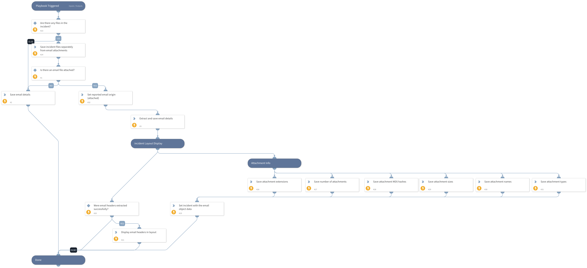

This playbook adds email details to the relevant context entities and handles the case where original emails are attached.

## Dependencies
This playbook uses the following sub-playbooks, integrations, and scripts.

### Sub-playbooks
This playbook does not use any sub-playbooks.

### Integrations
This playbook does not use any integrations.

### Scripts
* SetGridField
* IdentifyAttachedEmail
* Set
* SetAndHandleEmpty
* ParseEmailFilesV2

### Commands
* setIncident

## Playbook Inputs
---

| **Name** | **Description** | **Default Value** | **Required** |
| --- | --- | --- | --- |
| File | An EML or MSG file. | File.None | Optional |
| Email | The receiving email address. | incident.emailto | Optional |
| EmailCC | CC addresses | incident.emailcc | Optional |
| EmailFrom | The originator of the email. | incident.emailfrom | Optional |
| EmailSubject | The email subject. | incident.emailsubject | Optional |
| EmailText | The email text. | incident.emailbody | Optional |
| EmailHtml | The HTML version of the email. | incident.emailhtml | Optional |
| EmailHeaders | The email headers. | incident.emailheaders | Optional |
| EmailFormat | The email format. | incident.emailformat | Optional |

## Playbook Outputs
---

| **Path** | **Description** | **Type** |
| --- | --- | --- |
| Email.HTML | Email HTML body, if it exists. | string |
| Email | Email object. | unknown |
| Email.CC | Email CC addresses. | string |
| Email.From | Email 'from' sender. | string |
| Email.Subject | Email subject. | string |
| Email.To | Email 'to' addresses. | string |
| Email.Text | Email text body, if it exists. | string |
| Email.Headers | The full email headers as a single string. | string |
| Email.Attachments | The list of attachment names in the email. | string |
| Email.Format | The format of the email, if available. | string |
| File | The file object. | unknown |

## Playbook Image
---
