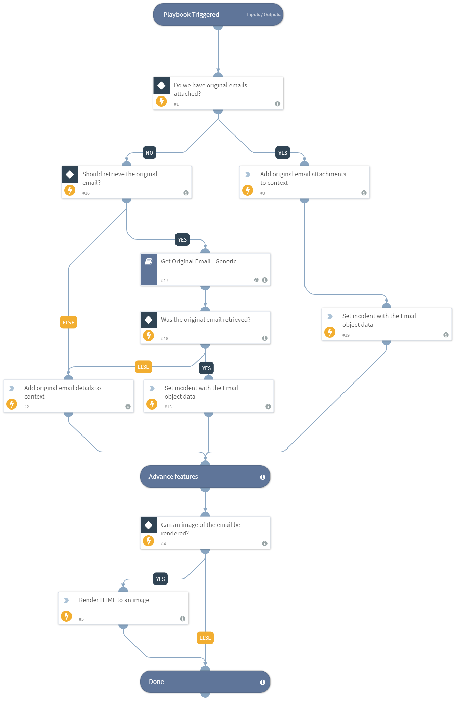

This playbook adds email details to the relevant context entities and handles original email attachments.

## Dependencies
This playbook uses the following sub-playbooks, integrations, and scripts.

### Sub-playbooks
Get Original Email - Generic

### Integrations
This playbook does not use any integrations.

### Scripts
* SetAndHandleEmpty
* ParseEmailFiles
* Set
* IdentifyAttachedEmail
* SetGridField

### Commands
* rasterize-email
* setIncident

## Playbook Inputs
---

| **Name** | **Description** | **Default Value** | **Required** |
| --- | --- | --- | --- |
| File | An EML or MSG file. | File.None | Optional |
| Email | The receiving email address. | incident.labels.Email | Optional |
| Email/cc | The CC addresses. | incident.labels.CC | Optional |
| Email/from | The originator of the email. | incident.labels.Email/from | Optional |
| Email/subject | The email subject. | incident.labels.Email/subject | Optional |
| Email/text | The email text. | incident.labels.Email/text | Optional |
| Email/html | The email HTML. | incident.labels.Email/html | Optional |
| Email/headers | The email headers. | incident.labels.Email/headers | Optional |
| Email/format | The email format. | incident.labels.Email/format | Optional |
| GetOriginalEmail | Retrieves the original email in the thread.   You must have the necessary permissions in your email service to execute global search. - EWS: eDiscovery - Gmail: Google Apps Domain-Wide Delegation of Authority | False | Optional |

## Playbook Outputs
---

| **Path** | **Description** | **Type** |
| --- | --- | --- |
| Email.HTML | The email HTML body if it exists. | string |
| Email | The email object. | unknown |
| Email.CC |The email CC addresses. | string |
| Email.From | The email from sender. | string |
| Email.Subject |The email subject. | string |
| Email.To | The email to addresses. | string |
| Email.Text | The email text body if exists. | string |
| Email.Headers | The full email headers as a single string. | string |
| Email.Attachments | The list of attachment names in the email. | string |
| Email.Format | The email format if available. | string |
| File | The file object. | unknown |

## Playbook Image
---

