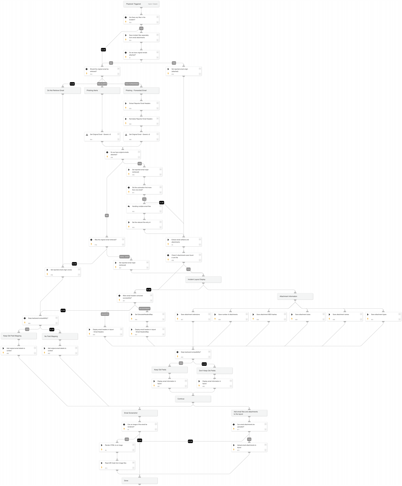

This playbook adds email details to the relevant context entities and handles original email attachments.

The v2 playbook enables parsing email artifacts more efficiently, including:
- Using incident fields and not incident labels.
- Providing separate paths to "Phishing Alerts".
- Using the new "Get Original Email - Generic v2" playbook to retrieve original emails as EML files from the following integrations:
  * EWS v2
  * Microsoft Graph Mail integration
  * Gmail
  * FireEye EX and FireEye CM
  * Proofpoint Protection Server
  * Agari Phishing Defense (EWS v2, MSGraph Mail, Gmail)
  * Mimecast.

## Dependencies

This playbook uses the following sub-playbooks, integrations, and scripts.

### Sub-playbooks

* Get Original Email - Generic v2

### Integrations

This playbook does not use any integrations.

### Scripts

* Set
* ParseEmailFilesV2
* SetAndHandleEmpty
* SetGridField
* IdentifyAttachedEmail

### Commands

* core-api-multipart
* rasterize-email
* setIncident

## Playbook Inputs

---

| **Name** | **Description** | **Default Value** | **Required** |
| --- | --- | --- | --- |
| File | An EML or MSG file. | File | Optional |
| Email | The receiver email address. | incident.emailto | Optional |
| EmailCC | The email CC addresses. | incident.emailcc | Optional |
| EmailFrom | The sender email address. | incident.emailfrom | Optional |
| EmailSubject | The email subject. | incident.emailsubject | Optional |
| EmailText | The email text. | incident.emailbody | Optional |
| EmailHtml | The email HTML. | incident.emailhtml | Optional |
| EmailHeaders | The email headers. | incident.phishingreporteremailheaders | Optional |
| EmailFormat | The email format. | incident.emailformat | Optional |
| GetOriginalEmail | Retrieves the original email in the thread.  You must have the necessary permissions in your email service to execute global search.  - For EWS: eDiscovery - For Gmail: Google Apps Domain-Wide Delegation of Authority - For MSGraph: As described in the \[message-get API\]\(https://docs.microsoft.com/en-us/graph/api/message-get\) and the \[user-list-messages API\]\(https://docs.microsoft.com/en-us/graph/api/user-list-messages\) | False | Optional |
| MessageID | The original email message ID to retrieve. Holds the value of the "Message-ID" header of the original email. This value is passed as an input to the "Get Original Email - Generic v2" playbook. | incident.emailmessageid | Optional |
| UserID | The user's email address to retrieve the original email. This value is passed as an input to the "Get Original Email - Generic v2" playbook. | incident.emailto | Optional |
| Thread-Topic | The value of the "Thread-Topic" header which holds the original email subject, needed for forwarded email scenarios. It is passed as an input to the "Get Original Email - Generic v2" playbook to use in the relevant sub-playbooks. | incident.emailsubject | Optional |
| EmailBrand | If this value is provided, only the relevant playbook runs. If no value is provided, all sub-playbooks are run. Possible values: - Gmail - EWS v2 - MicrosoftGraphMail - EmailSecurityGateway Choosing the EmailSecurityGateway executes the following if enabled: - FireEye EX \(Email Security\) - Proofpoint TAP - Mimecast. |  | Optional |
| EmailFileToExtract | Reported emails and emails retrieved during playbook execution can contain multiple nested email files. For example, an EML nested inside another EML file. If multiple level files are detected, this field determines which file represents the phishing email.  For example: User1 receives an email from Attacker. User1 attaches the email as an EML file and sends the email to User2. User2 also attaches that email as a file, and reports it as phishing. In this case, the phishing email would be the "inner file" \(as opposed to "outer file"\).  Possible values are: Inner file, Outer file, All files. Inner file: The file at the deepest level is parsed. If there is only one file, that file is parsed. Outer file: The file at the first level is parsed. All files: All files are parsed. Do not use this option in the phishing playbook, as there should only be one phishing email per playbook run. | Inner file | Optional |
| UseOldHTMLFields | This input is used to preserve backward-compatibility. It determines whether the playbook should set email fields that are no longer being used in the out-of-the-box content. If set to True, the playbook will save data into the the "Email Body HTML" and "Rendered HTML" incident fields as it did before. If set to False, the playbook will not save data into those fields, and will simply be using the Email HTML field instead. If you are ingesting large emails which are causing issues with large amounts of data being saved into incident fields, you should set the value to False. We recommend setting the value to False unless you are certain that you need the "Email Body HTML" and "Rendered HTML" incident fields. | True | Optional |

## Playbook Outputs

---

| **Path** | **Description** | **Type** |
| --- | --- | --- |
| Email.HTML | The email HTML body if it exists. | string |
| Email | The email object. | string |
| Email.CC | The email CC addresses. | string |
| Email.From | The email sender address. | string |
| Email.Subject | The email subject. | string |
| Email.To | The email receiver addresses. | string |
| Email.Text | The email text body if it exists. | string |
| Email.Headers | The full email headers as a single string. | string |
| Email.Attachments | The list of attachment names in the email. | string |
| Email.Format | The format of the email if available. | string |
| File | The file object. | string |

## Known Limitations
---
The playbook currently only support one eml attachment at a time - if you run this playbook with an email that contains multiple eml attachments - only the first attachment will be processed.

## Playbook Image

---

