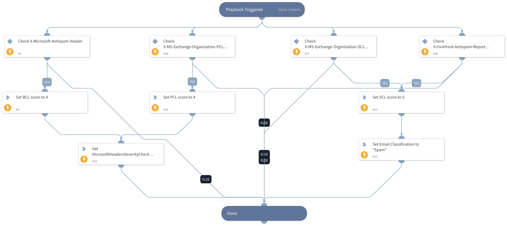

This playbook stores the SCL, BCL, and PCL scores if they exist to the associated incident fields (Phishing SCL Score, Phishing PCL Score, and Phishing BCL Score).
It also does the following:
1) Sets the email classification to "spam" if the SCL score is equal to or greater than 5.
2) Sets the incident severity according to the playbook inputs (default is: PCL/BCL - Medium, SCL - Low). The severity of the incident is set only when one (or more) of the following occurs:
  - PCL (Phishing Confidence Level) For a score between and including 4-8: The message content is likely to be phishing.
  - [BCL](https://docs.microsoft.com/en-us/microsoft-365/security/office-365-security/bulk-complaint-level-values?view=o365-worldwide) (Bulk Complaint Level) For a score between and including 4-7: The message is from a bulk sender that generates a mixed number of complaints. 
    For a score between and including 8-9: The message is from a bulk sender that generates a high number of complaints.
  - [SCL](https://docs.microsoft.com/en-us/microsoft-365/security/office-365-security/spam-confidence-levels?view=o365-worldwide) (Spam Confidence Level) For a score between and including 5-6: Spam filtering marks the message as spam. 
    For a score of 9: Spam filtering marks the message as high confidence spam. See [anti-spam stamps](https://docs.microsoft.com/en-us/exchange/antispam-and-antimalware/antispam-protection/antispam-stamps?view=exchserver-2019).

## Dependencies
This playbook uses the following sub-playbooks, integrations, and scripts.

### Sub-playbooks
This playbook does not use any sub-playbooks.

### Integrations
This playbook does not use any integrations.

### Scripts
* Set

### Commands
* setIncident

## Playbook Inputs
---

| **Name** | **Description** | **Default Value** | **Required** |
| --- | --- | --- | --- |
| BCL-Severity | Sets the minimum severity of an incident with a Bulk Complaint Level \(BCL\) score equal to or greater than 4.  Possible values: 0 \(Unknown\), 1 \(Low\), 2 \(Medium\), 3 \(High\), 4 \(Critical\). | 2 | Required |
| PCL-Severity | Sets the minimum severity of an incident with a Phishing Confidence Level \(PCL\) score equal to or greater than 4.  Possible values: 0 \(Unknown\), 1 \(Low\), 2 \(Medium\), 3 \(High\), 4 \(Critical\). | 2 | Required |
| SCL-Severity | Sets the minimum severity of an incident with a Spam Confidence Level \(SCL\) score equal to or greater than 5.  Possible values: 0 \(Unknown\), 1 \(Low\), 2 \(Medium\), 3 \(High\), 4 \(Critical\). | 1 | Required |

## Playbook Outputs
---

| **Path** | **Description** | **Type** |
| --- | --- | --- |
| Email.MicrosoftHeadersSeverityCheck | Possible Values:  Medium: PCL or BCL scores are equal to or greater than 4.  High: BCL score is equal to or greater than 8.  | unknown |

## Playbook Image
---
