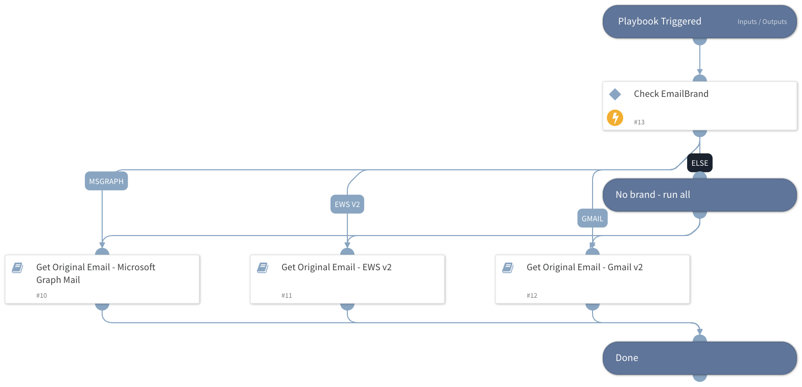

This v2 playbook is used inside the phishing flow. The inputs in this version do not use labels and also allow the user to supply an email brand.
Note: You must have the necessary permissions in your email service to execute a global search.

To retrieve the email files directly from the email service providers, use one of the provided inputs (Agari Phishing Defense customers should also use the following):
- EWS: eDiscovery
- Gmail: Google Apps Domain-Wide Delegation of Authority
- MSGraph: As described in the [message-get API](https://docs.microsoft.com/en-us/graph/api/message-get) and the [user-list-messages API](https://docs.microsoft.com/en-us/graph/api/user-list-messages)
- EmailSecurityGateway retrieves EML files from:
    * FireEye EX
    * FireEye CM
    * Proofpoint Protection Server
    * Mimecast

## Dependencies
This playbook uses the following sub-playbooks, integrations, and scripts.

### Sub-playbooks
* Get Original Email - EWS v2
* Get Original Email - Gmail v2
* Get Email From Email Gateway - Generic
* Get Original Email - Microsoft Graph Mail

### Integrations
This playbook does not use any integrations.

### Scripts
This playbook does not use any scripts.

### Commands
This playbook does not use any commands.

## Playbook Inputs
---

| **Name** | **Description** | **Default Value** | **Required** |
| --- | --- | --- | --- |
| MessageID | The original email message ID to retrieve. This should hold the value of the "Message-ID" header of the original email. |  | Optional |
| UserID | The email address of the user to fetch the original email for. For Gmail, the authenticated user. |  | Optional |
| EmailSubject | The original email subject. |  | Optional |
| EmailBrand | If this value is provided, only the relevant playbook runs. If no value is provided, all sub-playbooks are run. Possible values: - Gmail - EWS v2 - EWSO365 - MicrosoftGraphMail - EmailSecurityGateway  Choosing EmailSecurityGateway executes the following if enabled:     - FireEye EX \(Email Security\)     - Proofpoint TAP     - Mimecast |  | Optional |

## Playbook Outputs
---

| **Path** | **Description** | **Type** |
| --- | --- | --- |
| Email | The email object. | string |
| File | The original email attachments. | string |
| Email.To | The email recipient. | string |
| Email.From | The email sender. | string |
| Email.CC | The CC address of the email. | string |
| Email.BCC | The BCC address of the email. | string |
| Email.HTML | The email HTML. | string |
| Email.Body | The email text body. | string |
| Email.Headers | The email headers. | string |
| Email.Subject | The email subject. | string |
| Email.HeadersMap | The email headers map. | string |
| reportedemailentryid | If the original EML was retrieved, this field holds the file's Entry ID. | string |

## Playbook Image
---
