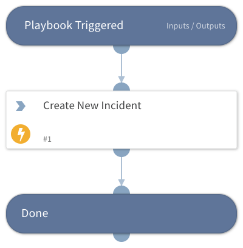

This playbook take arguments that will be used in order to create a new Phishing incident. It is needed for scenarios such as creating several incidents based on values stored in the context. In such scenarios, the playbook can be looped.

## Dependencies
This playbook uses the following sub-playbooks, integrations, and scripts.

### Sub-playbooks
This playbook does not use any sub-playbooks.

### Integrations
This playbook does not use any integrations.

### Scripts
This playbook does not use any scripts.

### Commands
createNewIncident

## Playbook Inputs
---

| **Name** | **Description** | **Default Value** | **Required** |
| --- | --- | --- | --- |
| IncidentName | The value for the Incident Name field. |  | Optional |
| ReportedEmailMessageID | The value for the Reported Email Message ID field. |  | Optional |
| EntryIDs | The value for the EntryIDs field. |  | Optional |

## Playbook Outputs
---

| **Path** | **Description** | **Type** |
| --- | --- | --- |
| CreatedIncidentID | ID of the created incident. | string |

## Playbook Image
---

